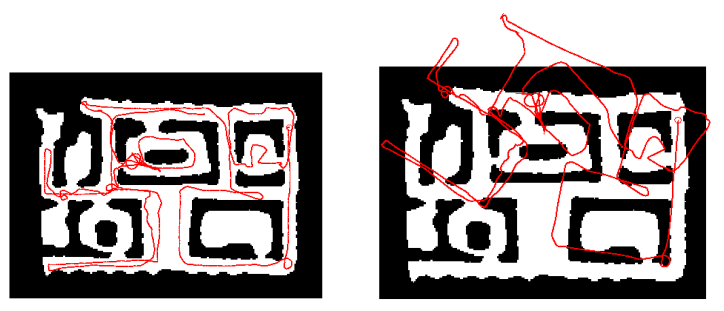
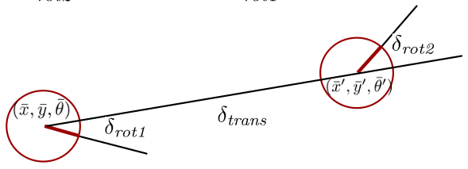
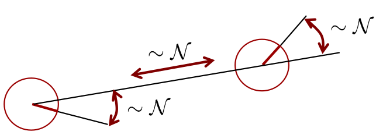
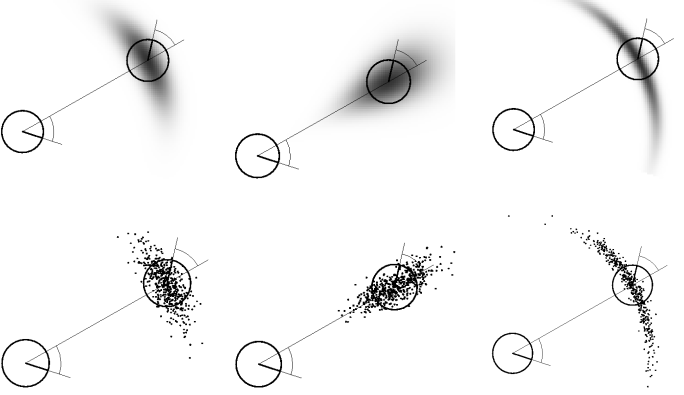
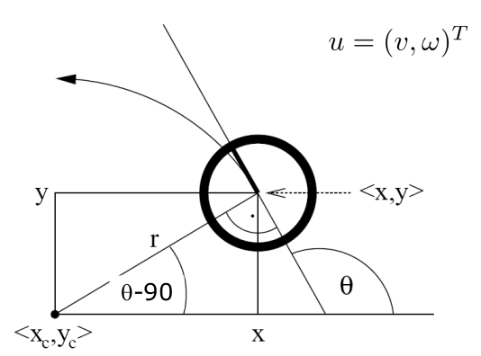
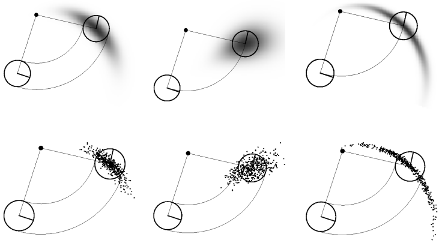
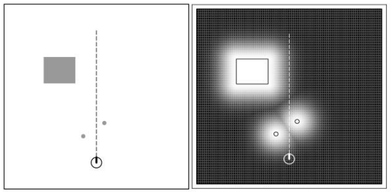
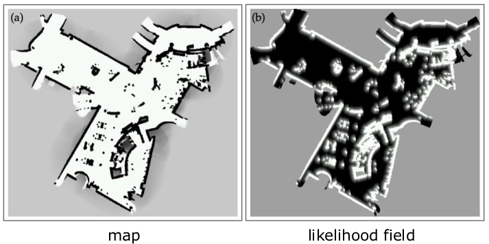
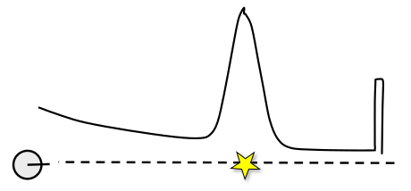

# A Short Introduction to the Bayes Filter and Related Models

## State Estimation
- Estimate the state $x$ of a system given observations $z$ and controls $u$
- **Goal**:
$$
p(x|z,u)
$$
## Recursive Bayes Filter

1. $bel(x_t) = \underset{\text{Definition of the belief}}{\underline{p(x_t|z_{1:z}, u_{1:t})}}$
2. $\ \ \ \ \ \ \ \ \ \ \ = \underset{\text{Bayes' Rule}}{\underline{\eta p(z_t | x_t, z_{1:t-1}, u_{1:t})p(x_t|z_{1:t-1}, u_{1:t})}}$
3. $\ \ \ \ \ \ \ \ \ \ \ = \underset{\text{Markov  assumption}}{\underline{\eta p(z_t | x_t)}}p(x_t|z_{1:t-1}, u_{1:t})$
4. $\ \ \ \ \ \ \ \ \ \ \ = {\eta p(z_t | x_t)}\underset{\text{Law of total probability}}{\underline{\int p(x_t|x_{t-1},z_{1:t-1}, u_{1:t})p(x_{t-1}|z_{1:t-1}, u_{1:t})dx_{t-1}}}$
5. $\ \ \ \ \ \ \ \ \ \ \ = {\eta p(z_t | x_t)}\int\underset{\text{Markov assumption}}{\underline{p(x_t|x_{t-1},u_{t})}}p(x_{t-1}|z_{1:t-1}, u_{1:t})dx_{t-1}$
6. $\ \ \ \ \ \ \ \ \ \ \ = {\eta p(z_t | x_t)}\int{p(x_t|x_{t-1},u_{t})}p(x_{t-1}|z_{1:t-1}, u_{1:\underline{t-1}})dx_{t-1}$
 $\ \ \ \ \ \ \ \ \ \ \ \ \ \ \ \ \ \ \ \ \ \ \ \ \ \ \ \ \ \ \ \ \ \ \ \ \ \ \ \ \ \ \ \ \ \ \ \ \ \ \ \ \ \ \ \ \ \ \ \ \ \ \ \ \ \ \ \ \ \ \ \ \ \ \ \ \ \ \ \ \ \ \ \overset{\text{Markov assumption}}{}$
7. $\ \ \ \ \ \ \ \ \ \ \ = {\eta p(z_t | x_t)}\int{p(x_t|x_{t-1},u_{t})}\underset{\text{Recursive term}}{\underline{bel(x_{t-1})}}dx_{t-1}$

## Prediction and Correction Step
- Bayes filter can be written as a two-step process
- **Prediction step**
$$
\bar{bel}(x_t) = \int p(x_t | u_t, x_{t-1})bel(x_{t-1})dx_{t-1}
$$
- **Correction step**
$$
bel(x_t) = \eta p(z_t|x_t)\bar{bel}(x_t)
$$

## Motion and Observation Model
- **Prediction step
$$
\bar{bel}(x_t) = \int \underset{\text{motion model}}{\underline{p(x_t | u_t, x_{t-1})}}bel(x_{t-1})dx_{t-1}
$$
- **Correction step**
$$
bel(x_t) = \underset{\text{sensor/obs model}}{\underline{\eta p(z_t|x_t)}}\bar{bel}(x_t)
$$
## Different Realisations
- The Bayes filter is a **framework** for recursive state estimation
- There are **different realisations**
- **Different properties**
	- Linear vs. non-linear models for motion and observation models
	- Gaussian distribution only?
	- Parametric vs. non-parametric filters
	- ...

## In This Course
- **Kalman filter & friends**
	- Gaussians
	- Linear or linearised models
- **Particle filter**
	- Non-parametric
	- Arbitrary models (sampling required)

# Motion Model
$$
\overline{bel}(x_t) = \int \underbrace{p(x_t|u_t, x_{t-1})}bel(x_{t-1})dx_{t-1}
$$

## Robot Motion Models
- Robot motion is inherently uncertain
- How can we model this uncertainty?

## Probabilistic Motion Models
- Specifies a posterior probability that action u carries the robot from $x$ to $x'$
$$
p(x_t|u_t,x_{t-1})
$$
## Typical Motion Models
- In practice, one often finds two types of motion models:
	- **Odometry-based**
	- **Velocity-based**
- Odometry-based models for systems that are equipped with wheel encoders
- Velocity-based when no wheel encoders are available

## Odometry Model
- Robot moves from $(\bar{x}, \bar{y}, \bar{z})$ to $(\bar{x}', \bar{y}, \bar{\theta}')$
- Odometry information $u=(\delta_{rot1}, \delta_{trans}, \delta_{rot2})$
$$
\delta_{trans} = \sqrt{(\bar{x}'-\bar{x})^2+(\bar{y}'-\bar{y})^2}
$$
$$
\delta_{rot1} = \text{atan2}(\bar{y}'-\bar{y}, \bar{x}'-\bar{x})-\bar{\theta}
$$
$$
\delta_{rot2} = \bar{\theta}' - \bar{\theta} - \delta_{rot1}
$$

## Probability Distribution
- Noise in odometry $u=(\delta_{rot1}, \delta_{trans}, \delta_{rot2})$
- Example: Gaussian noise
$$
u \sim N(0, \Sigma)
$$

## Examples (Odometry-Based)

## Velocity-Based Model

## Motion Equation
- Robot moves from $(x,y, \theta)$ to $(x', y', \theta')$
- Velocity information $u = (v, w)$
- $v$ represents linear velocity
- $w$ represents angular velocity
$$
\begin{pmatrix}
x' \\
y' \\
\theta'
\end{pmatrix}
= 
\begin{pmatrix}
x \\
y \\
\theta
\end{pmatrix}
+
\begin{pmatrix}
- \frac{v}{w}\sin \theta + \frac{v}{w} \sin(\theta + w\Delta t) \\
\frac{v}{w} \cos \theta - \frac{v}{w} \cos(\theta + w \Delta t) \\
w \Delta t
\end{pmatrix}
$$
## Problem of the Velocity-Based Model
- Robot moves in a circle
- The circle constrains the final orientation
- **Fix**: introduce an additional noise term on the final orientation

## Motion Including $3^{rd}$ Parameter
$$
\begin{pmatrix}
x' \\
y' \\
\theta'
\end{pmatrix}
=
\begin{pmatrix}
x \\
y \\
\theta
\end{pmatrix}
+
\begin{pmatrix}
-\frac{v}{w}\sin \theta + \frac{v}{w} \sin(\theta + w \Delta t) \\
\frac{v}{w}\cos \theta - \frac{v}{w} \cos(\theta + w \Delta t) \\
w \Delta t + \underline{\gamma \Delta t}
\end{pmatrix}
$$
- The **underlined term** above accounts for the final rotation

## Examples (Velocity-Based)

# Sensor Model
$$
bel(x_t) = \eta p(z_t | x_t)\overline{bel}(x_{t-1})
$$

## Model for Laser Scanners
- Scan $z$ consists of $K$ measurements
$$
z_t = \{z_t^1, ..., z_t^k\}
$$
- Individual measurements are independent given the robot position
$$
p(z_t|x_t, m) = \prod^k_{i=1}p(z_t^i|x_t, m)
$$

## Beam-Endpoint Model

## Ray-Cast Model
- Ray-cast model considers the first obstacle long the line of sight
- Mixture of four models

## Model for Perceiving Landmarks with Range-Bearing Sensors
- Range-bearing $z_t^{i} = (r_t^i, \phi_t^i)^T$
- Robot's pose $(x, y, \theta)^T$
- Observation of feature $j$ at location $(m_{j,x}, m_{j,y})^T$
$$
\begin{pmatrix}
r_t^i \\
\phi_t^i \\
\end{pmatrix}
=
\begin{pmatrix}
\sqrt{(m_{j,x-x})^2+(m_{j,y}-y)^2} \\
\text{atan2}(m_{j,y} - y, m_{j,x} - x) - \theta
\end{pmatrix}
+ Q_t
$$
