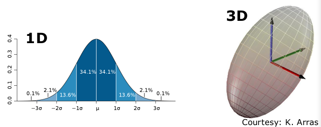
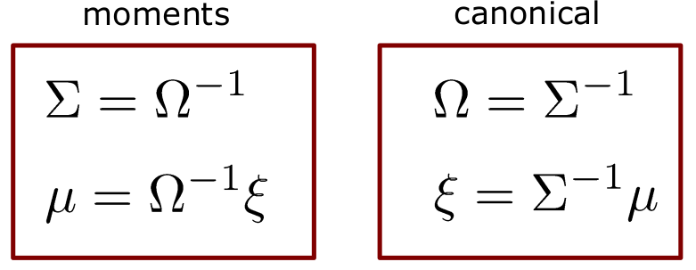
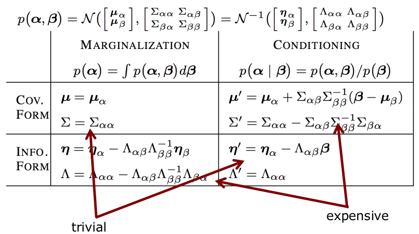
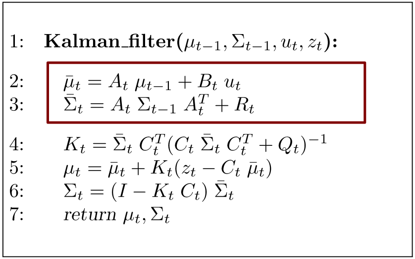
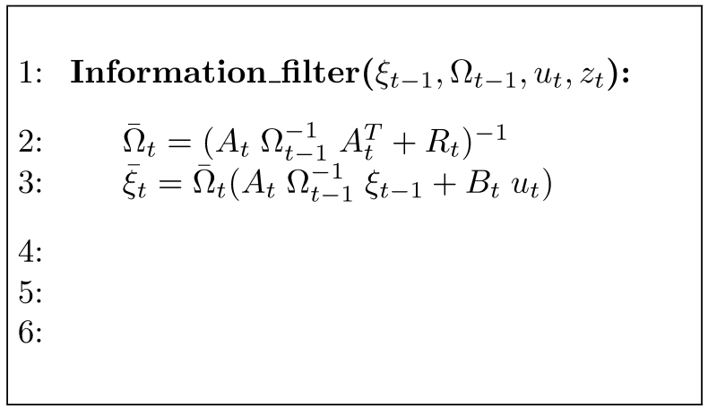
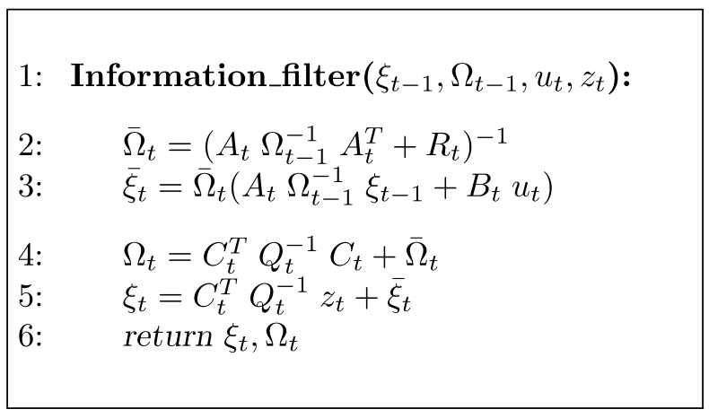
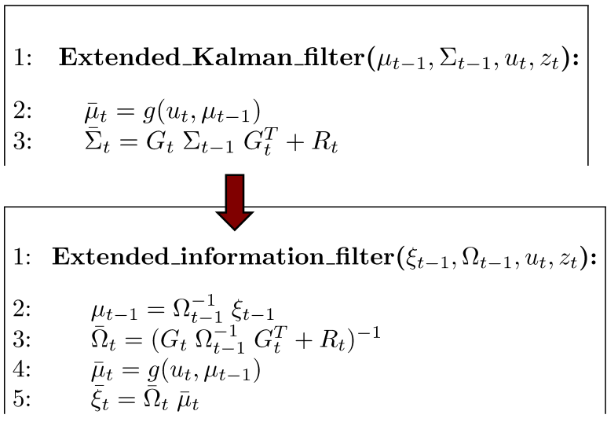
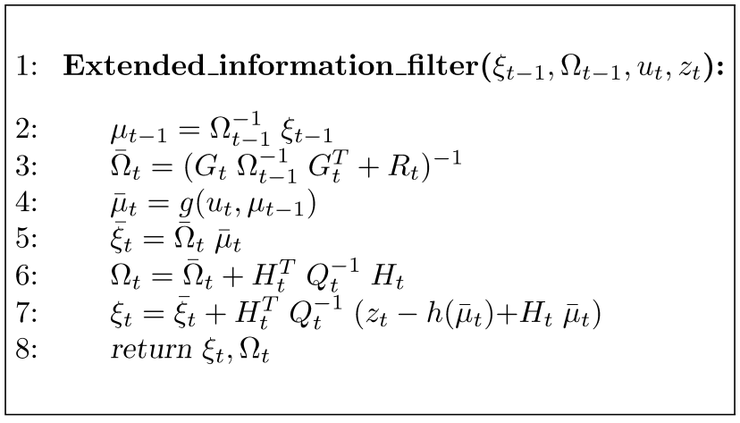

# Extended Kalman Filter
## Gaussians
- Gaussian described by **moments** $\mu,\Sigma$ 
$$
p(x) = \det(2\pi\Sigma)^{-\frac{1}{2}}\exp(-\frac{1}{2}(x - \mu)^T \Sigma^{-1}(x-\mu))
$$

## Canonical Parameterisation
- Alternatie representation for Gaussians
- Described by **information matrix** $\Omega$ and **information vector** $\xi$ 

## Canonical Parameterisation
- Alternative representation for Gaussians
- Described by **information matrix** $\Omega$
$$
\Omega = \Sigma^{-1}
$$
- And **information vector** $\xi$
$$
\xi = \Sigma^{-1}\mu
$$

## Complete Parameterisations

## Towards the Information Form
$$
\begin{align}
	p(x) &= \det(2\pi\Sigma)^{-\frac{1}{2}}\exp(\underbrace{-\frac{1}{2}(x-\mu)^T\Sigma^{-1}(x-\mu)}_{expand}) \\
	&= \det(2\pi\Sigma)^{-\frac{1}{2}}\exp(\underbrace{-\frac{1}{2}x^T\Sigma^{-1}x+x^T\Sigma^{-1}\mu}_{separate} - \underbrace{\frac{1}{2}\mu^T\Sigma^{-1}\mu}_{separate}) \\
	&= \underbrace{\det(2\pi\Sigma)^{-\frac{1}{2}}\exp(-\frac{1}{2}\mu^T\Sigma^{-1}\mu)}_{constant}\exp(-\frac{1}{2}x^T\Sigma^{-1}x+x^T\Sigma^{-1}\mu) \\
	&= \eta \exp(-\frac{1}{2}x^T\underbrace{\Sigma^{-1}}_{\Omega}x+x^T\underbrace{\Sigma^{-1}\mu}_{\xi}) \\
	&= \eta\exp(-\frac{1}{2}x^T\Omega x + x^T\xi)	
\end{align}
$$

## Dual Representation
**Canonical parameterisation**
$$
p(x) = \frac{\exp(-\frac{1}{2}\mu^T\xi)}{\det(2\pi\Omega^{-1})}\exp(-\frac{1}{2}x^T\Omega x +x^T\xi)
$$
**Moments parameterisation**
$$
p(x) = \det(2\pi\Sigma)^{-\frac{1}{2}}\exp(-\frac{1}{2}(x-\mu)^T\Sigma^{-1}(x-\mu))
$$

## Marginalisation and Conditioning
- Marginalisation is easy - just simply cut out a section of the matrix
- Conditioning is hard - requires  cutting out a section of the matrix and then inverting it (expensive computationally!)

## From the Kalman Filter to the Information Filter
- Two parameterisation for  Gaussian
- Same expressiveness
- Marginalisation and conditioning have different complexities
- We learned about Gaussian filtering with the Kalman filter in Chapter 4
- Kalman filtering in information form is called information filtering

## Kalman Filter Algorithm

## Prediction Step (1)
- Transform $\overline{\Sigma}_t = A_t\Sigma_{t-1}A_t^T + R_t$ 
- Using $\Sigma_{t-1}=\Omega^{-1}_{t-1}$
- Leads to
$$
\overline{\Omega}_t = (A_t\Omega^{-1}_{t-1}A_t^T + R_t)^{-1}
$$

## Prediction Step (2)
- Transform $\overline{\mu}_t = A_t\mu_{t-1}+B_tu_t$
- Using $\overline{\mu}_{t-1} = \Omega^{-1}_{t-1}\xi_{t-1}$
- Leads to
$$
\begin{align}
	\overline{\xi}_t &= \overline{\Omega}_t(A_t\mu_{t-1}+B_t u_t) \\
	&= \overline{\Omega}_t(A_t\Omega_{t-1}^{-1}\xi_{t-1}+B_t u_t)
\end{align}
$$

## Information Filter Algorithm

## Correction Step
- Use the Bayes filter measurement update and replace the components
- Observation model (first part) is multiplied with the predicted belief (check Kalman filter for refresher)
- The final claim we can trace back to our original derivation of the information filter (see at the top of the notes)
$$
\begin{align}
	bel(x_t) &= \eta p(z_t|x_t)\overline{bel}(x_t) \\
	&= \eta' \exp\Big(-\frac{1}{2}(z_t-C_tx_t)^TQ_t^{-1}(z_t - C_tx_t)\Big) \exp\Big(-\frac{1}{2}(x_t - \overline{\mu}_t)^T \overline{\Sigma}^{-1}(x_t-\overline{\mu}_t)\Big) \\
	&= \eta' \exp\Big( -\frac{1}{2}(z_t-C_tx_t) Q_t^{-1}(z_t - C_tx_t) -\frac{1}{2}(x_t - \overline{\mu}_t)^T \overline{\Sigma}_t^{-1} (x_t - \overline{\mu}_t) \Big) \\
	&= \eta'' \exp(-\frac{1}{2}x_t^T C_t^TQ_t^{-1}C_tx_t+x_t^TC_t^TQ^{-1}_tz_t - \frac{1}{2}x_t^T \overline{\Omega}_tx_t+x_t^T\overline{\xi}_t) \\
	&= \eta'' \exp\Bigg(-\frac{1}{2}x_t^T\underbrace{[C_t^TQ_t^{-1}C_t+\overline{\Omega}_t]}_{\Omega_t}x_t + x_t^T\underbrace{[C_t^TQ_t^{-1}z_t+\overline{\xi}_t]}_{\xi_t}\Bigg)
\end{align}
$$
- This results in a simple update rule
$$
\begin{align}
\Omega_t &= C_t^T Q_t^{-1}C_t+\overline{\Omega}_t \\
\xi_t &= C_t^TQ_t^{-1} z_t + \overline{\xi}_t
\end{align}
$$

## Information Filter Algorithm

## Prediction and Correction
- Prediction
$$
\begin{align}
\overline{\Omega}_t &= (A_t\Omega^{-1}_{t-1}A_t^T + R_t)^{-1} \\
\overline{\xi}_t &= \overline{\Omega}_t(A_t\Omega^{-1}_{t-1}\xi_{t-1}+B_t u_t) \\
\end{align}
$$
- Correction
$$
\begin{align}
	\Omega_t &= C_t^T Q_t^{-1}C_t+ \overline{\Omega}_t \\
	\xi_t &= C_t^TQ_t^{-1}z_t+\overline{\xi}_t
\end{align}
$$

## Complexity
- Kalman filter
	- Efficient prediction step: $O(n^2)^*$
	- Costly correction step: $O(n^2 + k^{2.4})$
- Information filter
	- Costly prediction step: $O(n^{2.4})$
	- Efficient correction step: $O(n^2)^*$
- Transformation between both parameterisations is costly: $O(n^{2.4})$
_Potentially faster, especially for SLAM; depending on type of controls and observations_

## Extended Information Filter
- As the Kalman filter, the information filter suffers from the linear models
- The extended information filter (EIF) uses a similar trick as the EKF
- Linearisation of the motion and observation function

## Prediction: From EKF of EIF
- Substitution moments brings us from the EKF
$$
\begin{align}
	\overline{\Sigma}_t &= G_t\Sigma_{t-1}G_t^T + R_t \\
	\overline{\mu}_t &= g(u_t, \mu_{t-1})
\end{align}
$$
- to the EIF
$$
\begin{align}
\overline{\Omega}_t &= (G_t\Omega_{t-1}^{-1}+R_t)^{-1} \\
\overline{\xi}_t &= \overline{\Omega}_t g(u_t, \Omega_{t-1}^{-1}\xi_{t-1})
\end{align}
$$

## Prediction: From EKF to EIF

## Correction Step of the EIF
- As from the KF to IF transition, use substitute the moments in the measurement update
$$
bel(x_t) = \eta \exp\Big( -\frac{1}{2}(z_t - h(\overline{\mu}_t) - H_t(x_t - \overline{\mu}_t))^T Q_t^{-1} (z_t - h(\overline{\mu}_t)-H_t(x_t - \overline{\mu}_t)) - \frac{1}{2} (x_t - \overline{\mu}_t)^T \overline{\Sigma}^{-1}_t (x_t - \overline{\mu}_t) \Big)
$$
- This leads to 
$$
\begin{align}
\Omega_t &= \overline{\Omega}_t + H_t^T Q^{-1}_t H_t \\
\xi_t &= \overline{\xi_t} H_t^T Q_t^{-1} (z_t - h(\overline{\mu}_t) + H_t\overline{\mu}_t)
\end{align}
$$

## Extended Information Filter

## EIF vs. EKF
- The EIF is the EKF in information form
- Complexities of the prediction and correction steps can differ 
- Same expressiveness than the EKF
- Unscented transform mean also be used
- Reported to be numerically more stable than the EKF
- In practice, the EKF is more popular than the EIF