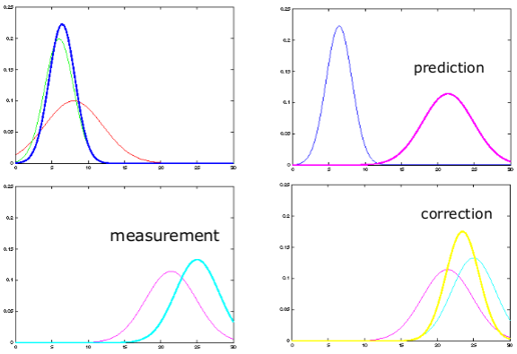

# Extended Kalman Filter
## SLAM is a State Estimation Problem
- Estimate the map and robot's pose
- Bayes filter is one tool for state estimation
- **Prediction**
$$
\overline{bel}(x_t) = \int p(x_t | u_t, x_{t-1})bel(x_{t-1})dx_{t-1}
$$
- **Correction**
$$
bel(x_t) = \eta p(z_t|x_t)\overline{bel}(x_t)
$$

## Kalman Filter
- It is a Bayes filter
- Estimator for the linear Gaussian case
- Optimal solution for linear models and Gaussian distributions

## Kalman Filter Distribution
- Everything is Gaussian
$$
p(x) = \det(2\pi \Sigma)^{-\frac{1}{2}} \exp(-\frac{1}{2}(x - \mu)^T \Sigma^{-1}(x-\mu))
$$

## Properties: Marginalisatin and Conditioning
- Given
$$
x =
\begin{pmatrix}
x_a \\
x_b
\end{pmatrix}
\quad
p(x) = \mathcal{N}
$$
- The marginals are Gaussians
$$
p(x_a) = \mathcal{N} \quad p(x_b)= \mathcal{N}
$$
- As well as the conditionals
$$
p(x_a | x_b) = \mathcal{N} \quad p(x_b | x_a) = \mathcal{N}
$$

## Marginalisation
- Given 
$$
p(x) = p(x_a, x_b) = \mathcal{N}(\mu, \Sigma)
$$
with
$$
\mu = \begin{pmatrix}\mu_a \\ \mu_b \end{pmatrix} \quad \Sigma = \begin{pmatrix} \Sigma_{aa} & \Sigma_{ab} \\ \Sigma_{ba} & \Sigma{bb} \end{pmatrix}
$$
- The marginal distribution is 
$$
p(x_a) = \int p(x_a, x_b) dx_b = \mathcal{N}(\mu, \Sigma)
$$
with
$$
\mu = \mu_a \quad \Sigma = \Sigma_{aa}
$$

## Conditioning
- Given 
$$
p(x) = p(x_a, x_b) = \mathcal{N}(\mu, \Sigma)
$$
with
$$
\mu = \begin{pmatrix}\mu_a \\ \mu_b \end{pmatrix} \quad \Sigma = \begin{pmatrix} \Sigma_{aa} & \Sigma_{ab} \\ \Sigma_{ba} & \Sigma{bb} \end{pmatrix}
$$
- The conditional distribution is
$$
p(x_a|x_b) = \frac{x_a, x_b}{p(x_b)} = \mathcal{N}(\mu, \Sigma)
$$
with
$$
\mu = \mu_a + \Sigma_{ab}\Sigma^{-1}_{bb}(b-\mu_b)
$$
$$
\Sigma = \Sigma_{aa} - \Sigma_{ab}\Sigma_{bb}^{-1}\Sigma_{ba}
$$

## Linear Model
- The Kalman filter assumes a linear transition and observation model
- Zero mean Gaussian noise
$$
x_t = A_tx_{t-1} +B_tu_t + \epsilon_t
$$
$$
z_t = C_tx_t + \delta_t
$$
## Component of a Kalman Filter
### $A_t$
Matrix $(n \times n)$ that describes how the state evolves from $t-1$ to $t$ without controls or noise

### $B_t$
Matrix $(n \times l)$ that describes how the control $u_t$ changes the state from $t-$ to $t$

### $C_t$
Matrix $(k \times n)$ that describes how to map the state $x_t$ to an observation $z_t$

### $\epsilon_t$ & $\delta_t$
Random variables representing the process and measurement noise that are assumed to be independent and normally distributed with covariance $R_t$ and $Q_t$ respectively

## Linear Motion Model
- Motion under Gaussian noise leads to
$$
p(x_t|u_t, x_{t-1}) = \det(2\pi R_t)^{-\frac{1}{2}}\exp(-\frac{1}{2}(x_t - A_tx_{t-1} - B_tu_t)^T(x_t - A_tx_{t-1} - B_tu_t))
$$
- $R_t$ describes the noise of the motion 

## Linear Observation Model
- Measuring under Gaussian noise leads to
$$
p(z_t|x_t) = \det(2\pi Q_t)^{-\frac{1}{2}}\exp(-\frac{1}{2}(z_t-C_tx_t)^TQt^{-1}(z_t-C_tx_t))
$$
- $Q_t$ describes the measurement noise

## Everything Stays Gaussian
- Given an initial Gaussian belief, the belief is always Gaussian
$$
\overline{bel}(x_t) = \int \underline{p(x_t | u_t,x_{t-1})}\underline{bel(x_{t-1})}dx_{t-1}
$$
$$
bel(x_t) = \eta p(z_t|x_t)\overline{bel}(x_t)
$$
- Proof is non-trivial

## Kalman Filter Algorithm

## 1D Kalman Filter Example (1)

## 1D Kalman Filter Example (2)

## Kalman Filter Assumptions
- Gaussian distributions and noise
- Linear motion and observation model

## Non-Linear Dynamic Systems
- Most realistic problems (in robotics) involve nonlinear functions

## Linearity Assumption Revisited

## Non-Linear Function

## Non-Gaussian Distributions
- The non-linear functions lead to non-Gaussian distributions
- Kalman filter is not applicable anymore!

**What can be done to resolve this?**
**Local linearisation!**

## EKF Linearisation: First Order Taylor Expansion

## Reminder: Jacobian Matrix
- It is a **non-square matrix** $m \times n$ in general
- Given a vector-valued function
$$
g(x) = 
\begin{pmatrix}
g_1(x) \\
g_2(x) \\
... \\
g_m(x)
\end{pmatrix}
$$
- The **Jacobian matrix** is defined as
$$
G_x = 

$$