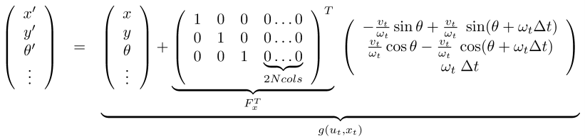

# EKF SLAM
## Simultaneous Localisation and Mapping (SLAM)
- Building a map and locating the robot in the map at the same time
- Chicken-or-egg problem

## Definition of the SLAM Problem
**Given**
- The robot's controls
$$
u_{1:T} = \{u_1, u_2, u_3, \dots, u_T\}
$$
- Observations
$$
z_{1:T} = \{z_1, z_2, z_3, \dots, z_T\}
$$
**Wanted**
- Map of the environment
$$
m
$$
- Path of the robot
$$
x_{0:T} == \{x_0, x_1, x_2, \dots, x_T\}
$$

## Three Main Paradigms

## Bayes Filter
- Recursive filter with prediction and correction step
- **Prediction**
$$
\overline{bel}(x_t) =\int p(x_t|u_t, x_{t-1})bel(x_{t-1})dx_{t-1}
$$
- **Correction**
$$
bel(x_t) = \eta p(z_t|x_t) \overline{bel}(x_t)
$$

## EKF for Online SLAM
- We consider here the Kalman filter as a solution to the online SLAM problem
$$
p(x_t,m|z_{1:t}, u_{1:t})
$$

## Extended Kalman Filter

## EKF SLAM
- Application of the EKF to SLAM
- Estimate robot's pose and locations of landmarks in the environment
- Assumption: known correspondences
- State space (for the 2D plane) is
$$
x_t = (\underbrace{x, y, \theta}_{\text{robot's pose}}, \underbrace{m_{1,x}, m_{1,y}}_{\text{landmark 1}}, \dots, \underbrace{m_{n,x}, m_{n,y}}_{\underbrace{\text{landmark n}}})^T
$$

## EKF SLAM: State Representation
- Map with $n$ landmarks: $(3+2n)$-dimensional Gaussian
- Belief is represented by

- More compactly

- Even more compactly (not: $x_R \rightarrow x$)

## EKF SLAM: Filter Cycle
1. State prediction
2. Measurement prediction
3. Measurement
4. Data association
5. Update

## EKF SLAM: State Prediction

## EKF SLAM: Measurement Prediction

## EKF SLAM: Obtained Measurement

## EKF SLAM: Data Association and Difference Between $h(x)$ and $z$

## EKF SLAM: Update Step

## EKF SLAM: Concrete Example
**Setup**
- Robot moves in the 2D plane
- Velocity-based motion model
- Robot observes point landmark
- Range-bearing sensor
- Known data association
- Known number of landmarks

## Initialisation
- Robot starts in its own reference frame (all landmarks unknown)
- $2N+3$ dimensions

## Extended Kalman Filter Algorithm

## Prediction Step (Motion)
- Goal: Update state space based on the robot's motion
- Robot motion in the plane
$$
\begin{pmatrix}
x' \\
y' \\
\theta'
\end{pmatrix}
=
\underbrace{\begin{pmatrix}
x \\
y \\
\theta
\end{pmatrix}
+
\begin{pmatrix}
-\frac{v_t}{w_t}\sin\theta+\frac{v_t}{w_t}\sin(\theta+w_t\Delta t) \\
\frac{v_t}{w_t}\cos \theta - \frac{v_t}{w_t}\cos(\theta + w_t \Delta t) \\
w_t \Delta t
\end{pmatrix}}_{g_{x,y,\theta}(u_t,(x,y,\theta)^T)}
$$
- How to map that to the $2N+3$ dim space?

## Update the State Space
- From the motion in the plane
$$
\begin{pmatrix}
x' \\
y' \\
\theta'
\end{pmatrix}
=
\begin{pmatrix}
x \\
y \\
\theta
\end{pmatrix}
+
\begin{pmatrix}
-\frac{v_t}{w_t}\sin\theta+\frac{v_t}{w_t}\sin(\theta+w_t\Delta t) \\
\frac{v_t}{w_t}\cos \theta - \frac{v_t}{w_t}\cos(\theta + w_t \Delta t) \\
w_t \Delta t
\end{pmatrix}
$$
- to the $2N+3$ dimensional space

## Extended Kalman Filter Algorithm

## Update Covariance
- The function $g$ only affects the robot's motion and not the landmarks

## Jacobian of the Motion
$$
G_t^x = \frac{\partial}{\partial(x, y, \theta)^T}\Bigg[
\begin{pmatrix}
x \\
y \\
\theta
\end{pmatrix}
+
\begin{pmatrix}
-\frac{v_t}{w_t}\sin \theta + \frac{v_t}{w_t} \sin(\theta + w_t \Delta t) \\
\frac{v_t}{w_t} \cos \theta - \frac{v_t}{w_t} \cos (\theta + w_t \Delta t) \\
w_t \Delta t
\end{pmatrix}
\Bigg]
$$
$$
G_t^x = I + \frac{\partial}{\partial (x, y, \theta)^T} 
\begin{pmatrix}
-\frac{v_t}{w_t}\sin \theta + \frac{v_t}{w_t} \sin(\theta + w_t \Delta t) \\
\frac{v_t}{w_t} \cos \theta - \frac{v_t}{w_t} \cos (\theta + w_t \Delta t) \\
w_t \Delta t
\end{pmatrix}
$$
$$
G_t^x = I +
\begin{pmatrix}
0 & 0 & -\frac{v_t}{w_t} \cos \theta + \frac{v_t}{w_t}\cos (\theta + w \Delta t)\\
0 & 0 & -\frac{v_t}{w_t} \sin \theta + \frac{v_t}{w_t} \sin(\theta + w_t \Delta t) \\
0 & 0  & 0 \\
\end{pmatrix}
$$
$$
G_t^x =
\begin{pmatrix}
1 & 0 & -\frac{v_t}{w_t} \cos \theta + \frac{v_t}{w_t} \cos (\theta + w_t \Delta t)\\
0 & 1 & - \frac{v_t}{w_t} \sin \theta + \frac{v_t}{w_t}\sin(\theta + w_t \Delta t)\\
0 & 0 & 1\\
\end{pmatrix}
$$

## This Leads to the Update

## Extended Kalman Filter Algorithm

## EKF SLAM: Prediction Step

## Extended Kalman Filter Algorithm

## EKF SLAM: Correction Step
- Known data association
- $c_t^i$: $i$-th measurement at time $t$ observes the landmark with index $j$
- Initialise landmark if unobserved
- Compute the expected observation
- Compute the Jacobian of $h$
- Proceed with computing the Kalman gain

## Range-Bearing Observation
- Range-Bearing observation $z_t^i = (r_t^i, \phi^i_t)^T$
- If landmark has not been observed
$$

$$