# FastSLAM - Feature-Based SLAM with Particle Filters

## Particle Filter
- Non-parametric recursive Bayes filter
- Posterior is represented by a set of weighted samples
- Can model arbitrary distributions
- Works well in low-dimensional spaces
- 3-Step procedure
	- Sampling from proposal
	- Importance weighting
	- Resampling

## Particle Filter Algorithm
1. Sample the particles from the proposal distribution
$$
x_t^{[j]} \sim \pi(x_t|\dots)
$$
2. Compute the importance weights
$$
w^{[j]}_t = \frac{target(x_t^{[j]})}{proposal(x_t^{[j]})}
$$
3. Resampling: Draw sample $i$ with probability $w_t^{[i]}$ and repeat $J$ times

## Particle Representation
- A set of weighted samples
$$
\mathcal{X} = \{ \langle x^{[i]}, w^{[i]} \rangle \}_{i=1,\dots,N}
$$
- Think of a sample as one hypothesis about the state
- For feature-based SLAM:
$$
x = (\underbrace{x_{1,t}}_{\text{poses}}, \underbrace{m_{1,x}, m_{1,y}, \dots, m_{M,x}, m_{M,y}}_{\text{landmarks}})^T
$$

## Dimensionality Problem
Particle filters are effective in low dimensional spaces as the likely regions of the state space need to be covered with samples
$$
x = \underbrace{(x_{1,t}, m_{1,x}, m_{1,y}, \dots, m_{M,x}, m_{M,y})^T}_{\text{high-dimensional}}
$$

### Can We Exploit Dependencies Between the Different Dimensions of the State Space?
$$
x_{1:t}, m_1, \dots, m_M
$$

### If  We Know the Poses of the Robot, Mapping is Easy!
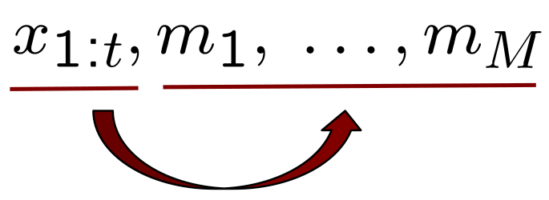

### Key Idea

If we use the particle set only to model the robot's path, each sample is a path hypothesis. For each sample, we can compute an individual map of landmarks.

## Rao-Blackwellization
- Factorization to exploit dependencies between variables:
$$
p(a,b) = p(b|a)p(a)
$$
- If $p(b|a)$ can be computed efficiently, represent only $p(a)$ with samples and compute $p(b|a)$ for every sample

## Rao-Blackwellization for SLAM
- Factorisation of the SLAM posterior
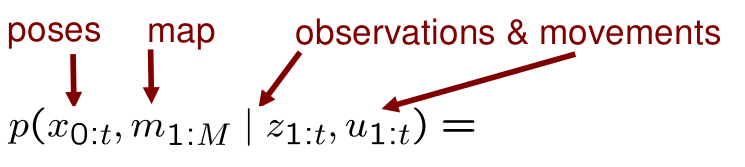
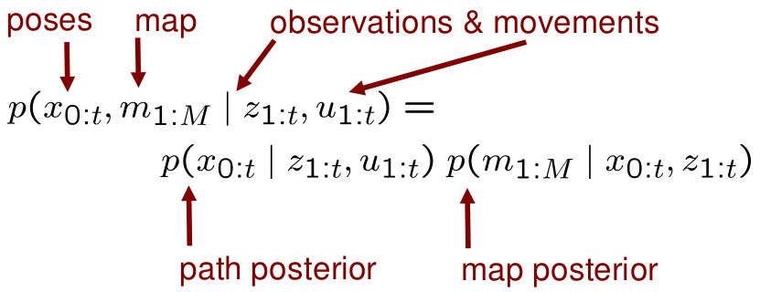
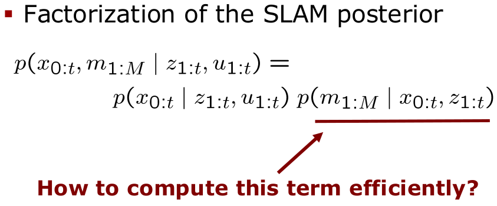

## Revisit the Graphical Model
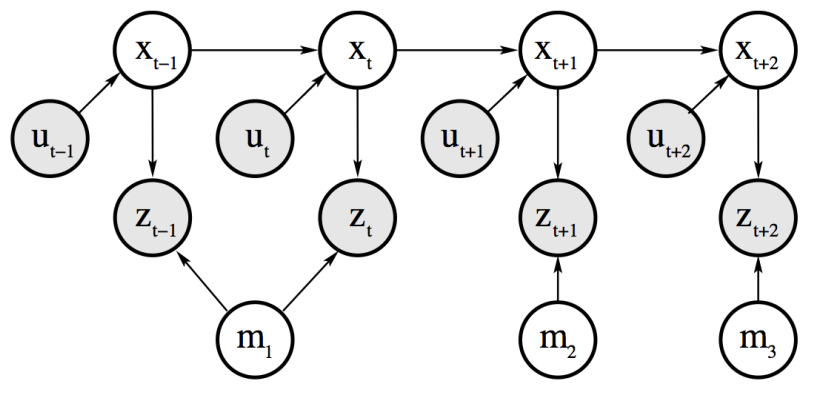
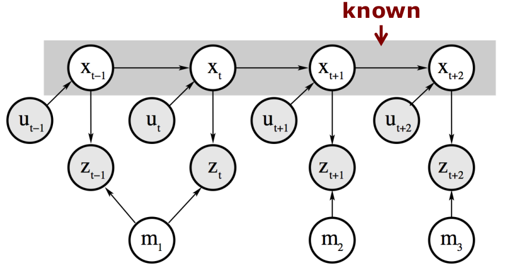

## Landmarks are Conditionally Independent Given the Poses
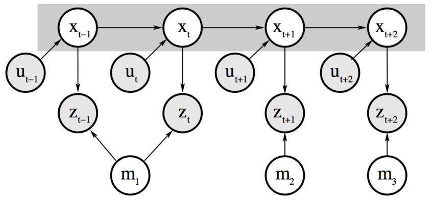
**Landmark variables are all disconnected (i.e. independent) given the robot's path**

## Rao-Blackwellisation for SLAM
- Factorisation of SLAM posterior
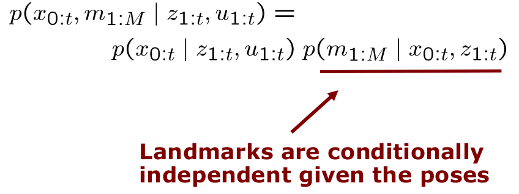
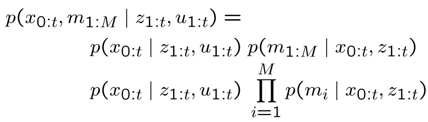
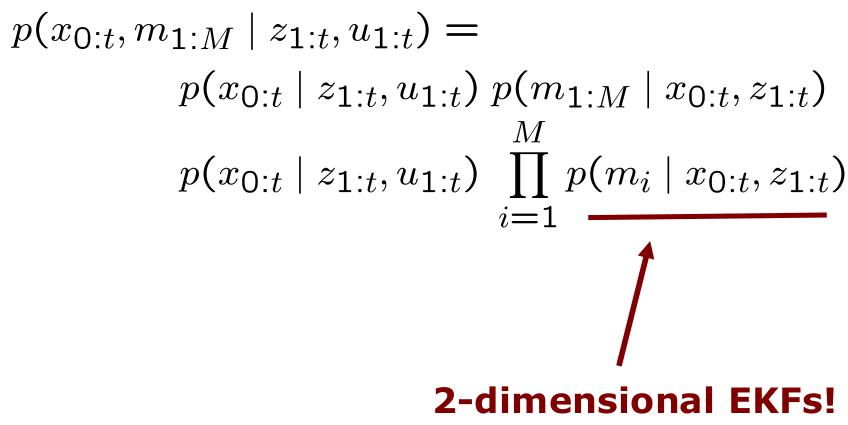
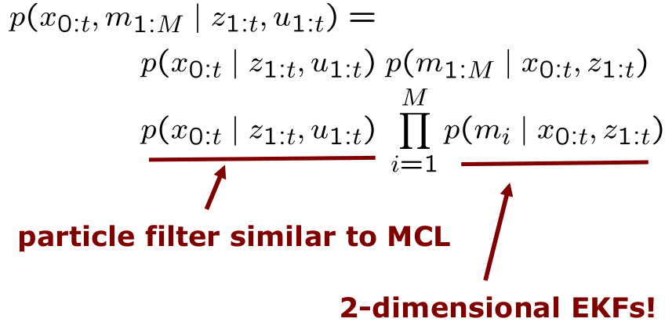

## Modelling the Robot's Path
- Sample-based representation for $p(x_{0:t}|z_{1:t}, u_{1:t})$
- Each sample is a path hypothesis
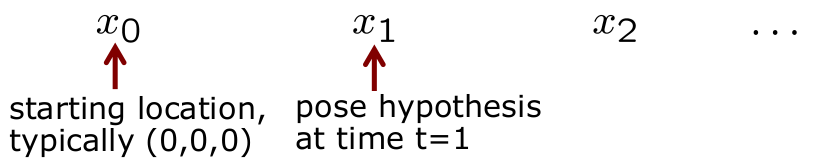
- Past poses of a sample are not revised
- No need to maintain past poses in the sample set

