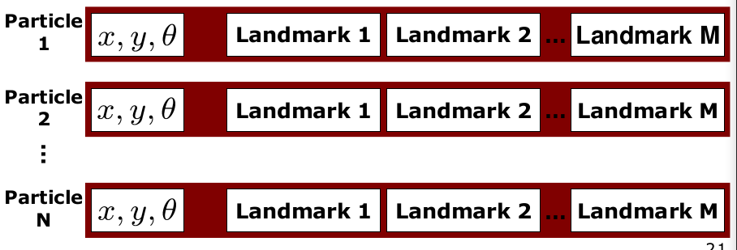
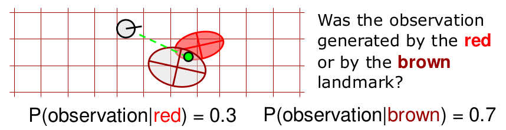

# FastSLAM - Feature-Based SLAM with Particle Filters

## Particle Filter
- Non-parametric recursive Bayes filter
- Posterior is represented by a set of weighted samples
- Can model arbitrary distributions
- Works well in low-dimensional spaces
- 3-Step procedure
	- Sampling from proposal
	- Importance weighting
	- Resampling

## Particle Filter Algorithm
1. Sample the particles from the proposal distribution
$$
x_t^{[j]} \sim \pi(x_t|\dots)
$$
2. Compute the importance weights
$$
w^{[j]}_t = \frac{target(x_t^{[j]})}{proposal(x_t^{[j]})}
$$
3. Resampling: Draw sample $i$ with probability $w_t^{[i]}$ and repeat $J$ times

## Particle Representation
- A set of weighted samples
$$
\mathcal{X} = \{ \langle x^{[i]}, w^{[i]} \rangle \}_{i=1,\dots,N}
$$
- Think of a sample as one hypothesis about the state
- For feature-based SLAM:
$$
x = (\underbrace{x_{1,t}}_{\text{poses}}, \underbrace{m_{1,x}, m_{1,y}, \dots, m_{M,x}, m_{M,y}}_{\text{landmarks}})^T
$$

## Dimensionality Problem
Particle filters are effective in low dimensional spaces as the likely regions of the state space need to be covered with samples
$$
x = \underbrace{(x_{1,t}, m_{1,x}, m_{1,y}, \dots, m_{M,x}, m_{M,y})^T}_{\text{high-dimensional}}
$$

### Can We Exploit Dependencies Between the Different Dimensions of the State Space?
$$
x_{1:t}, m_1, \dots, m_M
$$

### If  We Know the Poses of the Robot, Mapping is Easy!

### Key Idea

If we use the particle set only to model the robot's path, each sample is a path hypothesis. For each sample, we can compute an individual map of landmarks.

## Rao-Blackwellization
- Factorization to exploit dependencies between variables:
$$
p(a,b) = p(b|a)p(a)
$$
- If $p(b|a)$ can be computed efficiently, represent only $p(a)$ with samples and compute $p(b|a)$ for every sample
- The concept of this being that $b$ is considered the map and is high-dimensional, $a$ represents the particles of the robot trajectory and is low-dimensional
- Rather than computing $p(a,b)$ which is costly, we can focus on $p(b|a)$, sampling from $a$ which is much more efficient 

## Rao-Blackwellization for SLAM
- Factorisation of the SLAM posterior

## Revisit the Graphical Model

- Since the robot pose is known for each timestep, we can assume that each landmark $m_i$ is conditionally independent from each other.

## Landmarks are Conditionally Independent Given the Poses

**Landmark variables are all disconnected (i.e. independent) given the robot's path**

## Rao-Blackwellisation for SLAM
- Factorisation of SLAM posterior

- What this now means is that the probability can be now calculated via products of each landmark as shown below. Each probability is much lower in dimensionality than previously, hence saving heaps in computation

## Modelling the Robot's Path
- Sample-based representation for $p(x_{0:t}|z_{1:t}, u_{1:t})$
- Each sample is a path hypothesis

- Past poses of a sample are not revised
- No need to maintain past poses in the sample set

## FastSLAM
- Proposed by Montemerlo et al. in 2002
- Each landmark is represented by a $2\times2$ EKF
- Each particle therefore has to maintain $M$ individual EKFs

## FastSLAM - Action Update
- Below each robot pose represents a particle, and each landmark is represented by a $2\times2$ EKF filter
- This just uses the odometry model to draw up the next pose of the robot

## FastSLAM - Sensor Update
- Next step is taking our sensor data to update our belief, i.e. the importance weight
- Each particle predicts the landmarks at slightly different locations, where these points are then turned into importance weights
- Pay attention to how close the predicted yellow points are from the landmarks, this will determine the importance weights for the predictions of each particle
- After this, we can then update the map of each particle, along with its belief, as shown below

## Key Steps of FastSLAM 1.0
- Extend the path posterior by sampling a new pose for each sample
$$
x_t{[t]} \sim p(x_t | x_{t-1}^{[k]}, u_t)
$$
- Compute particle weight 
$$
w^{[k]} = |2\pi Q|^{-\frac{1}{2}}\exp\{-\frac{1}{2}(z_t - \hat{z}^{[k]})^T Q^{-1}(z_t - \hat{z}^{[k]})\}
$$
- $Q$ $\leftarrow$ measurement covariance
- $\hat{z}$ $\leftarrow$ exp. observation

- Update belief of observed landmarks (EKF update rule)
- Resample

## FastSLAM 1.0 - Part 1

## FastSLAM in Action

## The Weight is a Result From the Importance Sampling Principle
- Importance weight is given by the ratio of target and proposal in $x^{[k]}$
- See: importance sampling principle
$$
w^{[k]} = \frac{\text{target}(x^{[k]})}{\text{proposal}(x^{[k]})}
$$

## The Importance Weight
- The target distribution is
$$
p(x_{1:t}|z_{1:t}, u_{1:t})
$$
- The proposal distribution is
$$
p(x_{1:t}|z_{1:t-1}, u_{1:t})
$$
- Proposal is used step-by-step
$$
p(x_{1:t}|z_{1:t-1}, u_{1:t}) = \underbrace{p(x_t|x_{t-1}, u_t)}_{\text{from } \mathcal{X}_{t-1} \text{ to } \bar{\mathcal{X}}_t} \underbrace{p(x_{1:t-1}|z_{1:t-1}, u_{1:t-1})}_{\mathcal{X}_{t-1}}
$$

- Integrating over the pose of the observed landmark leads to

- This leads to

## FastSLAM 1.0 - Part 2

## Data Association Problem
- Which observation belongs to which landmark?
- If the robot is leaning a little more towards the right, it is more likely to be associated with the landmarks indicated by the red arrows
- If the robot is leaning a little more towards the left, it is more likely to be associated with the landmarks indicated by the blue arrows

- More than one possible association
- **Potential data associations depend on the pose of the robot**

## Particles Support for Multi-Hypotheses Data Association
- Decisions on a per-particle basis
- Robot pose **error** is factored out of data association decisions
- As shown below, the goodness of a particle is also attributed to its data association. These two particles below show good data association with the landmarks, however the particles a bit higher and lower will likely not have as good data association and will likely be filtered out in later iterations of the SLAM algorithm

## Per-Particle Data Association

- Two options for per-particle data association
	- Pick the most probable match
	- Pick an random association weighted by the observation likelihood
- If the probability for an assignment is too low, generate a new landmark

- Multi-modal belief
- Pose error is factored out of data association decisions
- **Simple but effective** data association
- Big **advantage of FastSLAM** over EKF

## Results - Victoria Park
- 4km traverse
- < 2.5 m RMS position error
- 100 particles

## Results (Sample Size)

## FastSLAM 1.0 Summary
- Use a particle filter to model the belief
- Factors the SLAM posterior into low-dimensional estimation problems
- Model only the robot's path by sampling
- Compute the landmarks given the path
- Per-particle data association
- No robot pose uncertainty in the per-particle data association

## FastSLAM Complexity - Simple Implementation
- Update robot particles based on the control
$$
O(N)
$$
- Incorporate an observation into the Kalman filters
$$
O(N)
$$
- Resample particle set
$$
O(NM)
$$
$$
\begin{align}
N &= \text{Number of particles} \\
M &= \text{Number of map features}
\end{align}
$$

## A Better Data Structure for FastSLAM

## FastSLAM Complexity
- Update robot particles based on the control
$$
O(N)
$$
- Incorporate an observation into the Kalman filters
$$
O(N \log M)
$$
- Resample particle set
$$
O(N \log M)
$$

## Memory Complexity

## FastSLAM 1.0
- FastSLAM 1.0 uses the motion model as the proposal distribution
$$
x_t^{[k]} \sim p(x_t|x_{t-1}^{[k]}, u_t)
$$
- **Is there a better distribution to sample from?**

## FastSLAM 1.0 to FastSLAM 2.0
- FastSLAM 1.0 uses the motion model as the proposal distribution
$$
x_t^{[k]} \sim p(x_t|x_{t-1}^{[k]}, u_t)
$$
- FastSLAM 2.0 **considers also the measurements during sampling**
- Especially useful if an accurate sensor is used (compared to the motion noise)

## FastSLAM 2.0 (Informally)
- FastSLAM 2.0 samples from 
$$
x_t^{[k]} \sim p(x_t | x_{1:t-1}^{[k]}, u_{1:t}, z_{1:t})
$$
- Results in a more peaked proposal distribution
- Less particles are required
- More robust and accurate
- But more complex...

## FastSLAM Problems
- How to determine the sample size?
- Particle deprivation, especially when closing (multiple loops)

## FastSLAM Summary
- Particle filter-based SLAM
- Rao-blackwellisation: model the robot's path by sampling and compute the landmarks given the poses
- Allow for per-particle data association
- FastSLAM 1.0 and 2.0 differ in the proposal distribution
- Complexity $O(N \log M)$

## FastSLAM Results
- Scales well (1 million + features)
- Robust to ambiguities in the data association 
- Advantages compared to the classical EKF approach (especially with non-linearities)