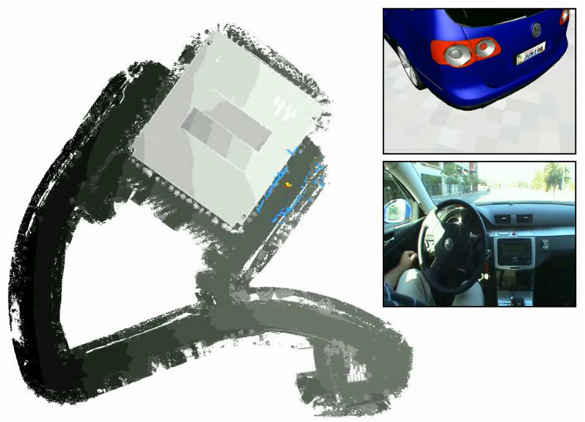

# SLAM Front-Ends
## Graph-Based SLAM
- Constraints connect the nodes through odometry and observations

- How to obtain the constraints?

## Interplay Between Front-End and Back-End

## Constraints From Matching
- Constraints can be obtained by matching observations

**Popular approaches**
- Dense scan-matching
- Feature-based matching
- Descriptor-based matching

## Where to Search for Matches?
- Consider uncertainty of the nodes with respect to the current one

## Note on the Uncertainty
- In graph-based SLAM, computing the uncertainty relative to A requires inverting the Hessian H
- Fast approximation by Dijkstra expansion ("propagate uncertainty along the shortest path in the graph")
- Conservative estimate

## Simple ICP-Based Approach for Laser-Based SLAM
- Estimate uncertainty of nodes relative to the current pose
- Sample poses in relevant area
- Apply Iterative Closest Point algorithm
- Evaluate match
- Accept match based on a threshold

## Problems
- ICP is sensitive to the intitial guess
- Local minima
- Inefficient sampling
- Ambiguities in the environment

### Examples

## Learning 3D Maps from Laser Data
- Robot that provides odometry
- Laser range scanner on a pan-tilt-unit

## Incremental 6D SLAM

## Aligning Consecutive Maps

- Let $u_{i_c}$ and $u'_{j_c}$ be corresponding points
- Find the parameters $R$ and $t$ which minimise the sum of the squared error
- ICP
$$
e(R, t) = \sum^C_{c=1}d(u_{i_c}, u'_{j_c})
$$
- ICP with additional knowledge
$$
e(R, t) = \underbrace{\sum^{C_1}_{c=1} d_v(u_{i_c}, u'_{j_c})}_{\text{vertical objects}} + \underbrace{\sum^{C_2}_{c=1}d(v_{i_c},v'_{j_c})}_{\text{traversable}} + \underbrace{\sum^{C_3}_{c=1}d(w_{i_c}, w'_{j_c})}_{\text{non-traversable}}
$$

## Online Estimated 3D Map

## Mapping with a Robotic Car
- 3D laser range scanner (Velodyne)
- Use map for autonomous driving

## Parking Garage

## Resulting Map

- Trajectory length of ~7,000m
- 1661 local 3D maps, cell size of 20cm x 20cm

## Map-Based Autonomous Parking

## Mapping with Arial Vehicles
- Flying vehicles equipped with cameras and an IMU

## Examples of Camera Images

## SURF Features
- Description vector of a local area in the image
- Descriptor is invariant to rotation and scale

## Determining the Camera Pose
**Wanted:** $x, y, z, \phi, \theta, \psi$ (roll, pitch, yaw)
- IMU determines roll and pitch accurately
- $x, y, z$ and the heading (yaw) have to be calculated based on the camera images
$\rightarrow$ 3D positions of **two** images features is sufficient to determine the stereo camera pose

## Feature Matching for Pose Estimation

## Camera Pose Estimation
1. Find possible matches (kd-tree)
2. Order matches by descriptor distance
	- Use two matches to calculate the camera position, start with the best one
	- Re-project all features accordingly to get a quality value about this pose
	- Repeat until satisfactory pose is found

## Finding Edges
- **Visual odometry**: Match features against $N$ previously observed ones
- **Localisation**: Match against features in the map in a given region around the odometry estimate (local search)
- **Loop closing**: Match a subset of the features against all map features. Match leads to a localisation in the subsequent steps

## Outdoor Example

## Resulting Trajectory

## Indoor Example

## Ground Truth

## System on a Blimp

## Problems
- ICP is sensitive to the initial guess
- Local minima
- Inefficient sampling
- **Ambiguities in the environment**

- Dealing with ambiguous areas in an environment is essential for robustly operating robots

## Ambiguities - Global Ambiguity
- $B$ is inside the uncertainty ellipse of $A$
- Are $A$ and $B$ the same place?

- $A$ and $B$ might not be the same place

- $A$ and $B$ are not the same place

## Ambiguities - Global Sufficiency
- $B$ is inside the uncertainty ellipse of $A$
- There is no other possibility for a match

## Ambiguities - Local Ambiguity
- "Picket Fence Problem": largely overlapping local matches

## Global Match Criteria
1. Global Sufficiency: There is no possible disjoint match ("A is not somewhere else entirely")
2. Local unambiguity: There are no overlapping matches ("$A$ is either here or somewhere else entirely")
**Both need to be satisfied for a match**

## Olson's Proposal

## Topological Grouping
- Group together topologically-related pose-to-pose matches to form local matches
- Each group asks a "topological" question: Do two local maps match?

## Locally Unambiguous Matches
**Goal:**

- Correct pose-to-pose hypotheses must agree with each other
- Incorrect pose-to-pose hypotheses tend to disagree with each other
- Find subset of self-consistent of hypotheses
- Multiple self-consistent subsets, are an indicator for a "picket fence"!

## Do Two Hypotheses Agree?
- Consider two hypotheses $i$ and $j$ in the set:

## Idea of Olson's Method
- Form a pair-wise consistency matrix $A$

## Single Cluster Graph Partitioning
- Idea: Identify the subset of consistent hypotheses
- Find the best **indicator vector** (represents a subset of the hypotheses)

- Identify the subset of hypotheses that is maximally self-consistent
- Which subset $v$ has the **greatest average pair-wise consistency** $\lambda$?

- Densest subgraph problem

## Consistent Local Matches
- We want find $v$ that maximises $\lambda(v)$ 
$$
\lambda(v) = \frac{v^TAv}{v^Tv}
$$
- Treat as continuous problem
- Derive and set to zero
$$
\frac{\partial \lambda (v)}{\partial v} = 0
$$
- Which leads to (for symmetric $A$)
$$
\frac{\partial \lambda (v)}{\partial v} = 0 \iff Av = \lambda v
$$

## Consistent Local Matches
- $Av = \lambda v$: Eigenvalue/vector problem
- The dominant eigenvector $v_1$ maximises
$$
\lambda(v) = \frac{v^T A v}{v^T v}
$$
- The hypothesis represented by $v_1$ is maximally self-consistent subset
- If $\lambda_1/\lambda_2$ is large (e.g., $\lambda_1/\lambda_2 > 2$) then $v_1$ is regarded as locally unambiguous
- Discretise $v_1$ after maximisation

## Global Consistency
- **Correct method**: Can two copies of $A$ be arranged so that they both fit inside the covariance ellipse?
- **Approximation**: Is the dimension of $A$ at least half the length of the dominant axis of the covariance ellipse?
- Potential failures for narrow local matches

## Olson's Proposal
