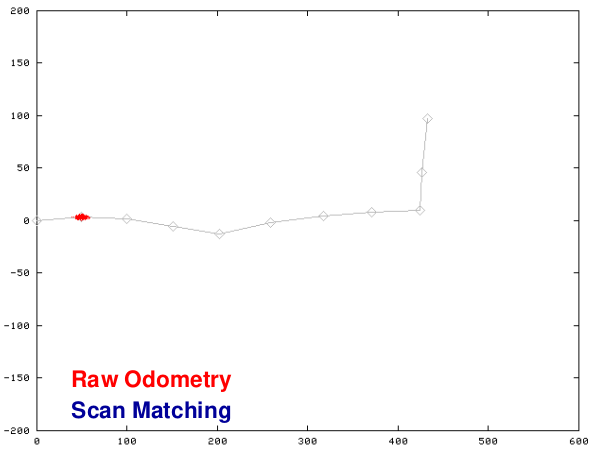

# Grid-Based FastSLAM
## Motivation
- So far, we addressed landmark-based SLAM (KF-based SLAM, FastSLAM)
- We learned how to build grid maps assuming "known poses"

**Today: SLAM for building grid maps**

## Mapping With Raw Odometry

## Observation
- **Assuming known poses fails!**

#### Questions
- Can we solve the SLAM problem if no pre-defined landmarks are available?
- Can we use the ideas of FastSLAM to build grid maps?

## Rao-Blackwellisation for SLAM
- Factorisation of the SLAM posterior

## Grid-Based SLAM
- As with landmarks, the map depends on the poses of the robot during data acquisition
- If the poses are known, grid-based mapping is easy ("mapping with known poses")

## A Graphical Model for Grid-Based SLAM

## Grid-Based Mapping with Rao-Blackwellisation Particle Filters
- Each particle represents a possible trajectory of the robot
- Each particle maintains its own map
- Each particle updates it upon "mapping with known poses"

## Particle Filter Example

## Performance of Grid-Based FastSLAM 1.0

## Problem
- Too many samples are needed to sufficiently model the motion noise
- Increasing the number of samples is difficult as each map is quite large

- **Idea**: Improve the pose estimate **before** applying the particle filter

## Pose Correction Using Scan-Matching
- Maximise the likelihood of the **current** pose and map relative to the **previous** pose and map

## Motion Model for Scan Matching

## Mapping Using Scan Matching

## Grid-Based FastSLAM with Improved Odometry
- Scan-matching provides a **locally consistent** pose correction
- Pre-correct short odometry sequences using scan-matching and use them as input to FastSLAM
- Fewer particles are needed, since the error in the input is smaller

## Graphical Model for Mapping with Improved Odometry

## Grid-Based FastSLAM with Scan-Matching

## Summary so far...
- Approach to SLAM that combines scan matching and FastSLAM
- Scan matching to generate virtual 'high quality' motion commands
- Can be seen as an ad-hoc solution to an improved proposal distribution

## What's Next?
- Compute an improved proposal that considers the most recent observation
$$
x_t^{[k]} \sim p(x_t | x_{1:t-1}^{[k]}, u_{1:t}, z_{1:t})
$$
**Goals:**
- More precise sampling
- More accurate maps
- Less particles needed

## The Optimal Proposal Distribution

## Proposal Distribution

## Gaussian Proposal Distribution

## Estimating the Parameters of the Gaussian for Each Particle
$$
\begin{align}
\mu^{[i]} &= \frac{1}{\eta}\sum^K_{j=1}x_j \tau(x_j) \\
\Sigma^{[i]} &= \frac{1}{\eta}\sum^K_{j=1}(x_j - \mu^{[i]})(x_j - \mu^{[i]})^T \tau(x_j)
\end{align}
$$
$x_j$ are the points sampled around the result of the scan matcher

## Gaussian Proposal Distribution

## The Importance Weight

## Improved Proposal
- The proposal adapts to the structure of the environment

## Resampling
- Resampling at each step limits the "memory" of our filter
- Suppose we lose each time 25% of the particles, this may lead to:

- Goal: Reduce the resampling actions

## Selective Resampling
- Resampling is necessary to achieve convergence
- Resampling is dangerous, since important samples might get lost ("particle depletion")
- Resampling makes only sense if particle weights differ significantly
- **Key question: When to resample?**

## Number of Effective Particles
- Empirical measure of how well the target distribution is approximately by samples drawn from the proposal
$$
n_{eff} = \frac{1}{\sum_i(w_t^{[i]})^2}
$$
- $n_{eff}$ describes "the inverse variance of the **normalized** particle weights"
- For equal weights, the sample approximation is close to the target

## Resampling with $n_{eff}$
- If our approximation is close to the target, no resampling is needed
- We only resample when $n_{eff}$ drops below a  given threshold ($N/2$)
$$
\frac{1}{\sum_i(w_t^{[i]})^2} \overset{?}{<} N / 2
$$
- Note: weights need to be normalized 

## Typical Evolution of $n_{eff}$

## Intel Lab
- **15 particles**
- Four times faster than real-time P4, 2.8GHz
- 5cm resolution during scan matching
- 1cm resolution in final map

## Outdoor Campus Map
- **30 particles**
- $250 \times 250m^2$
- 1.75km (odometry)
- 30cm resolution in final map

## MIT Killian Court

- The **"infinite-corridor-dataset"** at MIT

## Real World Application
- This guy uses a similar technique

## Problems of Gaussian Proposals
- Gaussians are uni-model distributions
- In case of loop-closures, the likelihood function might be multi-modal

## Gaussian or Non-Gaussian?
- Statistical test to check whether or not sample a generated from a Gaussian
- Anderson-Darling test (based on the cumulative density function)
- Difference between the Gaussian and the optimal proposal via KLD

## Is a Gaussian an Accurate Choice for the Proposal?

## Problems of Gaussian Proposals
- Multi-modal likelihood function can cause filter divergence

## Efficient Multi-Modal Sampling
- Approximate the likelihood in a better way!

- Sample from odometry first and the use this as the start point for scan matching

## The Two-Step Sampling Works!

## Proposal Error Evaluation

## Effect of Two-Step Sampling
- Allows for better modeling multi-modal likelihood functions (high KLD values do not occur)
- For uni-modal cases, identical results
- Minimal computational overhead

## Gaussian Proposal: Yes or No?
- Gaussian allow for efficient sampling 
- Problematic in multi-modal cases
- Laser-Based SLAM: 3-6% multi-modal distribution (for the datasets here)
- Gaussian proposals can lead to divergence
- Two-step sampling process overcomes this problem effectively and efficiently

## Conclusion 
- The ideas of FastSLAM can also be applied in the context of grid maps
- Improved proposals are essential 
- Similar to scan-matching on a per-particle base
- Selective resamples reduce the risk of particle depletion
- Substantial reduction of the required number of particles