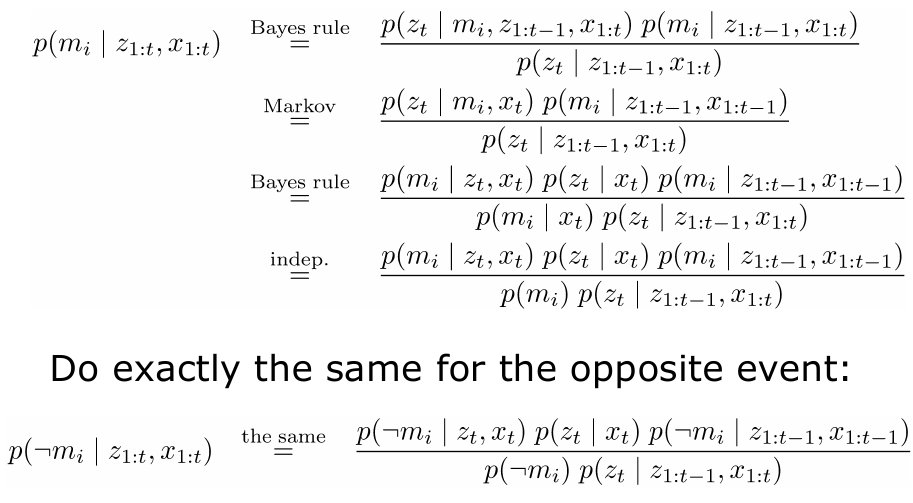
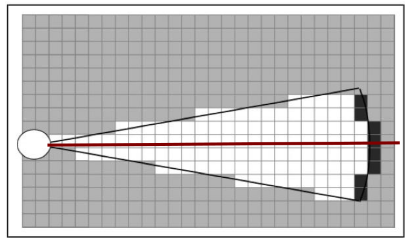
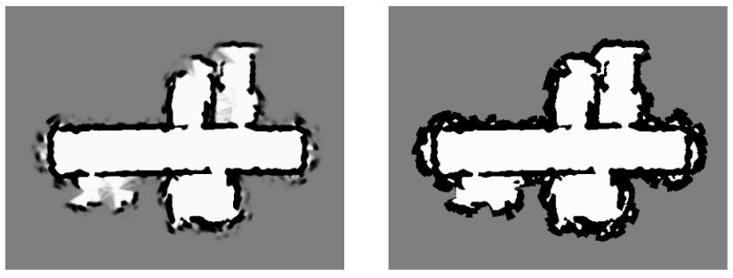
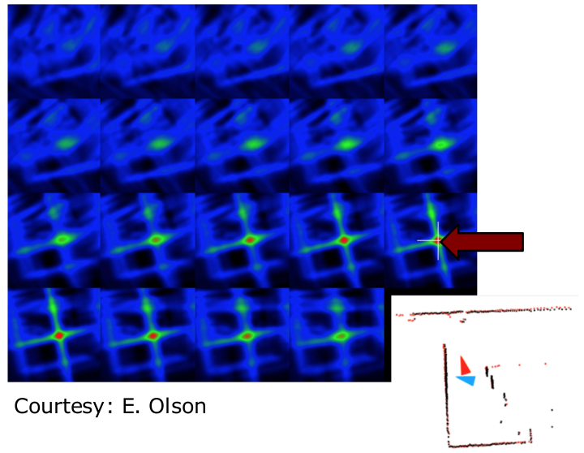

# Grid Maps
## Features vs. Volumetric Maps

## Features
- So far, we only used feature maps
- Natural choice for Kalman filter-based SLAM systems
- Compact representation
- Multiple feature observations improve the landmark position estimate (EKF)

## Grid Maps
- Discretise the world into cells
- Grid structure is rigid
- Each cell is assumed to be occupied or free space
- Non-parametric model
- Large maps require substantial memory resources
- Do not rely on a feature detector

## Example

## Assumption 1
- The area that corresponds to a cell is either completely free or occupied

## Representation
- Each cell is a **binary random variable** that models the occupancy

## Occupancy Probability
- Each cell is a **binary random variable** that models the occupancy
- Cell is occupied: $p(m_i)=1$ 
- Cell is not occupied: $p(m_i)=0$
- No knowledge: $p(m_i)=0.5$

## Occupancy Probability Example
- Each cell is a **binary random variable** that models the occupancy

## Assumption 2
- The world is **static** (most mapping systems make this assumption)

## Assumption 3
- The cells (the random variables) are **independent** of each other

## Joint Distribution

## Representation
- The probability distribution of the map is given by the product over the cells

## Example A

## Example B

## Estimating a Map From Data
- Given sensor data $z_{1:t}$ and the poses $x_{1:t}$ of the sensor, estimate the map

## Static State Binary Bayes Filter

## From Ratio to Probability
- We can easily turn the ration into the probability
$$
\begin{align}
\frac{p(x)}{1-p(x)} &= Y \\
p(x) &= Y - Y p(x) \\
p(x)(1+Y) &= Y \\
p(x) &= \frac{Y}{1+Y} \\
p(x) &= \frac{1}{1+\frac{1}{Y}}
\end{align}
$$

## From Ratio to Probability
- Using $p(x) = [1+Y^{-1}]^{-1}$ directly leads to

$$
p(m_i|z_{1:t},x_{1:t}) = \Bigg[1 + \frac{1-p(m_i|z_t,x_t)}{p(m_i|z_t, x_t)}\frac{1-p(m_i|z_{1:t-1}, x_{1:t-1})}{p(m_i|z_{t-1},x_{1:t-1})}\frac{p(m_i)}{1-p(m_i)}\Bigg]^{-1}
$$
**For reasons of efficiency, one performs the calculations in the log odds notation**

## Log Odds Notation
- The log odds notation computes the logarithm of the ratio of probabilities
$$
p(m_i|z_{1:t},x_{1:t}) = \underbrace{\frac{p(m_i|z_t,x_t)}{1-p(m_i|z_t, x_t)}}_{\text{uses }z_t}\underbrace{\frac{p(m_i|z_{1:t}, x_{1:t-1})}{1-p(m_i|z_{1:t-1}, x_{1:t-1})}}_{\text{recursive term}}\underbrace{\frac{1-p(m_i)}{p(m_i)}}_{\text{prior}}
$$
$$
\rightarrow l(m_i|z_{1:t}, x_{1:t}) = \log\Bigg(\frac{p(m_i|z_{1:t}, x_{1:t})}{1-p(m_i|z_{1:t}, x_{1:t})}\Bigg)
$$
- Log odds ratio is defined as
$$
l(x) = \log \frac{p(x)}{1-p(x)}
$$
- and with the ability to retrieve $p(x)$
$$
p(x) = 1 - \frac{1}{1+ \exp l(x)}
$$

## Occupancy Mapping in Log Odds Form
- The product turns into a sum
$$
l(m_i|z_{1:t},x_{1:t}) = \underbrace{l(m_i|z_{t}, x_t)}_{\text{inverse sensor model}} + \underbrace{l(m_i|z_{1:t-1},x_{1:t-1})}_{\text{recursive term}} - \underbrace{l(m_i)}_{\text{prior}}
$$
- or in short
$$
l_{t,i} = \text{inv\_sensor\_model}(m_i, x_t, z_t) + l_{t-1,i} - l_0
$$

## Occupancy Mapping Algorithm

- Moravec and Elfes proposed occupancy grid mapping in the mid 80'ies
- Developed for noisy sonar sensors
- Also called "mapping with known poses"

## Inverse Sensor Model for Sonar Range Sensors

In the following, consider the cells along the optical axis (red line)

## Occupancy Value Depending on the Measured Distance

## Example: Incremental Updating of Occupancy Grids

## Resulting Map Obtained with 24 Sonar Range Sensors

## Resulting Occupancy and Maximum Likelihood Map

The maximum likelihood map is obtained by rounding the probability for each cell to 0 or 1.

## Inverse Sensor Model for Laser Range Finders

## Occupancy Grids From Laser Scans to Maps

## Example: MIT CSAIL $3^{rd}$ Floor

## Occupancy Grid Map Summary
- Occupancy grid maps discretise the space into independent cells
- Each cell is a binary random variable estimating if the cell is occupied
- Static state binary Bayes filter per cell 
- Mapping with known poses is easy 
- Log odds model is fast to compute
- No need for predefined features

# Grid Mapping Meets Reality...
## Mapping With Raw Odometry

## Incremental Scan Alignment
- Motion is noisy, we cannot ignore it
- Assuming known poses fails!
- Often, the sensor is rather precise

- Scan-matching tries to incrementally align two scans or a map to a scan, without revising the past/map

## Pose Correction Using Scan-Matching
Maximise the likelihood of the current pose relative to the **previous** pose and map

## Incremental Alignment

## Various Different Ways to Realise Scan-Matching
- Iterative closest point (ICP)
- Scan-to-scan
- Scan-to-map
- Map-to-map
- Feature-based
- RANSAC for outlier rejection
- Correlative matching
- ...

## Example: Aligning Two 3D Maps

## With and Without Scan-Matching

## Motion Model for Scan Matching

## Scan Matching Summary
- Scan-matching improves the pose estimate (and thus mapping) substantially
- Locally consistent estimates
- Often scan-matching is not sufficient to build a (large) consistent map