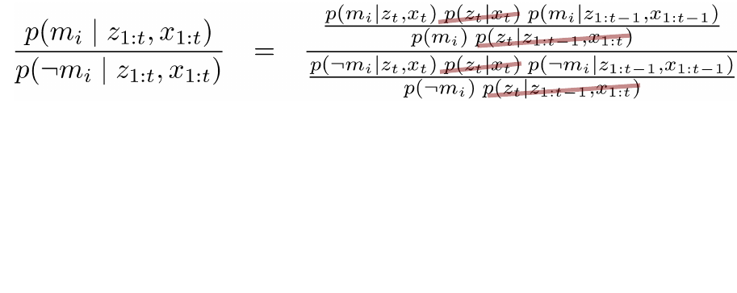
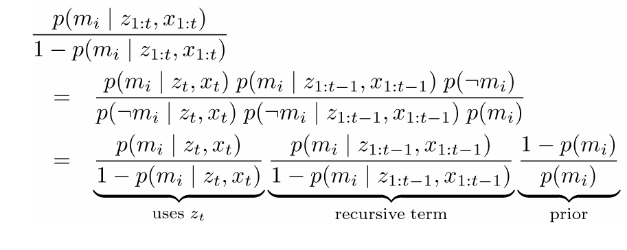

# Grid Maps
## Features vs. Volumetric Maps

## Features
- So far, we only used feature maps
- Natural choice for Kalman filter-based SLAM systems
- Compact representation
- Multiple feature observations improve the landmark position estimate (EKF)

## Grid Maps
- Discretise the world into cells
- Grid structure is rigid
- Each cell is assumed to be occupied or free space
- Non-parametric model
- Large maps require substantial memory resources
- Do not rely on a feature detector

## Example

## Assumption 1
- The area that corresponds to a cell is either completely free or occupied

## Representation
- Each cell is a **binary random variable** that models the occupancy

## Occupancy Probability
- Each cell is a **binary random variable** that models the occupancy
- Cell is occupied: $p(m_i)=1$ 
- Cell is not occupied: $p(m_i)=0$
- No knowledge: $p(m_i)=0.5$

## Occupancy Probability Example
- Each cell is a **binary random variable** that models the occupancy

## Assumption 2
- The world is **static** (most mapping systems make this assumption)

## Assumption 3
- The cells (the random variables) are **independent** of each other

## Joint Distribution

## Representation
- The probability distribution of the map is given by the product over the cells

## Example A

## Example B

## Estimating a Map From Data
- Given sensor data $z_{1:t}$ and the poses $x_{1:t}$ of the sensor, estimate the map

## Static State Binary Bayes Filter

