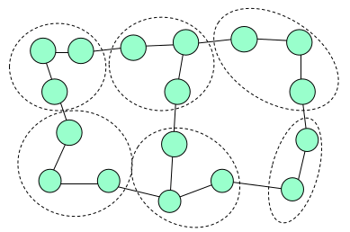

# Hierarchical Pose-Graphs for Online Mapping

## Graph-Based SLAM
- Constrainsts connect the poses of the robot while it is moving
- Constraints are inherently uncertain

- Observing previously seen areas generates constraints between non-successive poses

- Use a **graph** to represent the problem
- Every **node** in the graph corresponds to a pose of the robot during mapping
- Every **Edge** between two nodes corresponds to a spatial constraint between them
- **Graph-Based SLAM**: Build the graph and find a configuration that minimise the error introduced by the constraints

## Front-End and Back-End
- Front-end extracts constraints from the sensor data (data association!)
- Back-end optimises the pose-graph to reduce the error introduced by the constraints

$\rightarrow$ Intermediate solutions are needed to make good data associations

## Hierarchical Pose-Graph

"There is no need to optimise the whole graph when a new observation is obtained"

## Motivation
- SLAM front-end seeks for loop-closures
- Requires to compare observations to all previously obtained ones
- In practice, limit search to areas in which the robot is likely to be
- This requires to know **in which part of the graph to search for data associations**

## Hierarchical Approach
- **Insight**: to find loop closing points, one does not need the perfect global map
- **Idea**: correct only the core structure of the scene, not the overall graph
- The hierarchical pose-graph is a sparse approximation of the original problem
- It exploits the facts that in SLAM
	- Robot moved through the scene and it did not "teleport" to locations
	- Sensors have a limited range

## Key Idea of the Hierarchy
- Input is the dense graph

- Group the nodes of the graph based on their local connectivity

- **For each group select one node as a "representative"**

- The representatives are the nodes in a new sparsified graph (upper level)

- The representatives are the nodes in a new sparsified graph (upper level)
- Edges of the sparse graph are determined by the connectivity of the groups of nodes
- The parameters of the sparse edges are estimated via local optimization
- **Process is repeated recursively**
- Only the upper level of the hierarchy is optimised completely

- The changes are propagated to the bottom levels only close to the current robot position
- Only part of the graph is relevant for finding constraints

## Construction of the Hierarchy
- When and how to generate a new group?
	- A (simple) distance-based decision
	- The first nodes of a new group is the representative
- When to propagate information downwards?
	- Only when there are inconsistencies?
- How to construct an edge in the sparsified graph?
- How to propagate information downwards?

## Determining Edge Parameters
- Given two connected groups
- How to compute a virtual observation $z$ and the information and the information matrix $\Omega$ for the new edge?

- Optimise the sub-groups independently from the rest

- The observation is the relative transformation between the two representatives

- The information matrix is computed from the diagonal block of the matrix $H$ 

## Propagating Information Downwards
- All representative are nodes from the lower (bottom) level

- Information is propagated downwards by transforming the group at the lower level using a rigid body transformation

- Only if the lower level becomes inconsistent, optimise at the lower level

## For the Best Possible Map...
- Run the optimisation on the lowest level (at the end)
- For offline processing with all constraints, the hierarchy helps convergence faster in case of large errors
- In the case, one pass up the tree (to construct the edges) followed by one pass down the tree is sufficient

## Stanford Garage

- Parking garage at Stanford University
- Nested loops, trajectory of ~7000m

## Stanford Garage Result

- Parking garage at Stanford University
- Nested loops, trajectory of ~7000m

## Consistency
- How well does the top level in the hierarchy represent the original input?
- Probability mass of the marginal distribution in the highest level vs. the one of the true estimate (original problem, lowest level)

