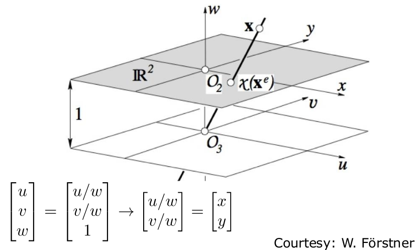
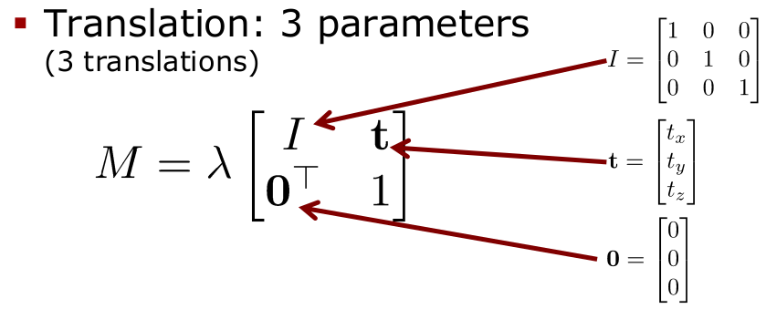
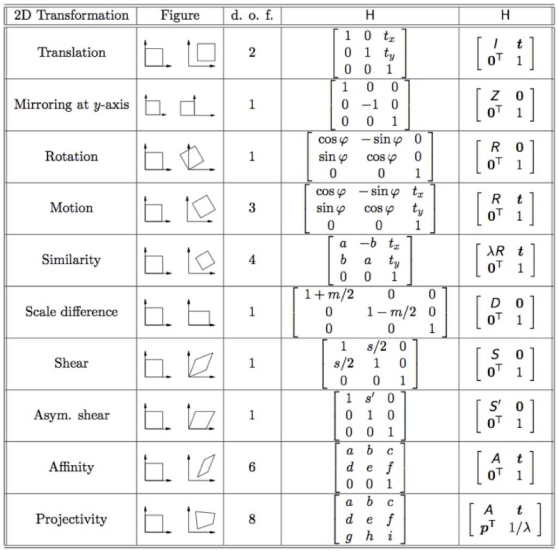

# A Short Introduction to Homogeneous Coordinates
## Motivation
- Cameras generate a projected image of the world
- Euclidean geometry is suboptimal to describe the central projection
- In Euclidean geometry, the math can get difficult
- Projective geometry is an alternative algebraic representation of geometric objects and transformations
- Math becomes simpler

## Projective Geometry
- Projective Geometry does not change the geometric relations
- Computations can also be done in Euclidean geometry (but more difficult)

## Homogeneous Coordinates
- H.C. are a system of coordinates used in projective geometry
- Formulas involving H.C. are often simpler than in the Cartesian world
- Points at infinity can be represented using finite coordinates
- A single matrix can represent affine transformations and projective transformations

- H.C. are a system of coordiantes used in projective geometry
- Formulas involving H.C. are often simpler than in the Cartesian world
- Points at infinity can be represented using finite coordinates
- **A single matrix can represent affine transformations and projective transformations**

## Homogeneous Coordinates
**Definition**
- The representation $x$ of a geometric object is homogeneous if $x$ of a geometric object is homogeneous if $x$ and $\lambda x$ represent the same object for $\lambda \neq 0$ 

**Example**
$$
\begin{bmatrix}
   u \\ 
   v \\
   w
\end{bmatrix}
= 
\begin{bmatrix}
	wx \\
	wy \\
	w
\end{bmatrix}
=
\begin{bmatrix}
	x \\
	y \\ 
	1
\end{bmatrix}
$$

## From Homogeneous to Euclidean Coordinates
**Homogeneous**
$$
x = 
\begin{bmatrix}
u \\
v \\
w
\end{bmatrix}
=
\begin{bmatrix}
wx \\
wy \\
w
\end{bmatrix}
=
\begin{bmatrix}
x \\
y \\
1
\end{bmatrix}
$$
**Euclidean**
$$
\begin{bmatrix}
u \\
v \\
w
\end{bmatrix}
=
\begin{bmatrix}
u / w \\
v / w \\
1
\end{bmatrix}
\rightarrow
\begin{bmatrix}
u/w \\
v/w
\end{bmatrix}
=
\begin{bmatrix}
x \\
y
\end{bmatrix}
$$

## Center of the Coordinate System
$$
O_2 = 
\begin{bmatrix}
0 \\
0 \\
1
\end{bmatrix} \ \ \ \ \ \ \ \ \ \ \ \ \ \ \ \ \ \ \ \ \  \
O_3 = 
\begin{bmatrix}
0 \\
0 \\
0 \\
1
\end{bmatrix}
$$

## Infinitively Distant Objects
- It is possible to explicitly model infinitively distant points with finite coordinates

$$
x_{\infty} = 
\begin{bmatrix}
u \\
v \\
0
\end{bmatrix}
$$

- Great tool when working with bearing-only sensors such as cameras

## 3D Points
- Analogous for 3D points
$$
x = \overset{homogeneous}{
\begin{bmatrix}
u \\
v \\
w \\
t
\end{bmatrix}
}
=
\begin{bmatrix}
u/t \\
v/t \\
w/t \\
1
\end{bmatrix}
\rightarrow
\overset{Euclidean}{
\begin{bmatrix}
u/t \\
v/t \\
w/t
\end{bmatrix}
}
$$
## Transformations
- A projective transformation is an invertible linear mapping
$$
x' = Mx
$$
### Important Transformations ($\mathbb{P}^3$)
- General projective mapping
$$
x' = \underset{4 \times 4}{M}x
$$
- Translation (3 translations): 3 parameters

- Rotation (3 rotation): 3 parameters

## Recap - Rotation Matrices
$$
R^{2D}(\theta) =
\begin{bmatrix}
\cos(\theta) & -\sin(\theta) \\
\sin(\theta) & \cos(\theta)
\end{bmatrix}
$$
$$
R_x^{3D}(\omega) = 
\begin{bmatrix}
1 & 0 & 0 \\
0 & \cos(\omega) & -\sin(\omega) \\
0 & \sin(\omega) & \cos(\omega)
\end{bmatrix}
$$
$$
R_y^{3D} = 
\begin{bmatrix}
\cos(\theta) & 0 & \sin(\phi) \\
0 & 1 & 0 \\
-\sin(\phi) & 0 & \cos(\phi)
\end{bmatrix}
$$
$$
R_z^{3D}(k) = 
\begin{bmatrix}
\cos(k) & -\sin(k) & 0 \\
\sin(k) & \cos(k) & 0 \\
0 & 0 & 1
\end{bmatrix}
$$
$$
R^{3D}(\omega, \phi, k) = R_z^{3D}(k)R_y^{3D}(\phi)R_x^{3D}(\omega)
$$
## Important Transformations ($\mathbb{P}^3$)
- Rotation (3 rotation): 3 parameters
$$
M = 
\begin{bmatrix}
R & 0 \\
0^T & 1
\end{bmatrix}
$$
- Rigid body transformation (3 translation + 3 rotation): 6 params
$$
M = \lambda
\begin{bmatrix}
R & t \\
0^T & 1
\end{bmatrix}
$$
- Similarity transformation (3 trans + 3 rot + 1 scale): 7 params
$$
M = \lambda
\begin{bmatrix}
mR & t \\
0^T & 1
\end{bmatrix}
$$
- Affine transformation (3 trans + 3 rot + 3 scale + 3 sheer): 12 parameters
$$
M = \lambda
\begin{bmatrix}
A & t \\
0^T & 1
\end{bmatrix}
$$
## Transformations in $\mathbb{P}^2$

## Transformations
- Inverting a transformation
$$
x' = Mx
$$
$$
x = M^{-1}x'
$$
- Chain transformations via matrix products (not commutative)
$$
x' = M_1M_2x
$$
$$
\ \ \neq M_2M_1x
$$

## Motions
- We will express motions (rotations and translations) using H.C.
$$
M = \lambda
\begin{bmatrix}
R & t \\
0^T & 1
\end{bmatrix}
$$
- Chaining transformations via matrix products (not commutative)
$$
x' = M_1M_2x
$$
$$
 \ \ \neq M_2M_1x
$$