## What is Robot Mapping?
- **Robot** - a device, that moves through the environment
- **Mapping** - modelling the environment

## Related Terms
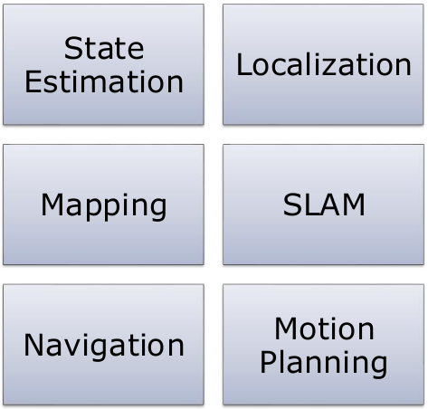

## What is SLAM?
- Computing the robot's poses and the map of the environment at the same time

- **Localization**: estimating the robot's location
- **Mapping**: building a map
- **SLAM**: building a map and localising the robot simultaneously

### Localisation Example
- Estimate the robot's poses given landmarks
- Stars = landmarks, black circles = robot pose
- The offsets in the robot pose represent that there was likely some unexpected events that occurred during the robot's movement.
- The small corrections can be noticed when the robot records the landmark, until it is properly corrected at the end.
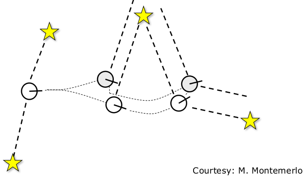

### Mapping Example
- Estimate the landmarks given the robot's poses
- This is similar as the above example, but it is showing the error in the sensors when they record landmarks as the robot moves
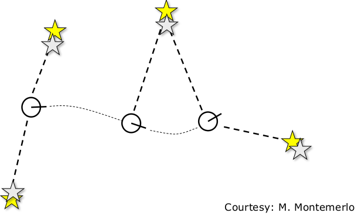

### SLAM Example
- Estimate the robot's poses and the landmarks at the same time
- Combines both examples above into one
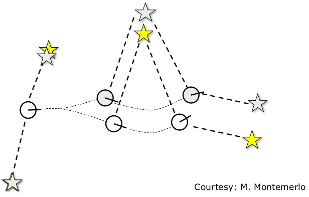

## The SLAM Problem
- SLAM is a **chicken-or-egg** problem:
	- A map is needed for localisation and
	- A pose estimate is needed for mapping
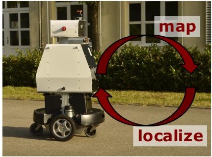

## SLAM is Relevant
- It is considered a fundamental problem for truly autonomous robots
- SLAM is the basis for most navigation systems
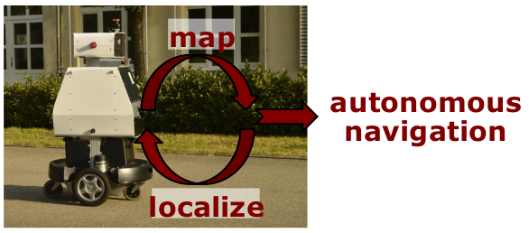

## SLAM Applications
- SLAM is central to a range of indoor, outdoor, air and underwater applications for both manned and autonomous vehicles.

**Examples**:
- At home: vacuum cleaner, lawn mower
- Air: surveillance with unmanned air vehicle
- Underwater: reef monitoring
- Underground: exploration of mines
- Space: terrain mapping for localisation

## SLAM Applications
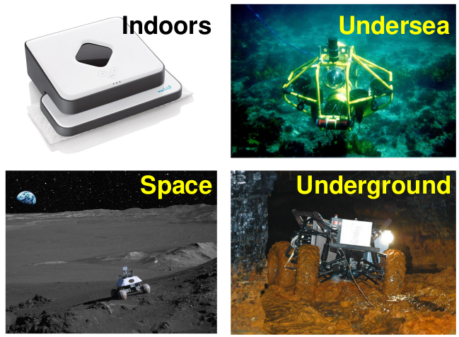

## Definition of the SLAM Problem
**Given**
- The robot's controls
	$u_{1:T} = \{u_1, u_2, u_3, ..., u_T\}$
- Observations
	$z_{1:T} = \{z_1, z_2, z_3, ..., z_T\}$
**Wanted**
- Map of the environment
	$m$
- Path of the robot
	$x_{0:T} = \{x_0, x_1, x_2, ..., x_T\}$

## Probabilistic Approaches
- Uncertainty in the robot's motions and observations
- Use the probability theory to explicitly represent the uncertainty
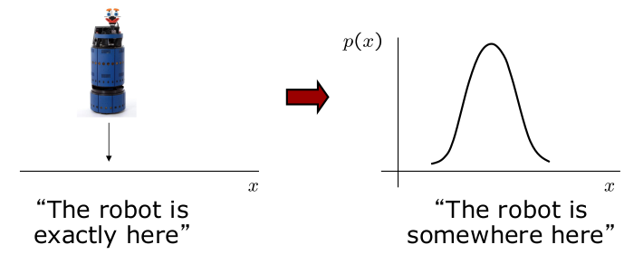

## In the Probabilistic World
Estimate the robot's path and the map
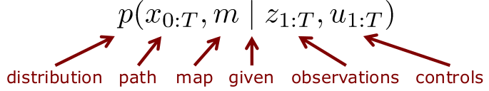

## Graphical Model
- In the below graph, nodes that point to other nodes means that these predecessor nodes influence the successor nodes
- $t$ is considered a timestep, and thus left to right represents time
- As mentioned above, the unknown nodes which we are searching for are the map $m$ and the localisation nodes $x$
- As can be seen in the below diagram, the unknown nodes influence the values of the estimated pose and control nodes
- These can be considered as conditional probabilities to the map and localisation nodes
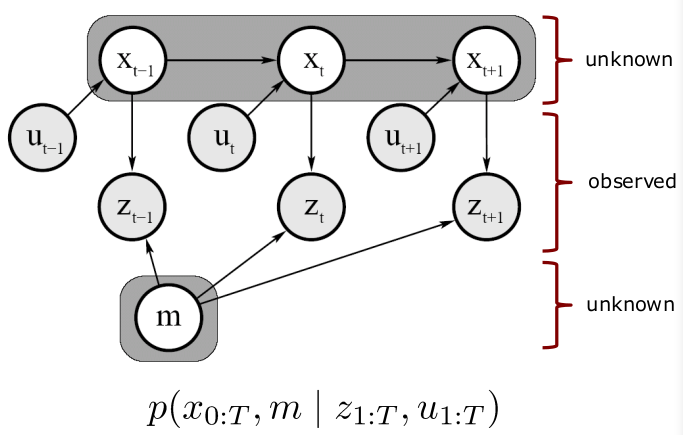

## Full SLAM vs. Online SLAM
- Full SLAM estimates the entire path
$$p(x_{0:T},m|z_{1:T},u_{1:T})$$
- Online SLAM seeks to recover only the most recent pose
$$p(x_t,m|z_{1:t}.u_{1:t})$$
### Graphical Model of Online SLAM
- Online SLAM is only interested in the last $x$ nodes and the map $m$
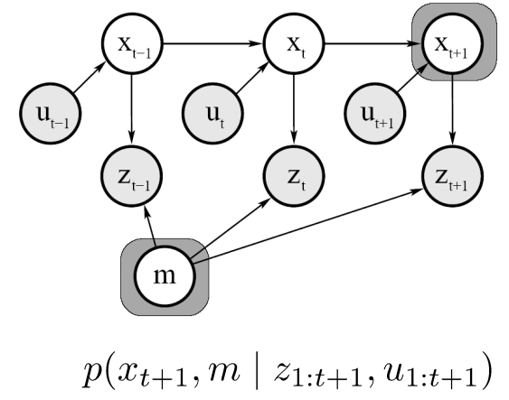

### Online SLAM
- Online SLAM means marginalising out the previous poses
$$p(x_t,m|z_{1:t},u_{1:t}) = \int ... \int p(x_{0:t}, m|z_{1:t},u_{1:t})dx_{t-1}...dx_0$$
- Integrals are typically solved recursively, one at a time
- By performing this, we are essentially removing these variables from the calculation at the current timestep

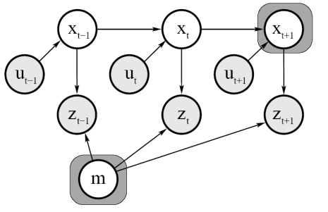
$$p(x_{t+1}, m|z_{1:t+1},u_{1:t}) = \int ... \int p(x_{0:t+1},m|z_{1:t+1},u_{t:t+1})dx_t ... dx_0$$
This is the equivalent of doing this rule:
$$
p(A,B) = P(A) - \int_B  P(A,B)dB
$$
## Why is SLAM a Hard Problem?
1. Robot path and map are both **unknown**
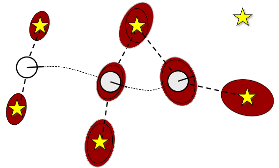
2. Map and pose estimates correlated

- The **mapping between observations and the map is unknown**
- Picking **wrong** data associations can have **catastrophic** consequences (divergence)
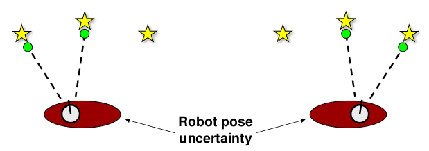

## Taxonomy of the SLAM Problem
### Volumetric vs. feature-based SLAM
- Volumetric will provide information about the physical structures of the map (top right photo). It can also be represented as occupancy maps, where white means unoccupied, black means occupied and grey means unknown (bottom left photo)
- Feature-based represent distinct landmarks in their environment, as shown in the right photo below.
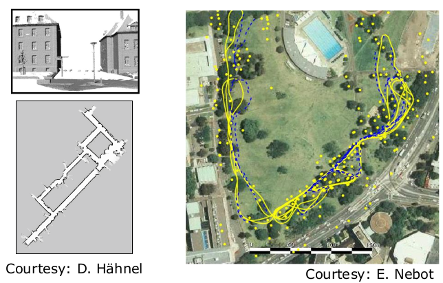

### Topologic vs. Geometric Maps
- Topologic maps represent the relationships between different places, a good example is looking at the metro lines in Paris (as shown below on the left). This map is not geographically accurate, because its purpose is to depict the relationship between each place on the map
- Geometric maps on the other hand, are the most common approach. These maps provide the real-world information that is left out in topological maps
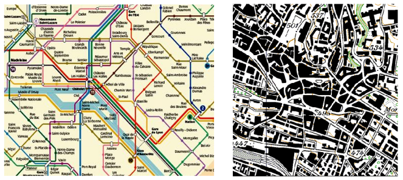

### Known vs. Unknown Correspondence
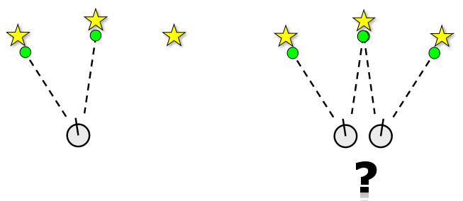

### Static vs. Dynamic Environments
- Is the environment changing or staying still? This is an important factor for robotics
- Some models remove the dynamic world assumption, however most try to include the dynamic nature of the world
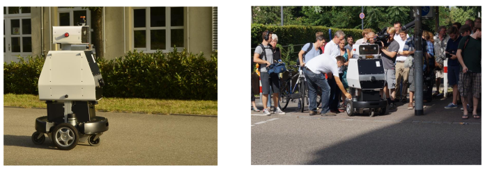

### Small vs. Large Uncertainty
- How certain are you that your robot is where it should be? It could be in one location if uncertainty is low (as shown in the left diagram), or it could be in many different locations if uncertainty is high (as shown in the right diagram)
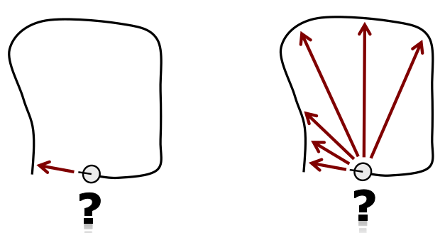

### Active vs. Passive SLAM
- Active SLAM means that the robot will actively go to places in a map to get a better representation of its environment
- Passive SLAM is just the robot being controlled where to go and creating a representation of the map as he goes
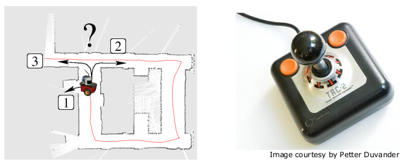

### Anytime and Any-Space SLAM
- This is to do with our SLAM algorithms can run on whatever time or memory constraint that we throw at it. 
- We could possibly have limited time or RAM, so we can design SLAM algorithms to be able to work with these constraints
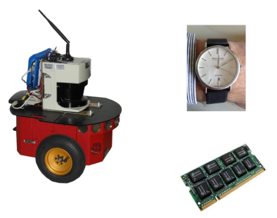

### Single-Robot vs. Multi-Robot SLAM
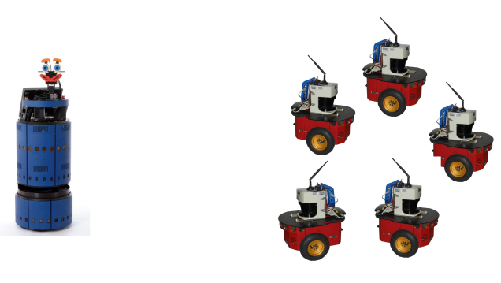

## Approaches to SLAM
- Large variety of different SLAM approaches have been proposed
- Most robotics conferences dedicate multiple tracks to SLAM
- The majority of techniques use probabilistic concepts
- History of SLAM dates back to the mid-eighties
- Related problems in geodesy and photogrammetry

## SLAM History by Durrant-Whyte
- 1985/86: Smith et al. and Durrant-Whyte describe geometric uncertainty and relationships between features and relationships between features and relationships between features or landmarks
- 1986: Discussion at ICRA on how to solve the SLAM problem followed by the key paper by Smith, Self and Cheeseman
- 1990-95: Kalman-filter based approaches
- 1995: SLAM acronym coined at ISRR'95
- 1995-19999: Convergence proofs & first demonstrations of real-systems 
- 2000: Wide interest in SLAM started

## Three Main Paradigm
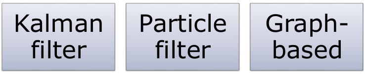

## Motion and Observation Model
- Moving from $x_{t-1}$ to $x_t$ indicates motion, and this action is described via a probability distribution that is conditioned on the previous pose and the action at its current timestep (see the formula and graph below)
- The observation model relies on the map and pose at its own timestep, and this is also described via a probability distribution
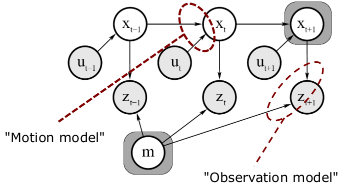

### Motion Model
- The motion model describes the relative motion of the robot
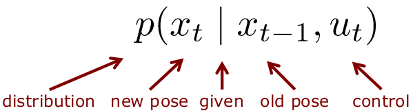

### Motion Model Example
- Gaussian model
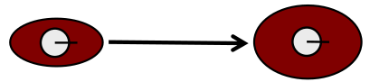
- Non-Gaussian model
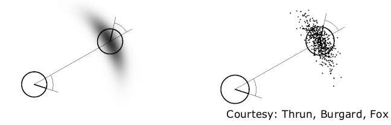

## Standard Odometry Model
- Robot moves from $(\bar{x}, \bar{y}, \bar{\theta})$, to $(\bar{x}', \bar{y}', \bar{\theta}')$
- Odometry information $y=(\delta_{rot1}, \delta_{trans}, \delta_{rot2})$ 
- $y$ in this case represents the movement of the robot, which we can break down into a first rotation ($\delta_{rot1}$), a displacement in cartesian coordinates ($\delta_{trans}$), and a second rotation ($\delta_{rot2}$)
$$
\delta_{trans} = \sqrt{(\bar{x}'-\bar{x})^2 - (\bar{y}'-\bar{y})^2}
$$
$$
\delta_{rot1} = \text{atan2}(\bar{y}'-\bar{y}, \bar{x}'-\bar{x}) - \bar{\theta}
$$
$$
\delta_{rot2} = \bar{\theta}' - \bar{\theta} - \delta_{rot1}
$$
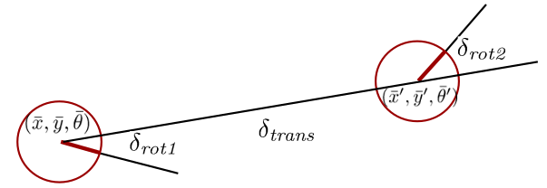