# Graph-Based SLAM with Landmarks

## Graph-Based SLAM
- Use a **graph** to represent the problem
- Every **node** in the graph corresponds to a pose of the robot during mapping
- Every **edge** between two nodes corresponds to a spatial constraint between them
- **Graph-Based SLAM**: Build the graph and find a node the configuration that minimises the error introduced by the constraints

## The Graph
**So far**:
- Vertices for robot poses ($x,y,\theta$)
- Edges for virtual observations (transformations) between robot poses

**Topic today**:
- How to deal with landmarks

## Landmark-Based SLAM
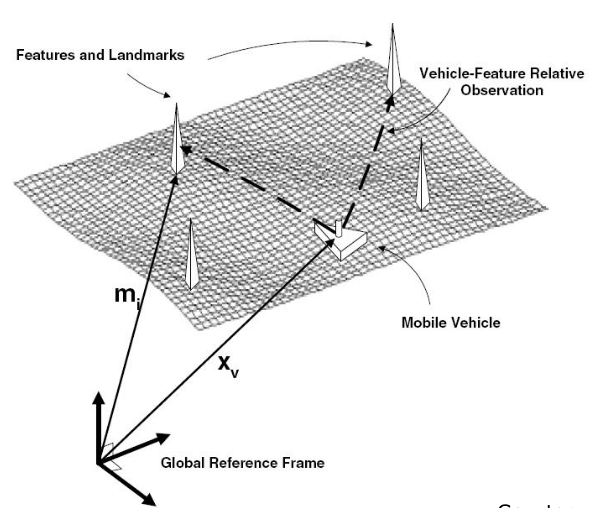

## Real Landmark Map Example
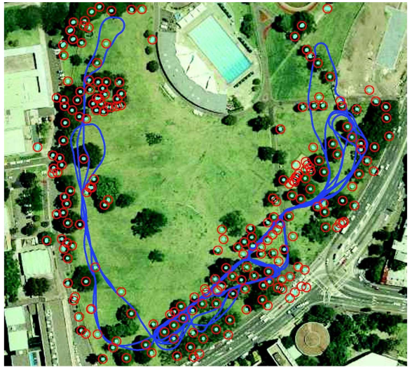

## The Graph with Landmark
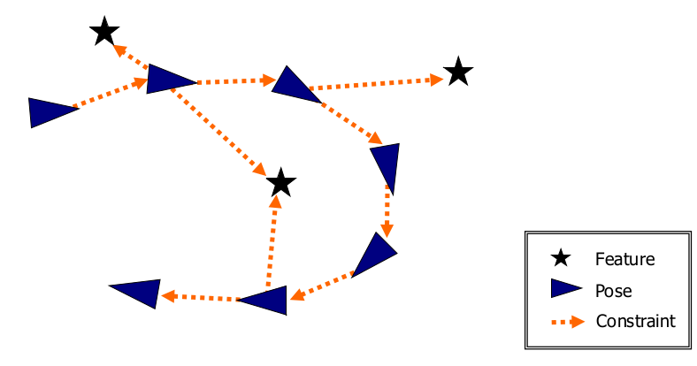
- **Nodes** can represent:
	- Robot poses
	- Landmark locations
- **Edges** can represent:
	- Landmark observations
	- Odometry measurements
- The minimisation optimises the landmark locations and robot poses

## 2D Landmarks
- Landmark is a ($x,y$) - point in the world
- Relative observation in ($x,y$)
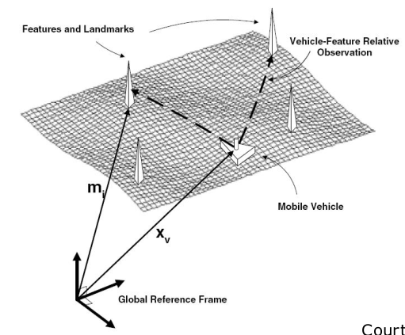

## Landmarks Observation
- Expected observation (x-y sensor)
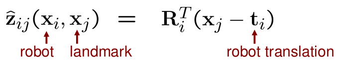
- Error function
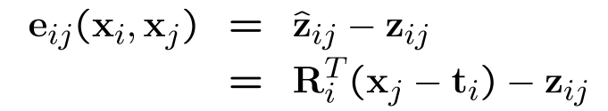

## Bearing Only Observations
- A landmark is still a 2D point
- The robot observe only the bearing towards the landmark
- Observation function
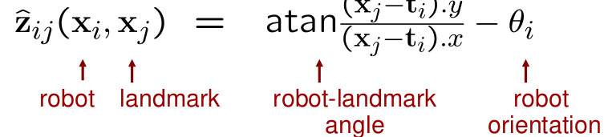
- Error function
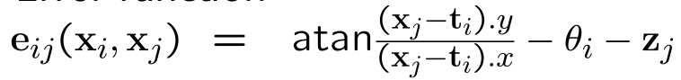

## The Rank of the Matrix $H$
- What is the rank of $H_{ij}$ for a 2D landmark-pose constraint?
	- The blocks of $J_{ij}$ are $2 \times 3$ matrices
	- $H_{ij}$ cannot have more than rank 2
$$
		\text{rank}(A^TA) = \text{rank}(A^T) = \text{rank}(A)
$$
- What is the rank of $H_{ij}$ for a bearing-only constraint?
	- The blocks of $J_{ij}$ are $1\times3$ matrices
	- $H_{ij}$ has rank 1

## Where is the Robot?
- Robot observes one landmark ($x,y$)
- Where can the robot be relative to the landmark?
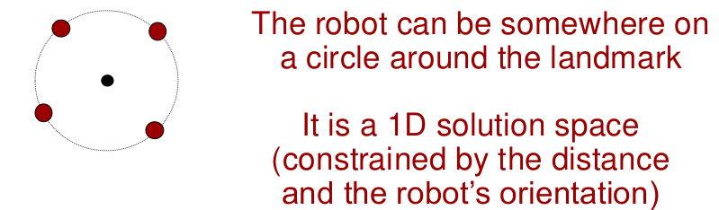
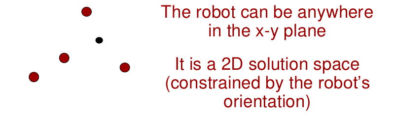

## Rank
- In landmark-based SLAM, the system can be under-determined
- The rank of $H$ is **less or equal** to the sum of the ranks of the constraints
- To determine a **unique solution**, the system must have **full rank**
- **Questions**:
	- How many 2D landmark observations are needed to resolve for a robot pose?
	- How many bearing-only observations are needed to resolve for a robot pose?

## Under-Determined Systems
- No guarantee for a full rank system
	- Landmarks may be observed only once
	- Robot might have no odometry
- We can still deal with these situations by adding a "damping" factor to $H$
- Instead of solving $H\Delta x = -b$, we solve
$$
(H + \lambda I) \Delta x = -b
$$
**What is the effect of that?**

## $(H + \lambda I) \Delta x = -b$
- Damping factor for $H$
- $(H + \lambda I) \Delta x = -b$
- The damping factor $\lambda I$ makes the system positive definite
- Weighted sum of Gauss Newton and Steepest Descent

## Simplified Levenberg Marquardt
- Damping to regulate the convergence using backup/restore actions
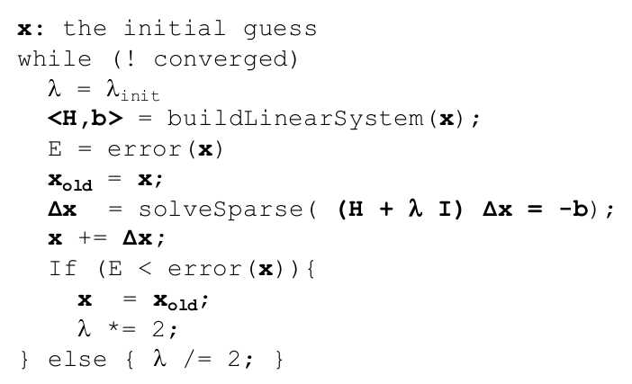

## Bundle Adjustment
- 3D reconstruction based on images taken at different viewpoints
- Minimises the reprojection error
- Often uses Levenberg Marquardt
- Developed in photogrammetry during the 1950s