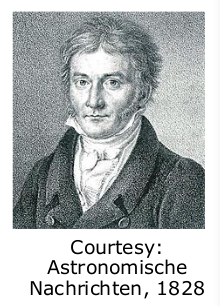

# Least Squares
## Three Main SLAM Paradigms

## Least Squares in General
- Approach for computing a solution for an **overdetermined system**
- "More equations than unknowns"
- Minimises the **sum of squared errors** in the equations
- Standard approach to a large set of problems

## Least Squares History
- Method developed by Carl Friedrich Gauss in 1795 (he was 18 years old)
- First showcase: predicting the future of the asteroid Ceres in 1801

## Problem
- Given a system described by a set of $n$ observation functions $\{f_i(x)\}_{i=1:n}$
- Let
	- $x$ be the state vector 
	- $z_i$ be a measurement of the state $x$
	- $\hat{z}_i = f_i(x)$ be a function which maps $x$ to a predicted measurement $\hat{z}_i$ 
- Given $n$ noisy measurements $z_{1:n}$ about the state $x$
-  **Goal**: Estimate the state $x$ which best explains the measurements $z_{1:n}$

## Graphical Explanation

## Example

- $x$ position of 3D features
- $z_i$ coordinates of the 3D features projected on camera images
- Estimate the most likely 3D position of the features based on the image projections (given the camera poses)

## Error Function
- Error $e_i$ is typically the **difference** between the **predicted and actual** measurement
$$
e_i(x) = z_i - f_i(x)
$$
- We assume that the error has **zero mean** and is **normally distributed**
- Gaussian error with information matrix $\Omega_i$
- The squared error of a measurement depends on the state and is a scalar
$$
e_i(x) = e_i(x)^T\Omega_i e_i(x)
$$

## Goal: Find the Minimum
- Find the state $x^*$ which minimises the error given all measurements

- A general solution is to derive the global error function and find its nulls
- In general complex and no closed form solution
$\rightarrow$ Numerical approaches

## Assumption 
- A "good" initial guess is available
- The error functions are "smooth" in the neighbourhood of the (hopefully global) minima

- Then, we can solve the problem by iterative local linearisations

## Solve Via Iterative Local Linearisations
- Linearise the error terms around the current/initial guess
- Compute the first derivative of the squared error function
- Set it to zero and solve linear system
- Obtain the new state (that is hopefully closer to the minimum)
- Iterate

## Linearising the Error Function
- Approximate the error functions around an initial guess $x$ via Taylor expansion
$$
e_i(x + \Delta x) \cong \underbrace{e_i(x)}_{e_i} + J_i(x)\Delta x
$$
- Reminder: Jacobian

## Squared Error
- With the previous linearization, we can fix $x$ and carry out the minimisation in the increments $\Delta x$
- We replace the Taylor expansion in the squared error terms:
$$
e_i(x + \Delta x) = \dots
$$

- With the previous linearization, we can fix $x$ and carry out the minimisation in the increments $\Delta x$ 
- We replace the Taylor expansion in the squared error terms:
$$
\begin{align}
e_i(x + \Delta x) &= e^T_i(x + \Delta x)\Omega_i e_i(x + \Delta x) \\
&\backsimeq (e_i + J_i \Delta x)^T \Omega_i (e_i + J_i \Delta x) \\
&=e_i^T \Omega_i e_i + e_i^T \Omega_i J_i \Delta x + \Delta x^T J_i^T \Omega_i e_i + \Delta x^T J_i^T \Omega_i J_i \Delta x
\end{align}
$$

- All summands are scalar so the transposition has no effect
- By grouping similar terms, we obtain:
$$
\begin{align}
e_i(x + \Delta x) &\backsimeq e_i^T \Omega_i e_i + e_i^T \Omega_i J_i \Delta x + \Delta x^T J_i^T \Omega_i J_i \Delta x \\
&= \underbrace{e_i^T \Omega_i e_i}_{c_i} + 2 \underbrace{e_i^T \Omega_i J_i}_{b_i^T} \Delta x^T + \Delta x^T \underbrace{J_i^T \Omega_i J_i}_{H_i} \\
&= c_i + 2b_i^T \Delta x + \Delta x^TH_i \Delta x
\end{align}
$$

## Global Error
- The global error is the sum of the squared errors terms corresponding to the individual measurements
- Form a new expression which approximates the global error in the neighbourhood of the current solution $x$
$$
\begin{align}
F(x + \Delta x) &\backsimeq \sum_i (c_i + b_i^T \Delta x + \Delta x^T H_i \Delta x) \\
&= \underbrace{\sum_i c_i}_{c_i} + 2 \underbrace{(\sum_i b_i^T)}_{b^T} \Delta x + \Delta x^T \underbrace{(\sum_i H_i)}_H \Delta x \\
&= c + 2b^T \Delta x + \Delta x^T H \Delta x \\
\text{with}
b^T &= \sum_i e^T_i \Omega_i J_i \\
H &= \sum_i J_i^T \Omega J_i
\end{align}
$$

## Quadratic Form
- We can write the global error terms as a quadratic form in $\Delta x$
$$
F(x + \Delta x) \simeq c + 2b^T \Delta x + \Delta x^T H \Delta x
$$
- We need to compute the derivative of $F(x + \Delta x)$ w.r $\Delta x$ (given $x$)

#### Deriving a Quadratic Form
- Assume a quadratic form
$$
f(x) = x^T H x + b^T
$$
- The first derivative is
$$
\frac{\partial f}{\partial x} = (H + H^T)x + b
$$

## Quadratic Form
- We can write the global error terms as a quadratic form in $\Delta x$
$$
F(x + \Delta x) \simeq c + 2b^T \Delta x + \Delta x^T H \Delta x
$$
- The derivative of the approximated $F(x + \Delta x)$ w.r.t. $\Delta x$ is then:
$$
\frac{\partial F(x + \Delta x)}{\partial \Delta x} \simeq 2b + 2H\Delta x
$$
## Minimising the Quadratic Form
- Derivative of $F(x + \Delta x)$
$$
\frac{\delta F(x + \Delta x)}{\partial \Delta x} \simeq 2b + 2H \Delta x
$$
- Setting it to zero leads to
$$
0 = 2b + 2H \Delta x
$$
- Which leads to the linear system
$$
H \Delta x = -b
$$
- The solution for the increment $\Delta x^*$ is
$$
\Delta x^* = -H^{-1}b
$$

## Gauss-Newton Solution
**Iterate the following steps:**
- Linearize around $x$ and compute for each measurement
$$
e_i(x + \Delta x) \simeq e_i(x) + J_i \Delta x
$$
- Compute the terms for the linear system $b^T = \sum_i e^T_i \Omega_i J_i$      $H = \sum_i J^T_i \Omega_i J_i$
- Solve the linear system
$$
\Delta x^* = -H^{-1}b
$$
- Solve the linear system
$$
\Delta x^* = -H^{-1}b
$$
- Updating state $x \leftarrow x + \Delta x^*$

## Example: Odometry Calibration
- Odometry measurements $u_i$
- Eliminate systematic error through calibration
- Assumption: Ground truth odometry $u^*_i$ is available
- Ground truth by motion capture, scan-matching, or a SLAM system

- There is a function $f_i(x)$ which, given some bias parameters $x$, returns an unbiased (corrected) odometry for the reading $u'_i$ as follows
$$
u_i' = f_i(x) = \begin{pmatrix}
x_{11} & x_{12} & x_{13} \\
x_{21} & x_{22} & x_{23} \\
x_{31} & x_{32} & x_{33}
\end{pmatrix} u_i
$$
- To obtain the correction function $f(x)$, we need to find the parameters $x$

## Odometry Calibration (cont.)
- The state vector is
$$
x = 
\begin{pmatrix}
x_{11} & x_{12} & x_{13} & x_{21} & x_{22} & x_{23} & x_{31} & x_{32} & x_{33}
\end{pmatrix}^T
$$
- The error function is
$$
e_i(x) = u_i^* - 
\begin{pmatrix}
x_{11} & x_{12} & x_{13} \\
x_{21} & x_{22} & x_{23} \\
x_{31} & x_{32} & x_{33}
\end{pmatrix} u_i
$$
- Its derivative is:

## Question
- How do the parameters look like if the odometry is perfect?
- How many measurements (at least) are needed to find a solution for the calibration problem?
- $H$ is symmetric. Why?
- How does the structure of the measurement function affects the structure of $H$?

## How to Efficiently Solve the Linear System?
- Linear system $H \Delta x = -b$ 
- Can be solved by matrix inversion (in theory)
- In practice:
	- Cholesky decomposition
	- QR decomposition
	- Iterative methods such as conjugate gradients (for large systems)

## Cholesky Decomposition for Solving a Linear System
- $A$ symmetric and positive definite
- System to solve $Ax = b$
- Cholesky leads to $A = LL^T$ with $L$ being a lower triangular matrix
- Solve first
$$
Ly = b
$$
- and then
$$
L^T x = y
$$

## Gauss-Newton Summary
Method to minimise a squared error:
- Start with an initial guess
- Linearise the individual error functions
- This leads to a quadratic form
- One obtains a linear system by settings its derivative to zero
- Solving the linear systems leads to a state update
- Iterate

## Relation to Probabilistic State Estimation
- So far, we minimised an error function
- How does this relate to state estimation in the probabilistic sense?

## General State Estimation
- Bayes rule, independence and Markov assumptions allow us to write
$$
p(x_{0:t}|z_{1:t}, u_{1:t}) = \eta p(x_0) \prod_t [p(x_t | x_{t-1}, u_t)p(z_t|x_t)]
$$

## Log Likelihood
- Written as the log likelihood, leads to
$$
\log p(x_{0:t} | z_{1:t}, u_{1:t}) = \text{const.} + \log p(x_0) + \sum_t[\log p(x_t|x_{t-1}, u_t)+ \log p (z_t | x_t)]
$$

## Gaussian Assumption
- Assuming Gaussian distributions
$$
\log p(x_{0:t} | z_{1:t}, u_{1:t}) = \text{const.} + \log \underbrace{p(x_o)}_{\mathcal{N}} + \sum_t \Bigg[ \log \underbrace{p(x_t | x_{t-1}, u_t)}_{\mathcal{N}} + \log \underbrace{p(z_t|x_t)}_{\mathcal{N}}\Bigg]
$$

## Log of a Gaussian
- Log likelihood of a Gaussian
$$
\log \mathcal{N}(x, \mu, \Sigma) = \text{const.} - \frac{1}{2}(x- \mu)^T (x-\mu)
$$

## Error Function as Exponent
- Log likelihood of a Gaussian
$$
\log \mathcal{N} (x, \mu, \Sigma) = \text{const.} - \frac{1}{2}\underbrace{\underbrace{(x - \mu)^T}_{e^T(x)}\underbrace{\Sigma^{-1}}_{\Omega}{\underbrace{(x-\mu)}_{e(x)}}}_{e(x)}
$$
- Is up to a constant equivalent to the error functions used before

## Log Likelihood with Error Terms
- Assuming Gaussian distributions
$$
\log p(x_{0:t} | z_{1:t}, u_{1:t}) = \text{const.} - \frac{1}{2} e_p(x - \frac{1}{2} \sum_t[e_{u_t}(x)+e_{z_t}(x)])
$$

## Maximising the Log Likelihood
- Assuming Gaussian distributions
$$
\log p(x_{0:t}| z_{1:t}, u_{1:t}) = \text{const.} - \frac{1}{2}e_p(x) - \frac{1}{2}\sum_t[e_{u_t}(x) + e_{z_t}(x)]
$$
- Maximising the log likelihood leads to
$$
\text{argmax} \log p(x_{0:t} | z_{1:t}, u_{1:t}) = \text{argmin } e_p(x) + \sum_t [e_{u_t}(x) + e_{z_t}(x)]
$$

## Minimising the Squared Error is Equivalent to Maximising the Log Likelihood of Independent Gaussian Distributions
with individual error temrs for the motions, measurements, and prior
$$
\text{argmax} \log p(x_{0:t} | z_{1:t}, u_{1:t}) = \text{argmin } e_p(x) + \sum_t[e_{u_t}(x) + e_{z_t}(x)]
$$