# Least Squares Approach to SLAM

## Three Main SLAM Paradigms
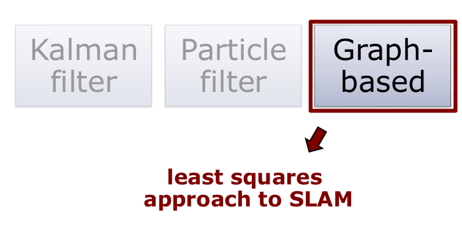

## Least Squares in General
- Approach for computing a solution for an **overdetermined system**
- "More equations than unknowns"
- Minimises the **sum of squared errors** in the equations
- Standard approach to a large set of problems

**Today: Application to SLAM**

## Graph-Based SLAM
- Constraints connect the poses of the robot while it is moving
- Constraints are inherently uncertain
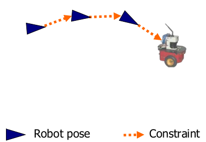

## Graph-Based SLAM
- Observing previously seen areas generates constraints between non-successive poses
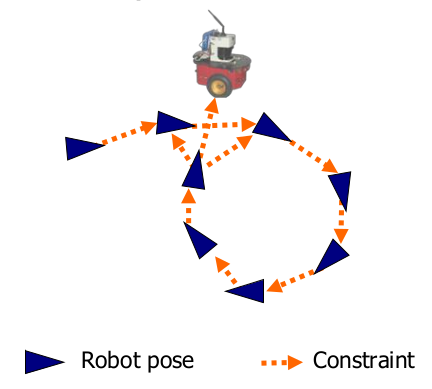

## Idea of Graph-Based SLAM
- Use a **graph** to represent the problem
- Every **node** in the graph corresponds to a pose of the robot during mapping
- Every **edge** between two nodes corresponds to a spatial constraint between them
- **Graph-based SLAM:** Build the graph and find a configuration that minimises the error introduced by the constraints

## Graph-Based SLAM in a Nutshell
- Every node in the graph corresponds to a robot position and a laser measurement
- An edge between two nodes represents a spatial constraint between the nodes
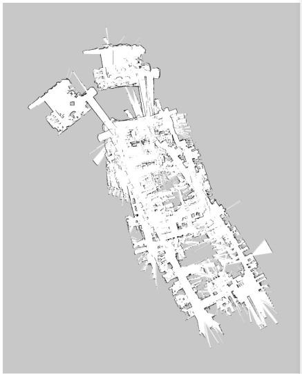

- Every node in the graph corresponds to a robot position and a laser measurement
- An edge between two nodes represents a spatial constraint between the nodes
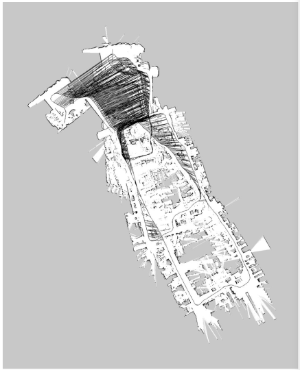

- Once we have the graph, we determine the most likely map by correcting the nodes
... like this
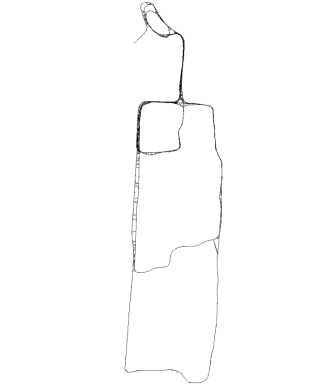

- Then we can render a map based on the known poses
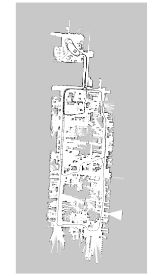

## The Overall SLAM System
- Interplay of front-end and back-end
- Map helps to determine constraints by reducing the search space
- Topic today: optimization

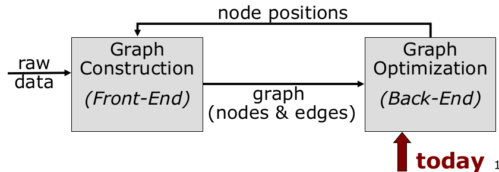

## The Graph
- It consists of $n$ nodes $x = x_{1:n}$
- Each $x_i$ is a @D or 3D transformation (the pose of the robot at time $t_i$)
- A constraint/edge exists between the nodes $x_i$ and $x_j$ if...
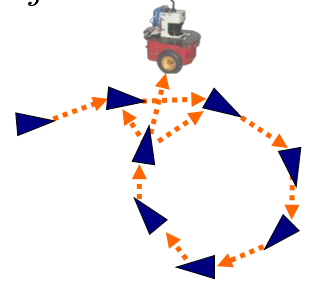

## Create an Edge If... (1)
- ...the robot moves from $x_i$ to $x_{i+1}$
- Edge corresponds to odometry
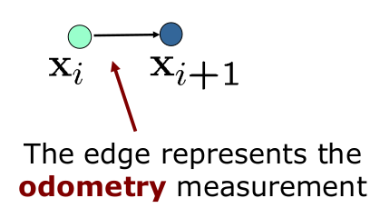

## Create an Edge If... (2)
 - ...the robot observes the same part of the environment from $xs_i$ and from $x_j$
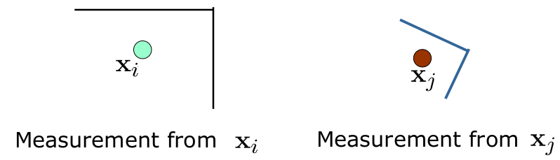
- ...the robot observes the same part of the environment from $x_i$ and from $x_j$
- Construct a **virtual measurement** about the position of $x_j$ seen from $x_i$
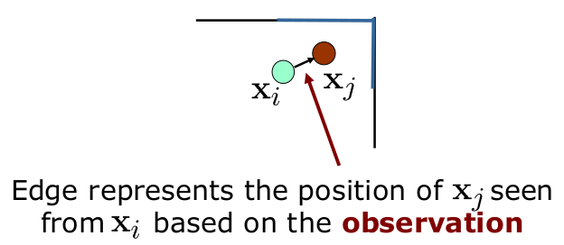

## Transformations
- Transformations can be expressed using **homogeneous coordinates**
- Odometry-based edge
$$
(X_i^{-1}X_{i+1})
$$
- Observation-based edge
$$
\begin{align}
(X_i^{-1}X_j) \\
\text{How node } i \text{ sees node } j
\end{align}
$$

## Homogeneous Coordinates
- H.C are a system of coordinates used in projective geometry
- Projective geometry is an alternative algebraic representation of geometric objects and transformations
- Formulas involving H.C. are often simpler than in the Cartesian world
- A single matrix can represent affine transformations and projective transformations

- H.C. are a system of coordinates used in projective geometry
- Projective geometry is an alternative algebraic representation of geometric objects and transformations 
- Formulas involving H.C. are often simpler than in the Cartesian world
- **A single matrix can represent affine transformations and projective transformations**

## Homogeneous Coordinates
- N-dim space expressed in $N+1$ dim
- 4 dim. for modeling the 3D space
- To HC: $(x, y, z)^T \rightarrow (x, y, z, 1)^T$
- Backwards: $(x, y, z, w)^T \rightarrow (\frac{x}{w}, \frac{y}{w}, \frac{z}{w})^T$
- Vector in HC: $v = (x, y, z, w)^T$
- Translation: 
$$
T = \begin{pmatrix}
1  & 0 & 0 & t_x \\
0 & 1 & 0 & t_y \\
0 & 0 & 1 & t_z \\
0 & 0 & 0 & 1
\end{pmatrix}
$$
- Rotation:
$$
R = \begin{pmatrix}
R^{3D} & 0 \\
0 & 1
\end{pmatrix}
$$

## The Edge Information Matrix
- Observations are affected by noise
- Information matrix $\Omega_{ij}$ for each edge to encode its uncertainty
- The "bigger" $\Omega_{ij}$, the more the edge "matters" in the optimisation

## Questions
- What do the information matrices look like in case of scan-matching vs. odometry?
- What should these matrices look like when moving in a long, featureless corridoor?

## Pose Graph
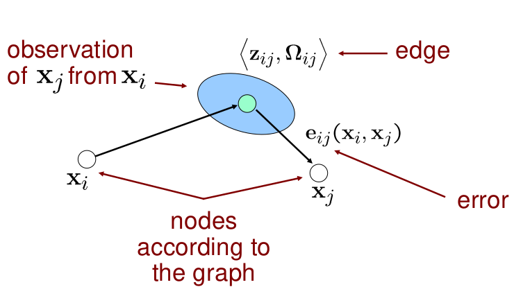

## Least Squares SLAM
- This error function looks suitable for least squares error minimisation
$$
\begin{align}
x^* &= \underset{x}{\text{argmin}}\sum_{ij}e^T_{ij}(x_i, xx_j) \Omega_{ij}e_{ij}(x_i, x_j) \\
&= \underset{x}{\text{argmin}}\sum_k e_k^T(x) \Omega_k e_k (x)
\end{align}
$$
- This error function looks suitable for least squares error minimisation
$$
x^* = \underset{x}{\text{argmix}}\sum_k e^T_k(x) \Omega_k e_k (x)
$$
**Question:**
- What is the state vector?

## Least Squares SLAM
- This error function looks suitable for least squares error minimisation
$$
x^* = \underset{x}{\text{argmin}}\sum_k e_k^T(x)\Omega_k e_k (x)
$$
**Question:**
- What is the state vector?
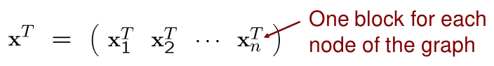
- Specify the error function!

## The Error Function
- Error function for a single constraint
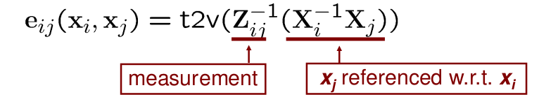
- Error as a function of the whole state vector
$$
e_{ij}(x) = t2v(Z^{-1}_{ij}(X_i^{-1}X_j))
$$
- Error takes a value of zero if
$$
Z_{ij} = (X_i^{-1}X_j)
$$