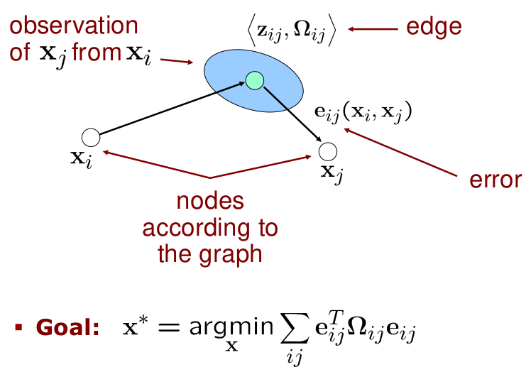

# Least Squares Approach to SLAM

## Three Main SLAM Paradigms

## Least Squares in General
- Approach for computing a solution for an **overdetermined system**
- "More equations than unknowns"
- Minimises the **sum of squared errors** in the equations
- Standard approach to a large set of problems

**Today: Application to SLAM**

## Graph-Based SLAM
- Constraints connect the poses of the robot while it is moving
- Constraints are inherently uncertain

## Graph-Based SLAM
- Observing previously seen areas generates constraints between non-successive poses

## Idea of Graph-Based SLAM
- Use a **graph** to represent the problem
- Every **node** in the graph corresponds to a pose of the robot during mapping
- Every **edge** between two nodes corresponds to a spatial constraint between them
- **Graph-based SLAM:** Build the graph and find a configuration that minimises the error introduced by the constraints

## Graph-Based SLAM in a Nutshell
- Every node in the graph corresponds to a robot position and a laser measurement
- An edge between two nodes represents a spatial constraint between the nodes

- Every node in the graph corresponds to a robot position and a laser measurement
- An edge between two nodes represents a spatial constraint between the nodes

- Once we have the graph, we determine the most likely map by correcting the nodes
... like this

- Then we can render a map based on the known poses

## The Overall SLAM System
- Interplay of front-end and back-end
- Map helps to determine constraints by reducing the search space
- Topic today: optimization

## The Graph
- It consists of $n$ nodes $x = x_{1:n}$
- Each $x_i$ is a @D or 3D transformation (the pose of the robot at time $t_i$)
- A constraint/edge exists between the nodes $x_i$ and $x_j$ if...

## Create an Edge If... (1)
- ...the robot moves from $x_i$ to $x_{i+1}$
- Edge corresponds to odometry

## Create an Edge If... (2)
 - ...the robot observes the same part of the environment from $xs_i$ and from $x_j$

- ...the robot observes the same part of the environment from $x_i$ and from $x_j$
- Construct a **virtual measurement** about the position of $x_j$ seen from $x_i$

## Transformations
- Transformations can be expressed using **homogeneous coordinates**
- Odometry-based edge
$$
(X_i^{-1}X_{i+1})
$$
- Observation-based edge
$$
\begin{align}
(X_i^{-1}X_j) \\
\text{How node } i \text{ sees node } j
\end{align}
$$

## Homogeneous Coordinates
- H.C are a system of coordinates used in projective geometry
- Projective geometry is an alternative algebraic representation of geometric objects and transformations
- Formulas involving H.C. are often simpler than in the Cartesian world
- A single matrix can represent affine transformations and projective transformations

- H.C. are a system of coordinates used in projective geometry
- Projective geometry is an alternative algebraic representation of geometric objects and transformations 
- Formulas involving H.C. are often simpler than in the Cartesian world
- **A single matrix can represent affine transformations and projective transformations**

## Homogeneous Coordinates
- N-dim space expressed in $N+1$ dim
- 4 dim. for modeling the 3D space
- To HC: $(x, y, z)^T \rightarrow (x, y, z, 1)^T$
- Backwards: $(x, y, z, w)^T \rightarrow (\frac{x}{w}, \frac{y}{w}, \frac{z}{w})^T$
- Vector in HC: $v = (x, y, z, w)^T$
- Translation: 
$$
T = \begin{pmatrix}
1  & 0 & 0 & t_x \\
0 & 1 & 0 & t_y \\
0 & 0 & 1 & t_z \\
0 & 0 & 0 & 1
\end{pmatrix}
$$
- Rotation:
$$
R = \begin{pmatrix}
R^{3D} & 0 \\
0 & 1
\end{pmatrix}
$$

## The Edge Information Matrix
- Observations are affected by noise
- Information matrix $\Omega_{ij}$ for each edge to encode its uncertainty
- The "bigger" $\Omega_{ij}$, the more the edge "matters" in the optimisation

## Questions
- What do the information matrices look like in case of scan-matching vs. odometry?
- What should these matrices look like when moving in a long, featureless corridoor?

## Pose Graph

## Least Squares SLAM
- This error function looks suitable for least squares error minimisation
$$
\begin{align}
x^* &= \underset{x}{\text{argmin}}\sum_{ij}e^T_{ij}(x_i, xx_j) \Omega_{ij}e_{ij}(x_i, x_j) \\
&= \underset{x}{\text{argmin}}\sum_k e_k^T(x) \Omega_k e_k (x)
\end{align}
$$
- This error function looks suitable for least squares error minimisation
$$
x^* = \underset{x}{\text{argmix}}\sum_k e^T_k(x) \Omega_k e_k (x)
$$
**Question:**
- What is the state vector?

## Least Squares SLAM
- This error function looks suitable for least squares error minimisation
$$
x^* = \underset{x}{\text{argmin}}\sum_k e_k^T(x)\Omega_k e_k (x)
$$
**Question:**
- What is the state vector?

- Specify the error function!

## The Error Function
- Error function for a single constraint

- Error as a function of the whole state vector
$$
e_{ij}(x) = t2v(Z^{-1}_{ij}(X_i^{-1}X_j))
$$
- Error takes a value of zero if
$$
Z_{ij} = (X_i^{-1}X_j)
$$

## Gaussian-Newton: The Overall Error Minimisation Procedure
- Define the error function
- Linearise the error function
- Compute its derivative
- Set the derivative to zero
- Solve the linear system
- Iterate this procedure until convergence

## Linearise the Error Function
- We can approximate the error functions around an initial guess $x$ Taylor expansion
$$
\begin{align}
e_{ij}(x + \Delta x) &\backsimeq e_{ij} +J_{ij} \Delta x \\
&\text{with } J_{ij} = \frac{\partial e_{ij}(x)}{\partial x}
\end{align}
$$

## Derivative of the Error Function
- Does one error term $e_{ij}(x)$ depend on all state variables?
$\rightarrow$ No, only on $x_i$ and $x_j$ 
- Is there any consequence on the **structure** of the Jacobian?

## Derivative of the Error Function
- Does one error term $e_{ij}(x)$ depend on all state variables?
$\rightarrow$ No, only on $x_i$ and $x_j$
- Is there any consequence on the **structure** of Jacobian?
$\rightarrow$ Yes, it will be non-zero only in the rows corresponding to $x_i$ and $x_j$
$$
\begin{align}
\frac{\partial e_{ij}(x)}{\partial x} &= (0 \dots \frac{\partial e_{ij}(x_i)}{\partial x_j} \dots \frac{\partial e_{ij}(x_j)}{\partial x_j} \dots 0) \\
J_{ij} &= (0 \dots A_{ij} \dots B_{ij} \dots 0)
\end{align}
$$

## Jacobians and Sparsity
- Error $e_{ij}(x)$ depends only on the two parameter blocks $x_i$ and $x_j$ 
$$
e_{ij}(x) = e_{ij}(x_i, x_j)
$$
- The Jacobian will be zero everywhere except in the columns of $x_i$ and $x_j$

## Consequence of the Sparsity
- We need to compute the coefficient vector $b$ and matrix $H$:
$$
\begin{align}
b^T &= \sum_{ij} b_{ij}^T &= \sum_{ij} e^T_{ij} \Omega_{ij} J_{ij} \\
H &= \sum_{ij} H_{ij} &= \sum_{ij}J_{ij}^T\Omega_{ij}J_{ij}
\end{align}
$$
- The sparse structure of $J_{ij}$ will result in a sparse structure of $H$
- This structure reflects the adjacency matrix of the graph

## Illustration of the Structure

## Consequence of the Sparsity
- An edge contributes to the linear system via $b_{ij}$ and $H_{ij}$ 
- The coefficient vector is:
$$
\begin{align}
b_{ij}^T &= e_{ij} \Omega_{ij} J_{ij} \\
&= e_{ij}^T \Omega_{ij} (0 \dots A_{ij} \dots B_{ij} \dots 0) \\
&= (0 \dots e_{ij}^T \Omega_{ij}A_{ij} \dots e_{ij}^T \Omega_{ij} B_{ij} \dots 0)
\end{align}
$$
- It is non-zero only at the indices corresponding to $x_i$ and $x_j$
- The coefficient matrix of an edge is:
$$
\begin{align}
H_{ij} &= J_{ij}^T \Omega_{ij} J_{ij} \\
&=  \begin{pmatrix}
		\vdots \\
		A_{ij}^T \\
		\vdots \\
		B_{ij}^T \\
		\vdots
	\end{pmatrix} \Omega_{ij} \begin{pmatrix}\dots A_{ij} \dots B_{ij} \dots \end{pmatrix} \\
&= \begin{pmatrix}
	A_{ij}^T\Omega_{ij} A_{ij} & A_{ij}^T \Omega_{ij} B_{ij} \\
	B_{ij}^T \Omega_{ij}A_{ij} & B_{ij}^T \Omega_{ij} B_{ij}
	\end{pmatrix}
\end{align}
$$
- Non-zero only in the blocks relating $i,j$

## Sparsity Summary
- An edge $ij$ contributes only to the 
	- $i^{th}$ and the $j^{th}$ blocks of the $b_{ij}$
	- to the blocks $ii$, $jj$, $ji$ of $H_ij$
- Resulting can be computed by summing up the contribution of each edge
- Efficient solvers can be used 
	- Sparse Cholesky decomposition 
	- Conjugation gradients
	- ... many others

## The Linear System
- Vector of the states increments:
$$
\Delta x^T = \begin{pmatrix}\Delta x_1^T & \Delta_2^T & \dots \Delta x^T_n\end{pmatrix}
$$
- Coefficient vector:
$$
b^T = \begin{pmatrix}\bar{b}^T_1 & \bar{b}^T_2 \dots \bar{b}^T_n \end{pmatrix}
$$
- System matrix:
$$
H = \begin{pmatrix}
	\bar{H}^{11} & \bar{H}^{12} & \dots & \bar{H}^{1n} \\
	\bar{H}^{21} & \bar{H}^{22} & \dots & \bar{H}^{2n} \\
	\vdots & \ddots & & \vdots \\
	\bar{H}^{n1} & \bar{H}^{n2} & \dots & \bar{H}^{nn}
\end{pmatrix}
$$

## Building the Linear System
For each constraint:
- Compute error $e_{ij} = t2v(Z_{ij}^{-1}(X_i^{-1}X_j))$
- Compute the blocks of the Jacobian:
$$
A_{ij} = \frac{\partial e(x_i, x_j)}{\partial x_i} \ \ \ \ \ \ \ \ \ \ \ \ \ \ \ \ \ \ B_{ij} = \frac{\partial e(x_i, x_j)}{\partial x_j}
$$
- Update the coefficient vector:
$$
\bar{b}^T_i += e_{ij}^T \Omega_{ij} A_{ij} \ \ \ \ \ \ \ \ \ \ \ \\ \ \ \ \  \ \ \ \ \ \ \ \bar{b}_j^T += e_{ij}^T \Omega_{ij} B_{ij}
$$
- Update the system matrix:
$$
\begin{matrix}
\bar{H}^{ii} += A_{ij} \Omega_{ij} A_{ij} & \bar{H}^{ij} += A^T_{ij} \Omega_{ij} B_{ij}  \\
\bar{H}^{ji} += A^T_{ij} \Omega_{ij} A_{ij} & \bar{H}^{jj} += B^T_{ij} \Omega_{ij} B_{ij}
\end{matrix}
$$

## Algorithm

## Trivial 1D Example
- Two notes and one observation
$$
\begin{align}
x &= (x_1 x_2)^T = (0 \ 0) \\
z_{12} &= 1 \\
\Omega &= 2 \\
e_{12} &= \ = z_{12} - (x_2 - x_1) = 1 - (0 - 0) = 1 \\
J_{12} &= (1 - 1) \\
b^T_{12} &= e^T_{12} \Omega J_{12} = \begin{pmatrix}
2 & -2 \\
-2  & 2
\end{pmatrix} \\
\Delta x &= -H^{-1}_{12} b_{12} \\
& \text{\textbf{BUT} } \det(H) = 0???
\end{align}
$$

## What Went Wrong?
- The constraint specifies a **relative constraint** between both nodes
- Any poses for the nodes would be fine as long as their relative coordinates fit
- **One node needs to be "fixed"**

## Role of the Prior
- We saw that the matrix $H$ has not full rank (after adding the constraints)
- The global frame had not been fixed
- Fixing the global reference frame is strongly related to the prior $p(x_0)$
- A Gaussian estimate about $x_0$ results in an additional constraint]
- E.g., first pose in the origin:
$$
e(x_0) = t2v(X_0)
$$

## Fixing a Subset of Variables
- Assume that the value of certain variables during the optimisation is known a priori
- We may want to optimise all others and keep these fixed
- How?
- If a variable is not optimised, it should "disappear" from the linear system
- Construct the full system
- Suppress the rows and the columns corresponding to the variables to fix

## Why Can We Simply Suppress the Rows and Columns of the Corresponding Variables?

## Uncertainty
- $H$ represents the information matrix given the linearisation point
- Inverting $H$ gives the (dense) covariance matrix
- The diagonal blocks the covariance matrix represent the (absolute) uncertainties of the corresponding variables

## Relative Uncertainty
To determine the relative uncertainty between $x_i$ and $x_j$:
- Construct the full matrix $H$
- Suppress the rows and the column of $x_i$ (= do not optimise/fix this variable)
- Compute the block $j,j$ of the inverse
- This block will contain the covariance matrix of $x_j$ w.r.t. $x_i$, which has been fixed

## Example

## Conclusions
- The back-end part of the SLAM problem can be effectively solved with Gauss-Newton
- The $H$ matrix is typically sparse
- This sparsity allows for efficiently solving the linear system
- One of the state-of-the-art solutions for computing maps