# Short Introduction to Particle Filters and Monte Carlo Localisation
## Gaussian Filters
- The Kalman filter and its variants can only model **Gaussian distributions**
$$
p(x) = \det(2\pi\Sigma)^{-\frac{1}{2}}\exp(-\frac{1}{2}(x-\mu)^T \Sigma^{-1}(x-\mu))
$$
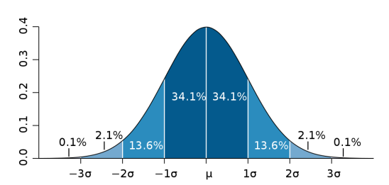

## Motivation
- Goal: approach for dealing with **arbitrary distributions**

## Key Idea: Samples
- Use **multiple samples** to represent arbitrary distributions
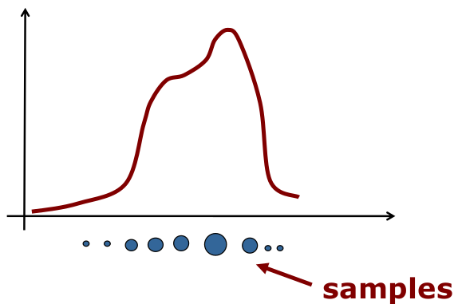

## Particle Set
- Set of weighted samples
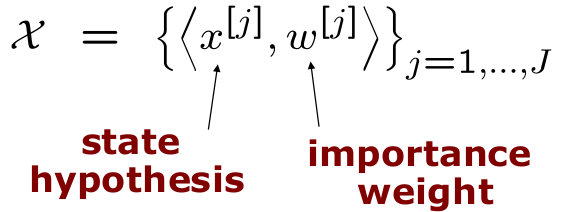
- The samples represent the posterior
$$
p(x) = \sum^J_{j=1} w^{[j]} \delta_{x^{[j]}}(x)
$$

## Particles for Approximation
- Particles for function approximation
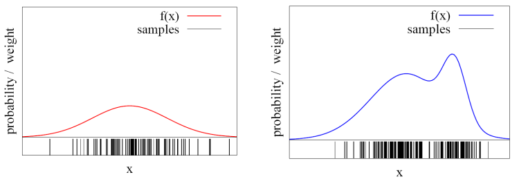
- The more particles fall into a region, the higher the probability of the region
**How to obtain such samples?**

## Closed Form Sampling is Only Possible for a Few Distributions?
- Example: Gaussian
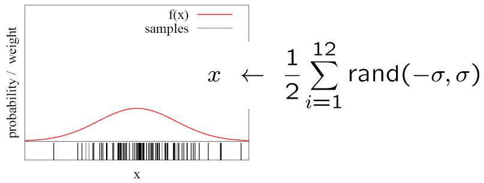
How to sample from **other** distributions?

## Importance Sampling Principle
- We can use a different distribution $g$ to generate samples from $f$
- Account for the "differences between $g$ and $f$" using a weight $w = f / g$
- Target $f$
- Pre-condition: $f(x) \rightarrow g(x) > 0$
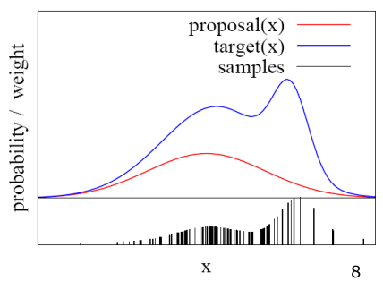

## Particle Filter
- Recursive Bayes filter
- Non-parametric approach
- Models the distribution by samples
- Prediction: draw from the proposal
- Correction: weighting by the ratio of target and proposal

**The more samples we use, the better is the estimate!**

## Particle Filter Algorithm
1. Sample the particles using the proposal distribution
$$
x_t^{[j]} \sim \pi(x_t | \dots)
$$
2. Compute the importance weights
$$
w_t^{[j]} = \frac{target(x_t^{[j]})}{proposal(x_t^{[j]})}
$$
- Resampling: Draw sample $i$ with probability $w_t^{[i]}$ and $J$ times

## Particle Filter Algorithm
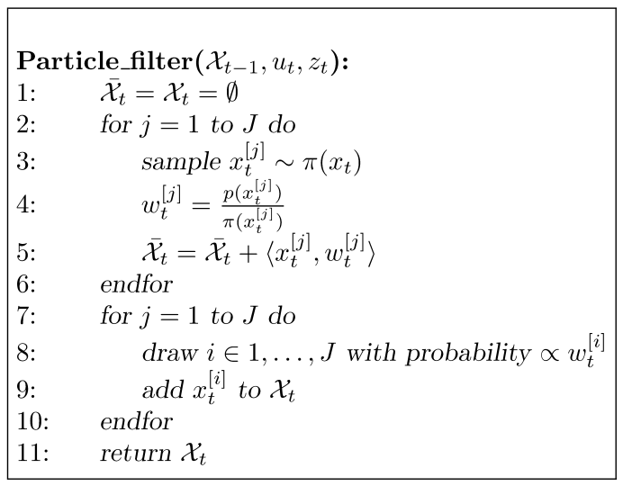

## Monte Carlo Localisation
- Each particle is a pose hypothesis
- Proposal is the motion model
$$
x_t^{[j]} \sim p(x_t|x_{t-1}, u_t)
$$
- Correction via the observation model
$$
w_t^{[j]} = \frac{target}{proposal} \propto p(z_t | x_t, m)
$$

## Particle Filter for Localisation
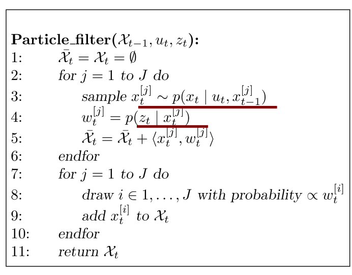

## Application: Particle Filter for Localisation (Known Map)
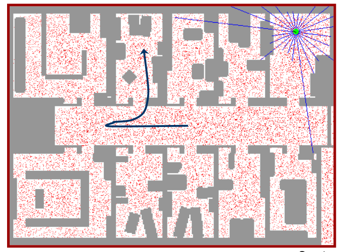

## Resampling
- Draw sample $i$ with probability $w^{[u]}_t$. Repeat $J$ times
- Informally: "Replace unlikely samples by more likely ones"
- Survival of the fittest
- "Trick" to avoid that many samples cover unlikely states
- Needed as we have a limited number of samples
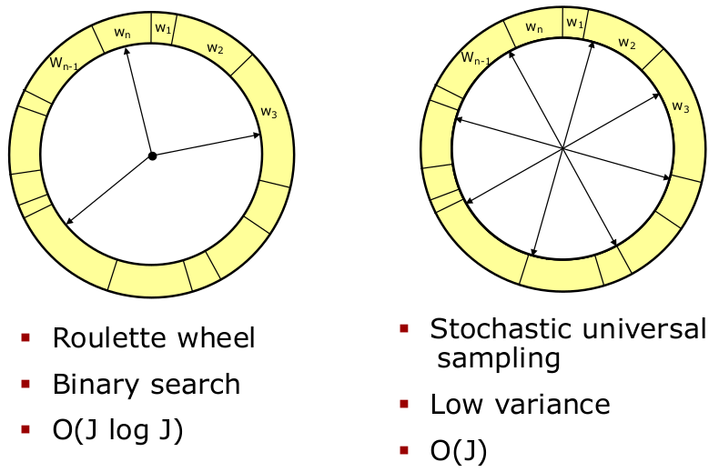

## Low Variance Resampling
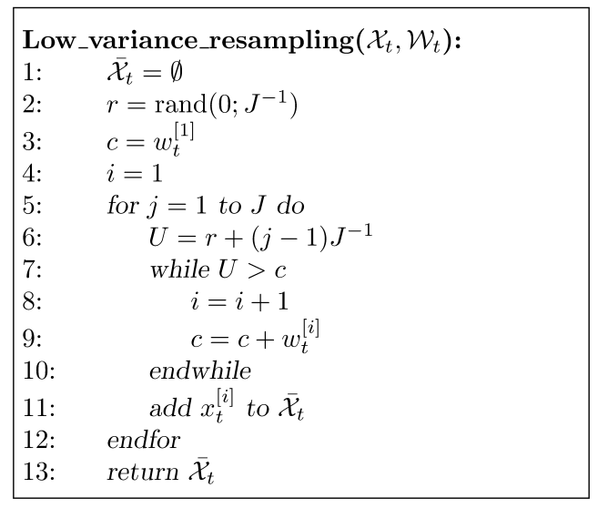

## Demonstration

## Summary - Particle Filters
- Particle filters are non-parametric, recursive Bayes filters
- Posterior is representative by a set of weighted samples
- Proposal to draw the samples for $t+1$
- Weight to account for the differences between the proposal and the target
- Work well in low-dimensional spaces

## Summary - PF Localisation
- Particles are propagated according to the motion model
- They are weighted according to the likelihood of the observation
- Called: Monte-Carlo localisation (MCL)
- MCL is the gold standard for mobile robot localisation today