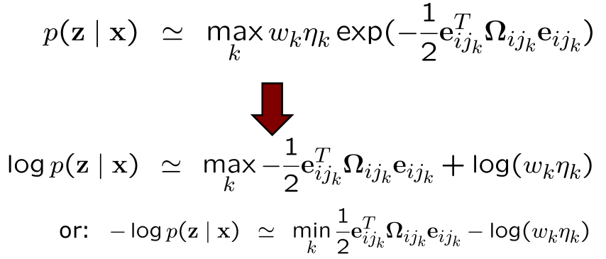

# Max-Mixture and Robust Least Squares for SLAM
## Least Squares in General
- Minimises the **sum of the squared errors**
- ML estimation in the Gaussian case

**Problems**:
- **Sensitive to outliers**
- **Only Gaussians** (single modes)

## Data Association is Ambiguous and Not Always Perfect
- Places that look identical
- Similar rooms in the same building
- Cluttered scenes
- GPS multi pass (signal reflections)
- ...

## Example

## Such Situations Occur in Reality

## Committing to the Wrong Mode Can Lead to Mapping Failures

## Data Association is Ambiguous and not Always Perfect
- Places that look identical
- Similar rooms in the same building
- Cluttered scenes
- GPS multi pass (signal reflections)
- ...
**How to incorporate that into graph-based SLAM?**

## Mathematical Model
- We can express a multi-modal belief by a sum of Gaussians

**Sum of Gaussians with $k$ modes**

## Problem
- During error minimisation, we consider the negative log likelihood

**The log cannot be moved inside the sum!**

## Max-Mixture Approximation
- Instead of computing the sum of Gaussians at $x$, compute the maximum of the Gaussians

## Log Likelihood of the Max-Mixture Formulation
- The log can be moved inside the max operator

## Integration
- With the max-mixture formulation, the log likelihood again results in local quadratic forms
- Easy to integrate in the optimiser:
	1. Evaluate all $k$ components
	2. Select the component with the maximum log likelihood
	3. Perform the optimisation as before using only the max components (as a single Gaussian)

## Performance (Gauss vs. MM)

## Runtime

## MM for Outlier Rejection

## Max-Mixture and Outliers
- MM formulation is useful for multi-model constraints (D.A. ambiguities)
- MM is also a handy tool outliers (D.A. failures)
- Here, one mode represents the edge and a second model uses a flat Gaussian for the outlier hypothesis

## Performance (1 outlier)

## Performance (10 outliers)

## Performance (100 outliers)

## Standard Gaussian Least Squares

## Dynamic Covariance Scaling

## Scaling Parameter

## Dynamic Covariance Scaling

## Optimising with Outliers
- Assuming a Gaussian error in the constraints is not always realistic
- Large errors are problematic

## Robust M-Estimators
- Assume non-normally-distributed noise
- Intuitively: PDF with "heavy tails"
- $\rho(e)$  function used to define the PDF
$$
p(e) = \exp(-\rho(e))
$$
- Minimising the neg. log likelihood
$$
x^* = \underset{x}{\text{argmin}} \sum_i \rho(e_i(x))
$$

## Different Rho Functions
- Gaussian: $\rho(e) = e^2$
- Absolute values (L1 norm): $\rho(e) = |e|$
- Huber M-estimator
$$
\rho(e) = \begin{cases}
   \frac{e^2}{2} &\text{if } |e| < c \\
   c(|e| - \frac{c}{2}) &\text{otherwise}{}
\end{cases}
$$
- Several others (Tukey, Cauchy, Blake-Zisserman, Corrupted Gaussian, ...)

## Huber
- Mixture of a quadratic and a linear function
$$
\rho(e) = \begin{cases}
   \frac{e^2}{2} &\text{if } |e| < c \\
   c(|e| - \frac{c}{2}) &\text{otherwise}{}
\end{cases}
$$

## Different Rho Functions

## MM Cost Function for Outliers

## Robust Estimation
- Choice of the rho function depends on the problem at hand
- Huber function is often used
- MM for outlier handling is similar to a corrupted Gaussian
- MM additionally supports multi-model constraints
- Dynamic Covariance Scaling is a robust M-estimator