# Sparse Extended Information Filter for SLAM
## Reminder: Parameterisations for the Gaussian Distribution
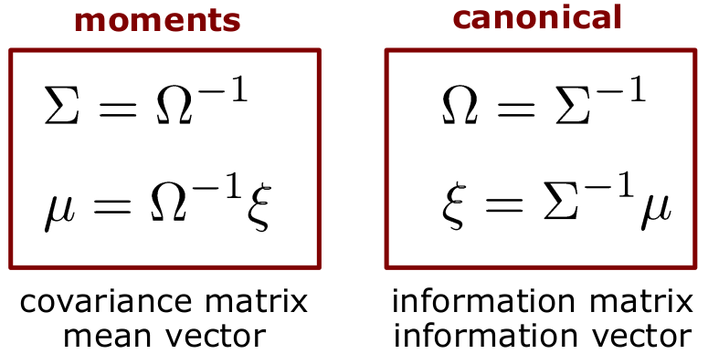

## Motivation
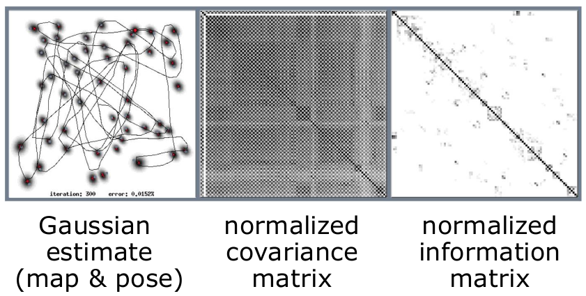

## Motivation
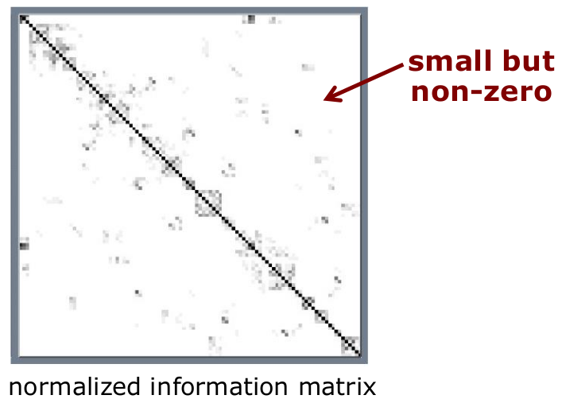

## Most Features Have Only a Small Number of Strong Links

## Information Matrix
- Information matrix can be interpreted as a graph of constraints/links between nodes (variables)
- Can be interpreted as a MRF
- Missing links indicate conditional independence of the random variables
- $\Omega_{i,j}$  tells us the strength of a link
- Larger values for nearby features
- Most off-diagonal elements in the information are close to 0 (but $\neq$ 0)

## Create Sparsity
- "Set" most links to zero/avoid fill-in
- Exploit sparseness of $\Omega$ in the computations
- **Sparse** = finite number of non-zero off-diagonals, independent of the matrix size

## Effect of Measurement Update on the Information Matrix
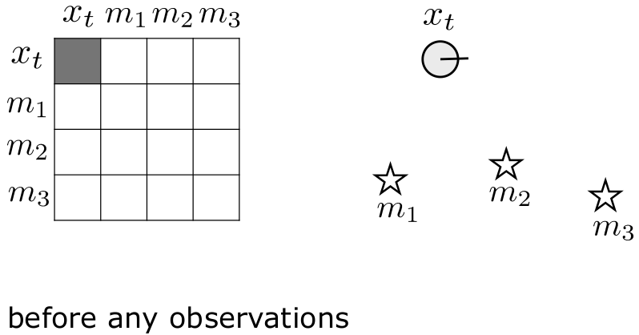

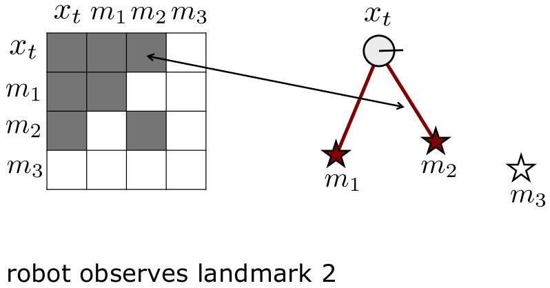
- Adds information between the robot's pose and the observed feature
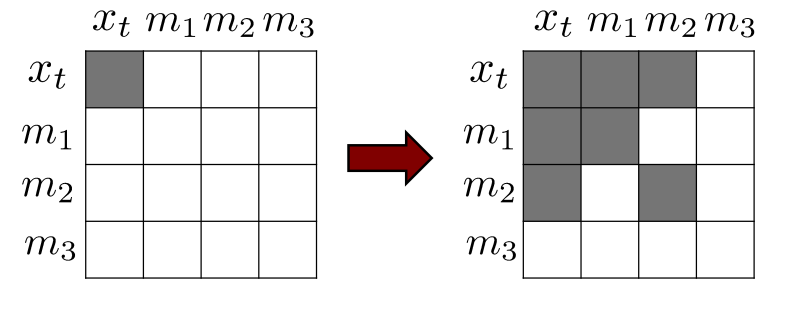

## Effect of Motion Update on the Information Matrix
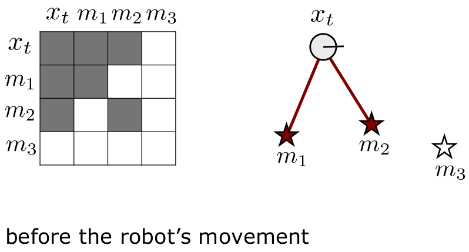
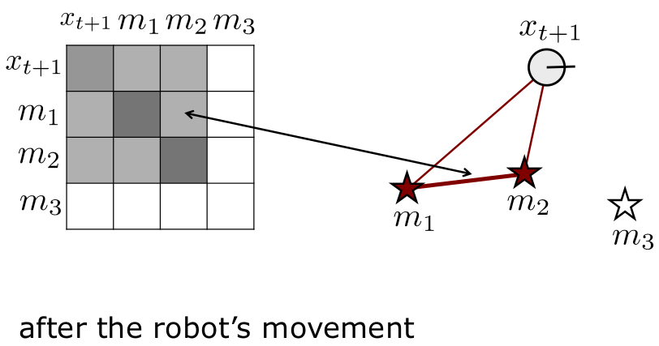
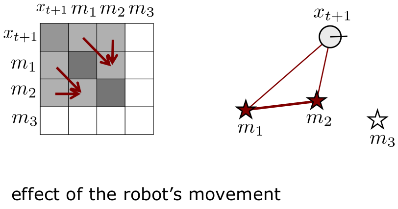
- Weakens the links between the robot's pose and the landmarks
- Add links between landmarks

## Sparsification
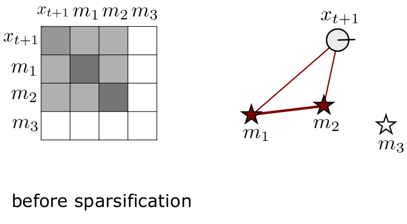
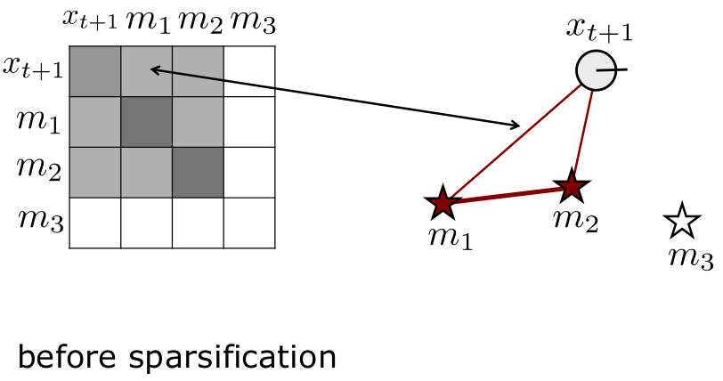
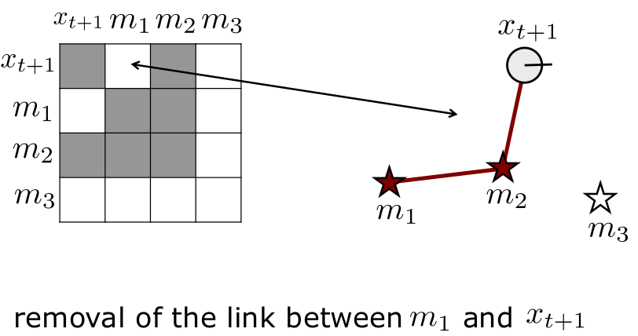
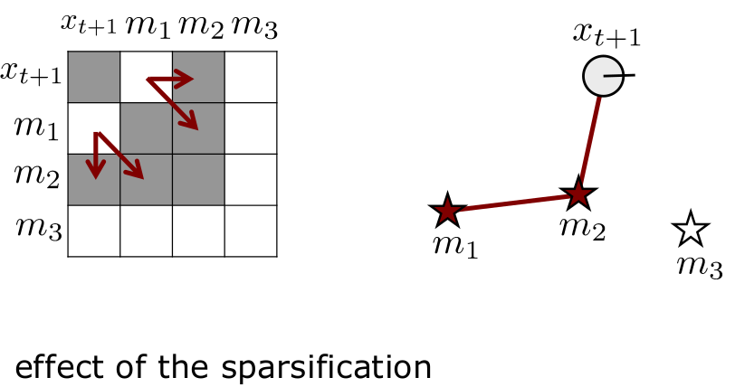
- Sparsification means "ignoring" links (assuming conditional independence)
- Here: links between the robot's pose and some of the features
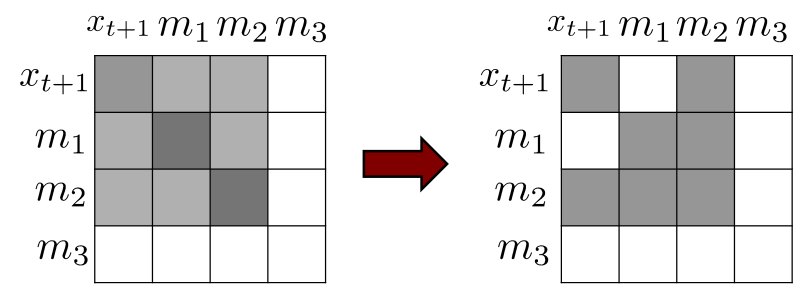

## Active and Passive Landmarks
Key element of SEIF SLAM to obtain an efficient algorithm

**Active Landmarks**
- A subset of all landmarks
- Includes the currently observed ones
**Passive Landmarks**
- All others

## Active vs. Passive Landmarks
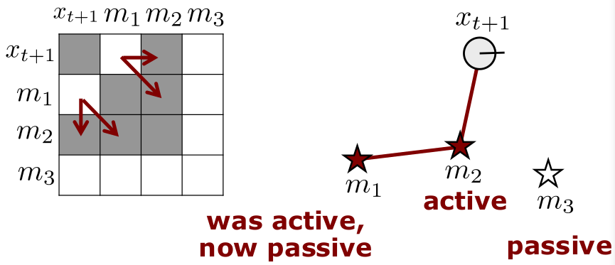

## Sparsification in Every Step
- SEIF SLAM conducts a **sparsification** step **in each iteration**

**Effect**
- The robot's pose is linked to the active landmarks only
- Landmarks have only links to nearby landmarks (landmarks that have been active at the same time)

## Key Steps of SEIF SLAM
1. Motion update
2. Measurement update
3. Sparsification

