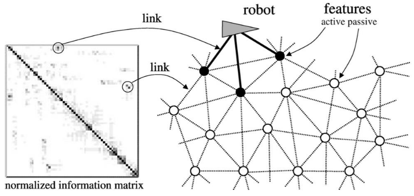
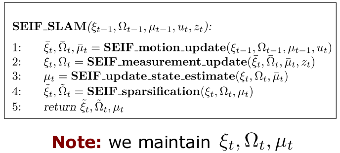
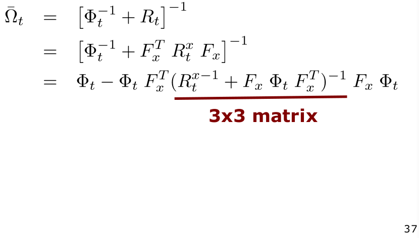

# Sparse Extended Information Filter for SLAM
## Reminder: Parameterisations for the Gaussian Distribution

## Motivation

- Look at the normalised information matrix, notice how it contains many values that are very close to zero (white spaces)
- The intuition is, what if we create a technique that sets many of these values to zero, thus creating a sparse matrix?
- This technique will heavily boost our computational efficiency

## Most Features Have Only a Small Number of Strong Links
- We can interpret the matrix as a graph
- Nodes with a darker colour indicates that there is a link between the robot's pose and this node (i.e. landmark). The darker the colour, the more information that this node contains about the robot's pose
- Active features are features that the robot is currently observing or is having a direct influence on  measurement of the robot's pose

## Information Matrix
- Information matrix can be interpreted as a graph of constraints/links between nodes (variables)
- Can be interpreted as a MRF
- Missing links indicate conditional independence of the random variables
- $\Omega_{i,j}$  tells us the strength of a link
- Larger values for nearby features
- Most off-diagonal elements in the information are close to 0 (but $\neq$ 0)

## Create Sparsity
- "Set" most links to zero/avoid fill-in
- Exploit sparseness of $\Omega$ in the computations
- **Sparse** = finite number of non-zero off-diagonals, independent of the matrix size

## Effect of Measurement Update on the Information Matrix

- Adds information between the robot's pose and the observed feature

## Effect of Motion Update on the Information Matrix

- Weakens the links between the robot's pose and the landmarks
- Add links between landmarks

## Sparsification

- Sparsification means "ignoring" links (assuming conditional independence)
- Here: links between the robot's pose and some of the features

## Active and Passive Landmarks
Key element of SEIF SLAM to obtain an efficient algorithm

**Active Landmarks**
- A subset of all landmarks
- Includes the currently observed ones
**Passive Landmarks**
- All others

## Active vs. Passive Landmarks

## Sparsification in Every Step
- SEIF SLAM conducts a **sparsification** step **in each iteration**

**Effect**
- The robot's pose is linked to the active landmarks only
- Landmarks have only links to nearby landmarks (landmarks that have been active at the same time)

## Four Steps of SEIF SLAM

## Matrix Inversion Lemma
- Before we start, let us re-visit the matrix inversion lemma
- For any invertible quadratic matrices $R$ and $Q$ and any matrix $P$, the following holds:
$$
(R+PQP^T)^{-1} = R^{-1}-R^{-1}P(Q^{-1}+P^T R^{-1} P)^{-1}P^T R^{-1}
$$

## SEIF SLAM - Prediction Step
- Goal: Compute $\overline{\xi}_t, \overline{\Omega}_t, \overline{\mu}_t$ from motion and the previous estimate $\xi_{t-1}, \Omega_{t-1}, \mu_{t-1}$ 
- Efficiency by exploiting sparseness of the information matrix

## Let us start from EKF SLAM...

## SEIF - Prediction Step (1/3)

### Compute the Information Matrix
- Computing the information matrix
$$
\begin{align}
	\overline{\Omega}_t &= \overline{\Sigma}_t^{-1} \\
	&= [G_t \Omega_{t-1}^{-1}G_t^T + R_t]^{-1} \\
	&= [\Phi^{-1}_t+R_t]^{-1}
\end{align}
$$
- with the term $\Phi_t$ defined as
$$
\begin{align}
\overline{\Omega}_t &= [\Phi_t^{-1}+R_t]^{-1} \\
&= [\Phi^{-1}_t+F^T_x R_t^x F_x]^{-1}
\end{align}
$$
- Apply the matrix inversion lemma

- This can be written as
$$
\begin{align}
\overline{\Omega}_t &= [\Phi_t^{-1}+R_t]^{-1} \\
&= [\Phi^{-1}_t+F^T_x R_t^x F_x]^{-1} \\
&= \Phi_t-\underbrace{\Phi_t F_x^T(R_t^{x-1}+F_x\Phi_tF_x^T)^{-1}F_x\Phi_t}_{\kappa_t} \\
&= \Phi_t - \kappa_t
\end{align}
$$
- Question: Can we compute $\Phi_t$ efficiently ($\Phi_t = [G_t^T]^{-1}\Omega_{t-1}G_t^{-1}$)?

### Computing $\Phi_t = [G_t^T]^{-1} \Omega_{t-1} G_t^{-1}$ 
- Goal: constant time if $\Omega_{t-1}$ is sparse

- We have
$$
\begin{align}
G_t^{-1} = I + \Psi_t \quad\quad\quad [G_t^T]^{-1} = I + \Psi_t^T \\
\end{align}
$$
- with
$$
\Psi_t = F_x^T\underbrace{[(I + \Delta)^{-1}-I]}_{3\times3 \text{ matrix}}F_x
$$
- $\Phi_t$ is zero except of a 3x3 block
- $G_t^{-1}$ is an identity except of a 3x3 block

Given that:
- $G_t^{-1}$ and $[G_t^T]^{-1}$ are identity matrices except of a 3x3 block
- The information matrix is sparse
- This implies that
$$
\Phi_t = [G_t^T]^{-1}\Omega_{t-1}G_t^{-1}
$$
- can be computed in constant time

- Given that $\Omega_{t-1}$ is sparse, the constant time update can be seen by
$$
\begin{align}
	\Phi_t &= [G_t^T]^{-1}\Omega_{t-1}G_t^{-1} \\
	&= (I + \Psi_t^T)\Omega_{t-1}(I+\Psi_t) \\
	&= \Omega_{t-1}+\underbrace{\Psi_t^T \Omega_{t-1}+\Omega_{t-1} \Psi_t^T + \Psi_t^T \Omega_{t-1} \Psi_t}_{\lambda_t} \\
	&= \Omega_{t-1} + \underline{\lambda_t} \\
	& \text{all elements zero except a constant number of entries}
\end{align}
$$

### Prediction Step in Brief
- Compute $\Psi_t$
- Compute $\lambda_t$ using $\Psi_t$
- Compute $\Phi_t$ using $\lambda_t$
- Compute $\kappa_t$ using $\Phi_t$
- Compute $\overline{\Omega}_t$ using $\Phi_t$ and $\kappa_t$

## SEIF - Prediction Step (2/3)

Information matrix is computed, now do the same for the information vector and the mean

### Compute the Mean
- The mean is computed as in the EKF
$$
\overline{\mu}_t = \mu_{t-1} + F_x^T \delta
$$
- Reminder (from SEIF motion update)

### Compute the Information Vector
- We obtain the information vector by 
$$
\begin{align}
	\overline{\xi}_t &= \overline{\Omega}_t (\mu_{t-1}+F^T_x\delta_t) \\
	&= \overline{\Omega}(\Omega^{-1}_{t-1} \xi_{t-1} + F_x^T \delta_t) \\
	&= \overline{\Omega}_t \Omega^{-1}_{t-1} \xi_{t-1} + \overline{\Omega}_t F_x^T \delta_t \\
	&= (\overline{\Omega} \underbrace{- \Phi_t + \Phi_t - \Omega_{t-1} + \Omega_{t-1}}_{=0})\Omega^{-1}_{t-1} \xi_{t-1} + \overline{\Omega}_t F_x^T\delta_t \\
	&= (\underbrace{\overline{\Omega}_t - \Phi_t}_{= -\kappa_t} + \underbrace{\Phi_t - \Omega_{t-1}}_{= \lambda_t})\underbrace{\Omega_{t-1}^{-1}\xi_{t-1}}_{\mu_{t-1}}+\underbrace{\Omega_{t-1}\Omega^{-1}_{t-1}}_{=I}\xi_{t-1}+\overline{\Omega}_tF_x^T\delta_t \\
	&= \xi_{t-1} + (\lambda_t - \kappa_t) \mu_{t-1} + \overline{\Omega}_t F_x^T \delta_t
\end{align}
$$

## SEIF - Prediction Step (3/3)

## Four Steps of SEIF SLAM

## SEIF - Measurement (1/2)

## SEIF - Measurement (2/2)

## Four Steps of SEIF SLAM

## Recovering the Mean
The mean is needed for
- Linearised motion model (pose)
- Linearised measurement model (pose and visible landmarks)
- Sparsification step (pose and subset of the landmarks)

- In the motion update step, we can compute the predicted mean easily

- Computing the corrected mean, however, **cannot be done as easy**
- Computing the mean from the information vector is costly:
$$
\mu = \Omega^{-1}\xi
$$
- Thus, SEIF SLAM approximates the computation for the corrected mean

## Approximation of the Mean
- Compute a **few dimensions** of the mean in an approximated way
- Idea: Treat that as an optimsation problem and seek to find
$$
\begin{align}
	\hat{\mu} &= \text{argmax}p(\mu) \\
	&= \underset{\mu}{\text{argmax}} \exp(-\frac{1}{2}\mu^T\Omega\mu+\xi^T\mu)
\end{align}
$$
- Seeks to find the value that maximise the probability density function

- Derive function
- Set first derivative to zero
- Solve equation(s)
- Iterate

- Can be done effectively given that only a few dimensions of $\mu$ are needed (robot's pose and active landmarks)

## Four Steps of SEIF SLAM

## Sparsification
- In order to perform all previous computations efficiently, we assumed a **sparse information matrix**
- Sparsification step ensures that
- **Question**: what does sparsifying the information matrix mean?
- It means "ignoring" some direct links 
- Assuming conditional independence

## Sparsification in General
- Replace the distribution
$$
p(a,b,c)
$$
- by an approximation $\tilde{p}$ so that $a$ and $b$ are independent given $c$
$$
\begin{align}
\tilde{p}(a|b,c) =p(a|c) \\
\tilde{p}(b|a,c) = p(b|c)
\end{align}
$$

## Approximation by Assuming Conditional Independence
- This leads to

## Sparsification in SEIFs
- Goal: approximate $\Omega$ so that it is and stays sparse
- Realised by maintaining only links between the robot and a few landmarks
- This also limits the number of links between landmarks

## Limit Robot-Landmark Links
- Consider a set of **active landmarks** during the updates

### Active and Passive Landmarks
#### Active Landmarks
- A subset of all landmarks
- Includes the currently observed ones

#### Passive Landmarks
- All others

## Sparsification Considers Three Sets of Landmarks
- Active ones that stay active
- Active ones that become passive
- Passive ones
$$
m = \underset{\text{active}}{m^+} + \underset{\text{active to passive}}{m^0} + \underset{\text{passive}}{m^-}
$$

## Sparsification
- Remove links between robot's pose and active landmarks that become passive
- Equal to conditional independence given the other landmarks
- No change in the links of passive ones
- **Sparsification is an approximation!**
$$
\begin{align}
p(x_t, m| z_{1:t}, u_{1:t}) &= p(x_t, m^+, m^0, m^-|z_{1:t}, u_{1:t}) \\
&\approx \dots
\end{align}
$$
- Dependencies from $z, u$ not shown:

## Information Matrix Update
- Sparsifying the direct links between the robot's pose and $m^0$ results in

## Sparsified Information Matrix
$$
\tilde{p}(x_t, m|z_{1:t}, u_{1:t}) \approx \frac{p(x_t, m^+ | m^- = 0, z_{1:t}, u_{1:t})}{p(m^+| m^- = 0, z_{1:t}, u_{1:t})}p(m^0, m^+, m^-|z_{1:t}, u_{1:t})
$$
- Conditioning $\Omega_t$ on $m^- = 0$ yields $\Omega_t^0$
- Marginalising $m^0$ from $\Omega^0_t$ yields $\Omega^1_t$
- Marginalising $x, m^0$ from $\Omega_t$ yields $\Omega_t^3$
- Computing sparsified information matrix
$$
\tilde{\Omega}_t = \Omega^1_t - \Omega^2_t + \Omega^3_t
$$

## Information Vector Update
- The information vector can by recovered directly by:
$$
\begin{align}
	\tilde{\xi}_t &= \tilde{\Omega}_t \mu_t \\
	&= (\Omega_t - \Omega_t + \tilde{\Omega}_t)\mu_t \\
	&= \xi_t + (\tilde{\Omega}_t - \Omega_t)\mu_t
\end{align}
$$

## Sparsification

## Four Steps of SEIF SLAM

## Effect of the Sparsification

## SEIF SLAM vs. EKF SLAM
- Roughly **constant time** complexity vs. quadratic complexity of the EKF
- **Linear memory** complexity vs. quadratic complexity of the EKF
- SEIF SLAM is **less accurate** than EKF SLAM (sparsification, mean recovery)

## SEIF & EKF: CPU Time

## SEIF & EKF: Memory Usage

## SEIF & EKF: Error Comparison

## Influence of the Active Features

