# Unscented Kalman Filter
## KF, EKF and UKF
- Kalman filter requires linear models
- EKF linearises via Taylor expansion

**Is there a better way to linearize?**
**Unscented transform $\rightarrow$ Unscented Kalman Filter (UKF)**

## Taylor Approximation (EKF)
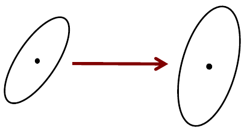

Linearisation of the non-linear function through Taylor expansion

## Unscented Transform
- We sample some points according to an existing Gaussian distribution
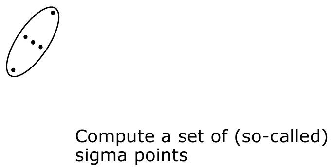
- We then remap those points to a new Gaussian distribution, transformed by a non-linear function
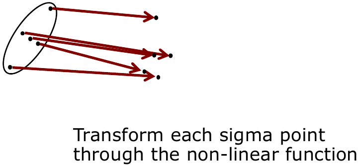
- Calculate the new Gaussian distribution from the transformed points
- This is done by calculating the mean and covariance of the new points to get the new Gaussian distribution
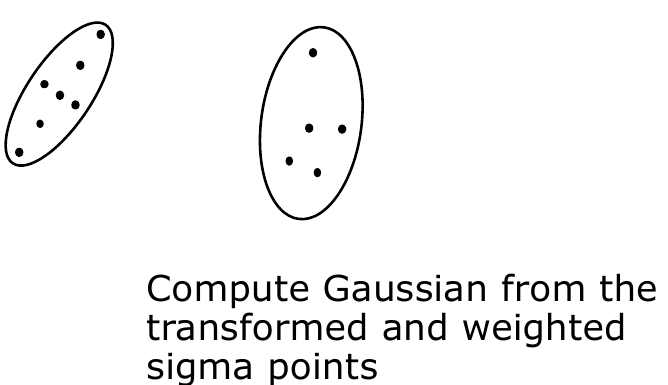

## Unscented Transform Overview
- Compute a set of sigma points
- Each sigma points has a weight
- Transform the point through the non-linear function
- Compute a Gaussian from weighted points

- Avoids to linearise **around the mean** as Taylor expansion (and EKF) does

## Sigma Points
- How to choose the sigma points?
- How to set the weights?

### Sigma Points Properties
- How to choose the sigma points?
- How to set the weights?
- Select $\mathcal{X}^{[i]}, w^{[i]}$ so that:
$$
\begin{align}
	\sum_i w^{[i]} &= 1 \\
	\mu &= \sum_i w^{[i]} \mathcal{X}^{[i]} \\
	\Sigma &= \sum_i w^{[i]}(\mathcal{X}^{[i]} - \mu)(\mathcal{X}^{[i]} - \mu)^T	
\end{align}
$$
- What this means is the following:
	- The sum of weights $w$ must be equal to 1
	- The sum of weighted $\mathcal{X}$ must equal to the mean
	- The weighted sum of squared difference between the $\mathcal{X}$ and $w$ must equal to covariance
- There is no unique solution for $\mathcal{X}^{[i]},w^{[i]}$

## Sigma Points
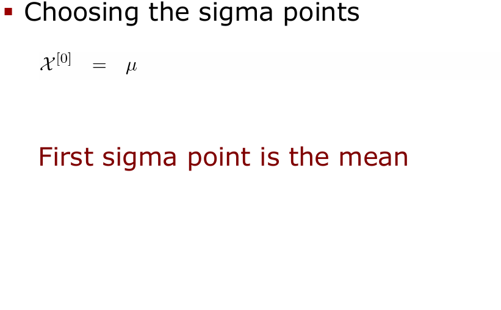
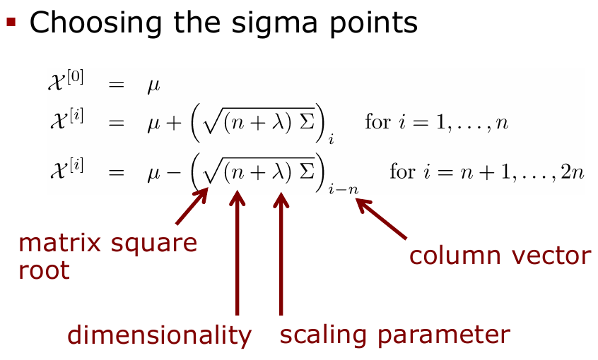

## Matrix Square Root
- Defined as $S$ with $\Sigma = SS$
- Computed via diagonalisation
$$
\begin{align}
\Sigma &= VDV^{-1} \\
&= V
\begin{pmatrix}
d_{11} & \dots & 0 \\
0 & \ddots & 0 \\
0 & \dots & d_{nn}
\end{pmatrix}
V^{-1} \\
&= V
\begin{pmatrix}
\sqrt{d_{11}} & \dots & 0 \\
0 & \ddots & 0 \\
0 & \dots & \sqrt{d_{nn}}
\end{pmatrix}
\begin{pmatrix}
\sqrt{d_{11}} & \dots & 0 \\
0 & \ddots & 0 \\
0 & \dots & \sqrt{d_{nn}}
\end{pmatrix}
V^{-1}
\end{align}
$$

## Matrix Square Root
- Thus, we can define
$$
S = V
\underbrace{\begin{pmatrix}
\sqrt{d_{11}} & \dots & 0 \\
0 & \ddots & 0 \\
0 & \dots & \sqrt{d_{nn}}
\end{pmatrix}}_{D^{1/2}}
V^{-1}
$$
- so that
$$
SS = (VD^{1/2}V^{-1})(VD^{1/2}V^{-1}) = VDV^{-1} = \Sigma
$$

## Cholesky Matrix Square Root
- Alternative definition of the matrix square root
$$
L \text{ with } \Sigma = LL^T
$$
- Result of the Cholesky decomposition
- Numerically stable solution
- Often used in UKF implementations
- $L$ and $\Sigma$ have the same Eigenvectors

## Sigma Points and Eigenvectors
- Sigma point **can** but **do not have to** lie on the main axes of $\Sigma$
$$
\begin{align}
\mathcal{X}^{[i]} &= \mu + \bigg(\sqrt{(n+ \lambda)\Sigma}\bigg)_i & \text{for } i =1,\dots, n \\
\mathcal{X}^{[i]} &= \mu - \bigg(\sqrt{(n+ \lambda)\Sigma}\bigg)_{i-n} & \text{for } i =n+1,\dots, 2n \\
\end{align}
$$
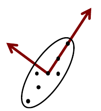

## Sigma Points Example
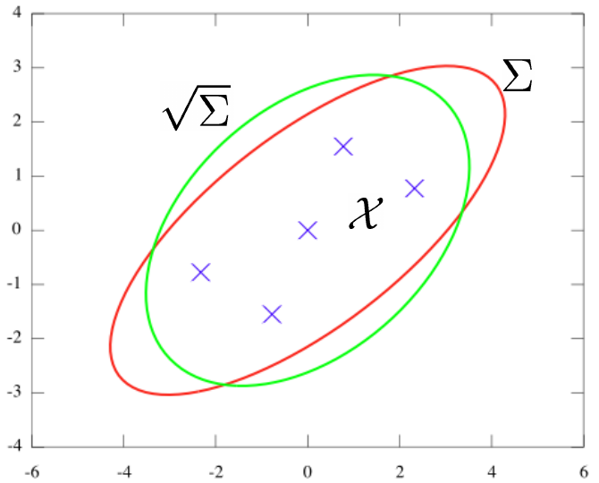

## Sigma Point Weights
- Weight sigma points
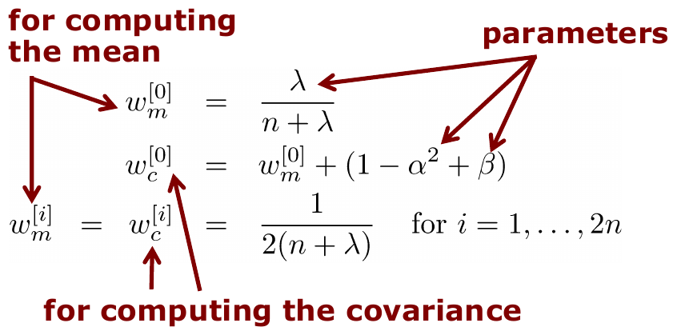

## Recover the Gaussian
- Compute the Gaussian from weighted and transformed points
$$
\begin{aligned}
\mu' &= \sum^{2n}_{i=0}w^{[i]}_m g(\mathcal{X}^{[i]}) \\
\Sigma' &= \sum^{2n}_{i=0}w_c^{[i]}(g(\mathcal{X}^{[i]})-\mu')(g(\mathcal{X}^{[i]})-\mu')^T
\end{aligned}
$$

### Example
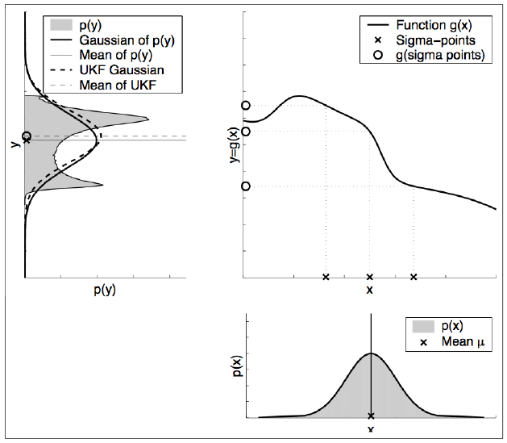

### Examples
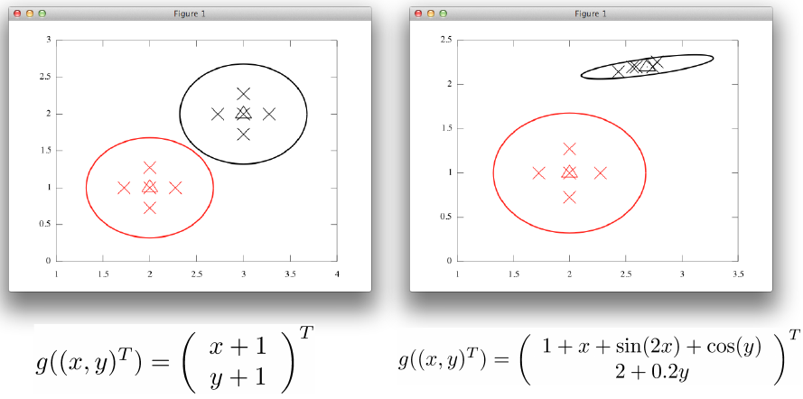

## Unscented Transform Summary
- Sigma points
$$
\begin{align}
\mathcal{X}^{[0]} &= \mu \\
\mathcal{X}^{[i]} &= \mu + \bigg(\sqrt{(n+ \lambda)\Sigma}\bigg)_i & \text{for } i =1,\dots, n \\
\mathcal{X}^{[i]} &= \mu - \bigg(\sqrt{(n+ \lambda)\Sigma}\bigg)_{i-n} & \text{for } i =n+1,\dots, 2n \\
\end{align}
$$
- Weights
$$
\begin{aligned}
w^{[0]} &= \frac{\lambda}{n+\lambda} \\
w_c^{[i]} &= w_m^{[0]} + (1 - \alpha^2 + \beta) \\
w_m^{[i]} = w_c^{[i]} &= \frac{1}{2(n+\lambda)} \quad \text{ for } i = 1, \dots, 2n
\end{aligned}
$$

## UT Parameters
- Free parameters as there is no unique solution
- Scaled Unscented Transform suggests
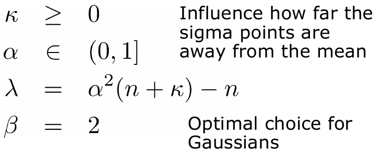

## Examples
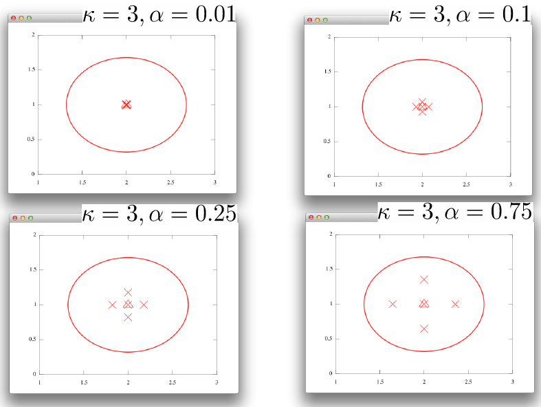
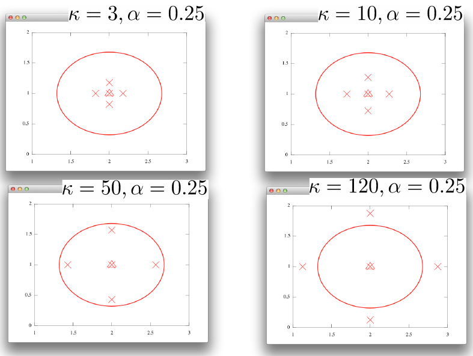

## EKF Algorithm
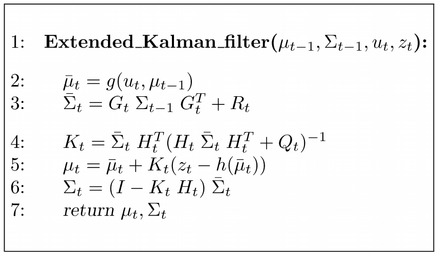

## EKF to UKF - Prediction
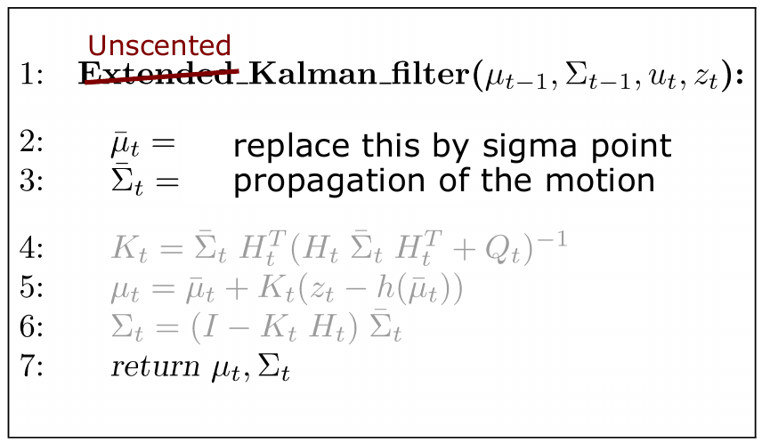

## UKF Algorithm - Prediction
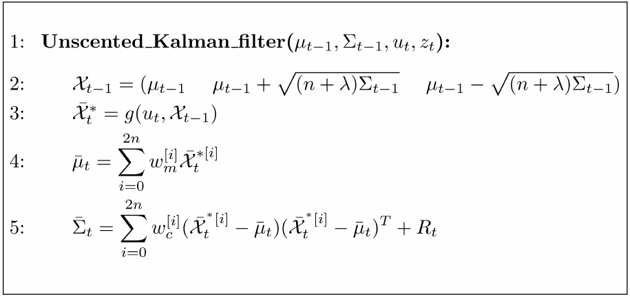
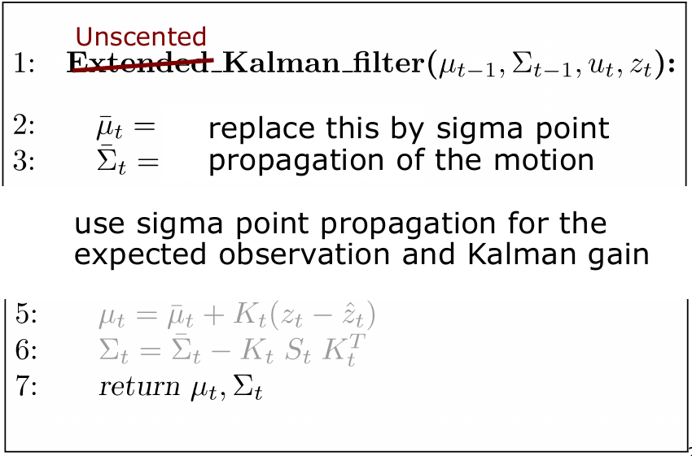
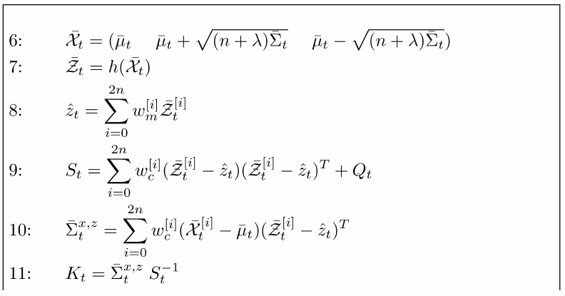
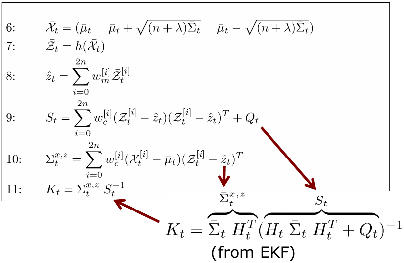
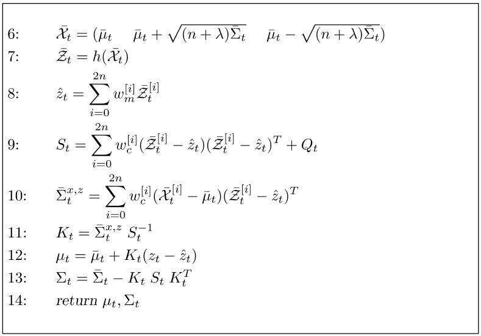
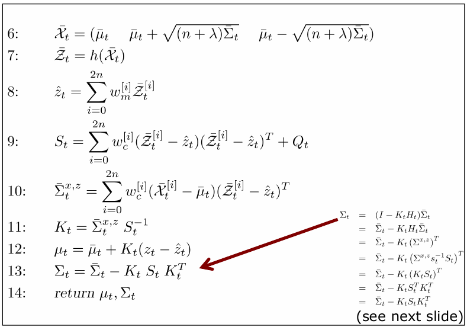

## From EKF to UKF - Computing the Covariance
$$
\begin{align}
\Sigma_t &= (I - K_t H_t) \overline{\Sigma}_t \\
&= \overline{\Sigma}_t - K_t \underbrace{H_t \overline{\Sigma}_t}_{simplify} \\
&= \overline{\Sigma}_t - K_t (\overline{\Sigma}^{x,z})^T \\
&= \overline{\Sigma}_t - K_t (\underbrace{\overline{\Sigma}^{x,z}S_t^{-1}}_{simplify}S_t)^T \\
&= \overline{\Sigma}_t - K_t(K_t S_t)^T \\
&= \overline{\Sigma}_t - K_tS_t^TK_t^T \\
&= \overline{\Sigma}_t - K_tS_tK_t^T
\end{align}
$$

## UKF vs. EKF
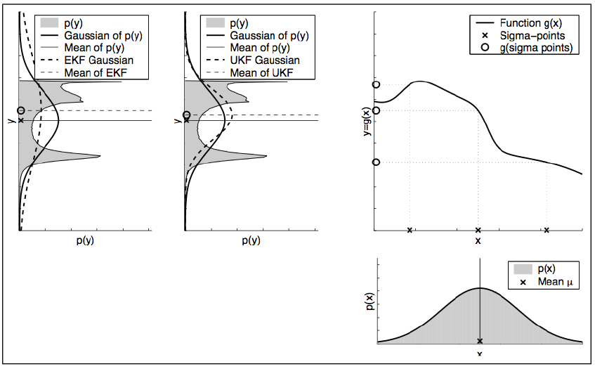

## UKF vs. EKF (Small Covariance)
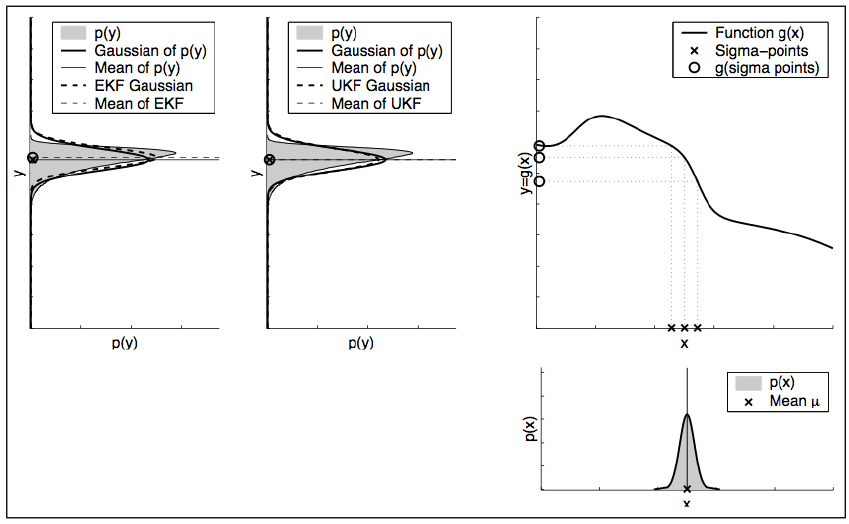

## UKF vs. EKF - Banana Shape
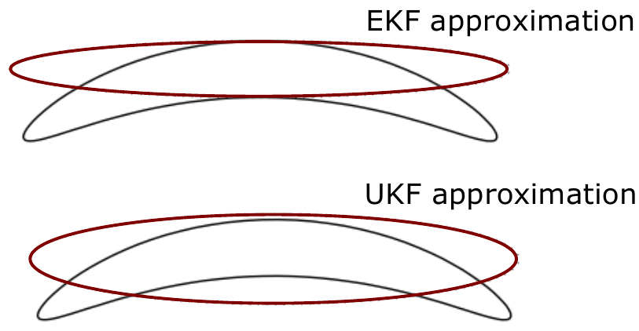

## UKF vs. EKF
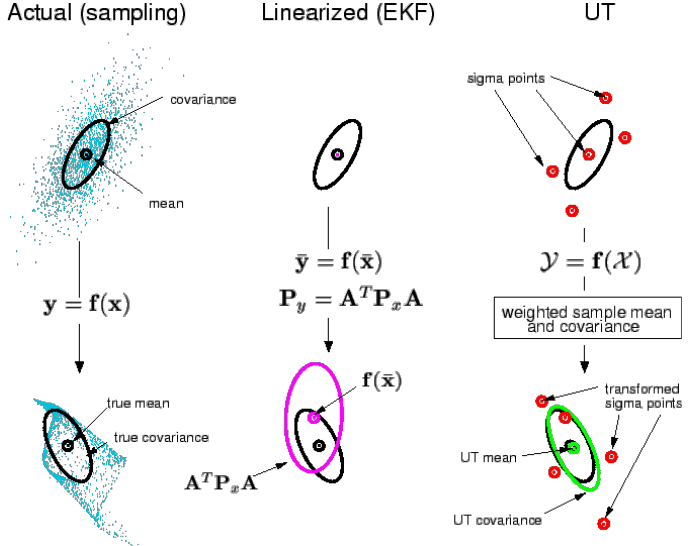